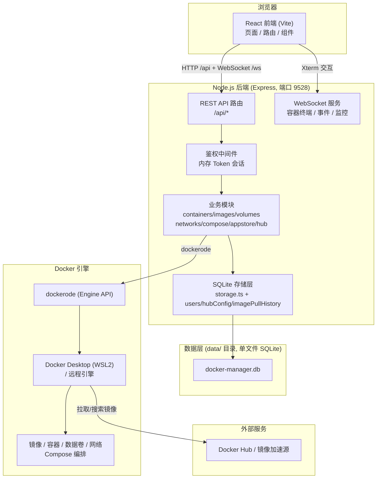

# Docker Manager（Docker 管理面板）

一个跨平台的 Docker 容器管理面板（类似 1Panel），支持 **Windows**、**Ubuntu 24** 和 **CentOS 7+**，提供浏览器可视化管理 Docker 引擎的能力。支持容器、镜像、数据卷、网络、Compose、应用商店、Docker Hub 镜像搜索/拉取、实时监控、容器终端等核心功能。

## ✨ 功能特性

- **总览监控**：Docker 引擎信息、系统资源实时曲线（CPU / 内存 / 网络 / 磁盘分区）；支持 NVIDIA GPU 利用率 / 显存 / 温度监控（`nvidia-smi`）
- **容器管理**：列表、启停/删除/重启/克隆、镜像过滤、查看日志与详情、内置 Web 终端（xterm.js + WebSocket）、设置重启策略等
- **镜像管理**：列表、拉取/推送/导入/导出、删除、打标签、清理、镜像详情与构建历史；支持多镜像源自动切换与失败重试；展示构建时间与本地拉取时间
- **构建镜像**：基于宿主机目录的 Dockerfile 独立构建（支持构建参数 / noCache），构建结果持久化为**构建历史**（可回溯日志、一键复用配置、清空）
- **镜像源（Hub）**：配置国内镜像加速源（内置轩辕、1ms）、Docker Hub 在线搜索、常用镜像快捷拉取
- **数据卷 / 存储 / 网络**：卷与网络列表、创建、删除、清理未使用；存储使用统计与一键回收
- **Compose**：编排文件查看与编辑、`docker compose up / down / pull / build`
- **应用商店（AppStore）**：内置应用目录，一键安装部署
- **计划任务**：定时任务（周期 / 依存的容器操作等）管理
- **文件管理**：容器内文件浏览 / 上传 / 下载 / 编辑
- **宿主机文件 / 终端**：宿主机文件浏览与远程终端（xterm）
- **Docker 引擎**：多 Docker 引擎端点管理（新增 / 编辑 / 设为当前 / 删除）
- **数据库可视化**：容器数据库 / Redis 的可视化查询与信息查看（只读保护）
- **备份恢复**：DATA / Compose / 卷 / 站点备份恢复中心；支持将备份文件**上传到云端**（S3 / OSS / WebDAV）
- **云端备份**：S3 / OSS / WebDAV 目标配置（零第三方依赖，https 手写）、连通性测试、文件上传
- **站点反代 / SSL**：基于反代容器的站点反向代理、启停与配置 reload、SSL 证书状态与替换
- **防火墙**：Windows 防火墙入站端口放行管理（基于系统 `netsh`，管理员权限提示）
- **事件流**：实时查看 Docker 引擎事件；事件**持久化到 SQLite**，可查询**历史**、**导出 CSV**、清空
- **操作日志**：管理操作审计日志
- **用户与鉴权**：登录鉴权、会话管理、用户增删/改密、RBAC（管理员专属页面 / 操作守卫）、内置权限边界自动化测试
- **系统设置**：主题、语言等偏好设置

## 🧰 技术栈

| 层级        | 技术                                                                  |
| --------- | ------------------------------------------------------------------- |
| 前端        | React 18 · TypeScript · Vite · Less · xterm.js · ECharts(LineChart) |
| 后端        | Node.js ≥ 22 · TypeScript · Express 4 · ws（WebSocket）              |
| Docker 交互 | dockerode（Docker Engine API）                                        |
| 数据存储      | SQLite（node:sqlite，零依赖）                                          |
| 打包发布      | Windows: NSIS + NSSM + TrayApp · Linux: deb/rpm + systemd          |

## 💾 数据存储说明（SQLite，无第三方数据库服务）

> 本项目使用 **SQLite** 作为数据存储，基于 **Node.js 内置的** **`node:sqlite`** **模块**，**零第三方依赖、零编译**（无需安装 MySQL / PostgreSQL 等数据库服务）。

所有业务数据统一存储在 **`data/docker-manager.db`** 这一个 SQLite 数据库文件（自包含、可整体复制备份），由后端通过 `node:sqlite` 的 `DatabaseSync` 同步 API 读写。采用 WAL 日志模式，兼顾并发读与崩溃安全。

| 表                    | 内容                             | 对应模块                             |
| -------------------- | ------------------------------ | -------------------------------- |
| `users`              | 用户账号、盐值（salt）与加盐 scrypt 密码哈希   | `server/src/users.ts`            |
| `hub_sources`        | 镜像加速源列表（含内置默认源）                | `server/src/hubConfig.ts`        |
| `setting`            | 键值配置（如自定义搜索源基址 `searchSource`） | `server/src/hubConfig.ts`        |
| `image_pull_history` | 镜像 ID → 本地拉取时间戳（秒）映射           | `server/src/imagePullHistory.ts` |
| `operation_logs`     | 管理员操作审计日志                       | `server/src/operationLog.ts`     |
| `cron_tasks` / `cron_task_logs` | 计划任务定义与执行日志            | `server/src/routes/tasks.ts`     |
| `appstore_instances` / `appstore_app_params` | 应用商店已安装实例与应用参数 | `server/src/appstore/`           |
| `database_instances` | 数据库 / Redis 可视化实例定义            | `server/src/routes/databases.ts` |
| `docker_engines`     | 多 Docker 引擎端点配置                | `server/src/routes/engines.ts`   |
| `cloud_targets`      | 云端备份目标（S3 / OSS / WebDAV）    | `server/src/routes/cloud.ts`     |
| `sites`              | 站点反代配置                          | `server/src/routes/sites.ts`     |
| `backups`            | 备份记录（DATA / Compose / 卷 / 站点） | `server/src/backup/manager.ts`  |
| `image_build_history`| 镜像构建历史（日志预览 / 耗时 / 结果）      | `server/src/routes/build.ts`     |
| `docker_events`      | Docker 事件持久化历史（实时事件落库）       | `server/src/docker/events.ts`   |
| `firewall_ports`     | Windows 防火墙放行端口规则              | `server/src/routes/firewall.ts`  |

> **旧版兼容**：早期版本使用 JSON/文本文件存储（`data/users.json`、`data/hub-sources.json`、`data/hub-search-source.txt`、`data/image-pull-history.json`）。服务启动时会自动将旧文件数据迁移进 SQLite，并把旧文件重命名为 `.bak` 备份，实现平滑升级、不丢失任何现有配置。

### 鉴权与会话

- 登录采用**内存 Token 方案**（`server/src/auth.ts`）：登录成功后生成随机会话 Token，存于内存 `Map` 并带过期时间（默认 24 小时，可用 `AUTH_TTL_HOURS` 调整）。
- 请求携带 `Authorization: Bearer <token>`，由 `requireAuth` 中间件校验。
- 会话 Token 仅存内存，服务重启后失效，不落库（属于短期会话态，无需持久化）。

### 安全与保障

- 用户密码采用 **scrypt 加盐哈希**（`crypto.scryptSync`），绝不保存明文。
- SQLite 数据库文件随 `data/` 目录自动创建；用户表为空时自动以默认管理员初始化，保证首次启动可用。

## 🏗️ 整体系统架构



### 请求链路（示例：拉取镜像）

```
浏览器 images 页
  → POST /api/images/pull {ref, source}
  → requireAuth 校验 Token
  → images 路由：按镜像源顺序尝试 docker.pull
  → 成功后 inspect 获取镜像 Id，recordPullTime 写入 image_pull_history 表（SQLite）
  → 返回 {ok, ref, source, progress}
```

### 开发态前后端代理

- 前端开发服务端口 **9526**（Vite），将 `/api` 代理到 `http://localhost:9528`。
- 后端服务端口 **9528**，前端静态文件由后端在生产模式下一并托管，实现单进程部署。

## 📁 目录结构

```
dockerDesktop/
├── web/                        # 前端工程（React + Vite + TS）
│   └── src/
│       ├── pages/              # 各业务页面
│       ├── components/         # 通用组件（Button/Modal/Form/Layout/Toast 等）
│       ├── api/                # 请求封装与鉴权
│       ├── hooks/              # 自定义 hooks（日志、主题）
│       ├── types/              # 类型定义
│       └── styles/             # 全局样式
├── server/                     # 后端工程（Express + TS）
│   └── src/
│       ├── routes/             # REST API 路由
│       ├── docker/             # dockerode 客户端、监控、终端
│       ├── appstore/           # 应用商店目录与状态
│       ├── storage.ts          # SQLite 存储层（连接/建表/旧数据迁移）
│       ├── users.ts            # 用户存储（SQLite users 表）
│       ├── hubConfig.ts        # 镜像源存储（SQLite hub_sources/setting 表）
│       ├── imagePullHistory.ts # 拉取时间存储（SQLite image_pull_history 表）
│       └── auth.ts             # 会话鉴权
├── data/                       # 运行时数据（SQLite 数据库 + 旧 JSON 迁移备份，自动生成）
├── packaging/                  # 打包脚本与 NSIS 安装包工具
└── dist-release/               # 发布产物（构建生成）
```

## 📋 环境要求

- **Node.js ≥ 22**（推荐使用 LTS 版本）
- **npm**（随 Node.js 安装）
- 已启动的 **Docker 引擎**
  - **Windows**：Docker Desktop（需开启 WSL2 后端）
  - **Ubuntu 24 / CentOS 7+**：docker-ce + docker-compose-plugin

## 🚀 安装与运行

### 方式一：源码开发模式

```bash
# 1. 安装依赖（根目录会自动处理 server / web 两个工作区）
npm install

# 2. 启动后端（端口 9528，ts-node-dev 支持热重载）
npm run dev:server

# 3. 另开终端启动前端（端口 9526，自动代理 /api 到后端）
npm run dev:web
```

打开浏览器访问 `http://localhost:9526`。

### 方式二：生产构建 & 本地运行

```bash
# 构建前后端（输出到 server/dist 与 web/dist）
npm run build

# 运行后端（生产模式，自动托管 web/dist 前端静态文件）
cd server && npm start
```

打开浏览器访问 `http://localhost:9528`。

### 方式三：打安装包

#### Windows

```bash
# 生成发布目录 dist-release/DockerManager（含 NSSM、托盘、安装脚本）
npm run package

# 一键生成 NSIS 安装包 setup.exe（自动调用 package 并编译）
npm run package:installer
```

生成 `DockerManager-setup-0.1.0.exe` 安装包，在目标 Windows 电脑上运行即完成安装。

#### Linux（Ubuntu 24 / CentOS 7+）

```bash
# 方式 A：使用安装脚本（推荐）
# 1. 从 GitHub Releases 下载对应平台的安装包
# 2. 解压后运行安装脚本
sudo bash install.sh

# 方式 B：从源码打包
npm run package          # 生成 dist-release/DockerManager
npm run package:deb -- amd64   # 生成 .deb 包（需要 Docker）
npm run package:rpm -- x86_64  # 生成 .rpm 包（需要 Docker）
```

安装完成后通过 `systemctl` 管理服务：

```bash
sudo systemctl start docker-manager    # 启动
sudo systemctl status docker-manager   # 查看状态
sudo systemctl enable docker-manager   # 开机自启
```

## 🔑 使用说明

| 项目     | 说明                                            |
| ------ | --------------------------------------------- |
| 默认登录账号 | `admin`                                       |
| 默认登录密码 | `admin888`                                    |
| 默认端口   | `9528`（后端）/ `9526`（前端开发）                      |
| 会话有效期  | 24 小时（可用环境变量 `AUTH_TTL_HOURS` 调整）             |
| 数据目录   | Windows: `<安装目录>/data/` · Linux: `/var/lib/docker-manager/` |

### 环境变量

| 变量                          | 说明                                             | 默认值                  |
| --------------------------- | ---------------------------------------------- | -------------------- |
| `PORT`                      | 后端监听端口                                         | `9528`               |
| `HOST`                      | 后端监听地址                                         | `0.0.0.0`            |
| `DOCKER_HOST`               | Docker 引擎端点（`npipe://` / `unix://` / `tcp://`） | 自动探测                 |
| `ADMIN_USER` / `ADMIN_PASS` | 初始管理员账号/密码                                     | `admin` / `admin888` |
| `AUTH_TTL_HOURS`            | 会话过期小时数                                        | `24`                 |
| `STATIC_DIR`                | 生产模式前端静态目录（可选）                                 | `web/dist`           |
| `DOCKERMANAGER_DATA`        | 自定义数据目录路径（Linux 可选）                              | `/var/lib/docker-manager` |

## ⚙️ 环境变量补充说明：Docker 引擎连接

后端通过 `server/src/docker/client.ts` 自动探测可用的 Docker 引擎，按以下顺序连接（使用真实 `ping` 验证）：

**Linux**：
1. 环境变量 `DOCKER_HOST` 显式指定的端点
2. `unix:///var/run/docker.sock`（Linux 默认）

**Windows**：
1. 环境变量 `DOCKER_HOST` 显式指定的端点
2. `npipe:////./pipe/dockerDesktopLinuxEngine`（Docker Desktop WSL2）
3. `npipe:////./pipe/docker_engine`（Windows 默认）

> 注意：Windows named pipe 无法用 `fs.existsSync` 检测，需通过真实连接验证，因此新增端点会自动尝试逐个探测。

<br />

功能总览：


## 🧪 常见问题

- **提示"无法连接 Docker 引擎"**：请确认 Docker Desktop 已启动，必要时设置 `DOCKER_HOST` 环境变量指向可用的引擎端点。
- **镜像搜索失败（502 / 无法搜索）**：国内大多数镜像加速站只代理镜像**拉取**，并不实现 Docker Hub 的 `search` 接口，因此搜索会失败。解决办法：
  - 在**镜像中心 → 镜像源 → 搜索源**填入一个支持搜索的源，例如 `https://docker-0.unsee.tech`（备用 `https://docker.tbap.top`），保存后即可在线搜索。完整实测明细与配置步骤见 [可搜索镜像源文档](docs/docker-hub-search-sources.md)。
  - 上述可搜索源为社区公益服务，可能限流或变更；搜索仍不可用时，可直接在镜像中心点选"常用镜像"，或在"拉取镜像"输入已知镜像名（走镜像源拉取可靠）。
  - 本地开发/自动化回归可启动自带的本地 mock 搜索服务（`npm run mock:hub-search`）作为不依赖外网的兜底。
- **忘记密码**：停止服务后删除 `data/docker-manager.db`（及同目录 `-wal` / `-shm` 文件），重新启动服务，会以 `ADMIN_USER` / `ADMIN_PASS`（默认 `admin` / `admin888`）重新初始化管理员和默认配置。
- **备份/迁移数据**：只需复制整个 `data/` 目录（核心是 `docker-manager.db`）即可完成配置的备份与迁移。详见 [数据迁移指南](docs/migration-guide.md)。
- **Linux 安装后无法连接 Docker**：确保 `dockerman` 用户已加入 `docker` 组（`sudo usermod -aG docker dockerman`），并重启服务。

## 📜 License

本项目采用 MIT 许可证 - 查看 [LICENSE](https://github.com/13861419/dockerDesktop/blob/main/LICENSE) 文件了解详情。
