# Docker Manager 功能操作手册

> 本手册面向 Docker Manager（Docker 管理面板）的使用者，介绍系统各功能模块的用途与操作步骤。
> 适用于手册编写时的当前版本。部分页面标注 🔒 的为**管理员专属**，普通用户登录后不可见、无法操作。

---

## 目录

- [0. 安装部署](#0-安装部署)
- [1. 登录与使用准备](#1-登录与使用准备)
- [2. 总览与健康体检](#2-总览与健康体检)
- [3. 容器管理](#3-容器管理)
- [4. 容器模板 🔒](#4-容器模板-)
- [5. 容器编排 🔒](#5-容器编排-)
- [6. 镜像管理](#6-镜像管理)
- [7. 镜像构建 🔒](#7-镜像构建-)
- [8. 数据卷 / 存储 / 网络](#8-数据卷--存储--网络)
- [9. Compose 编排](#9-compose-编排)
- [10. 应用商店](#10-应用商店)
- [11. 计划任务](#11-计划任务)
- [12. 文件管理 / 宿主机文件 / 宿主机终端](#12-文件管理--宿主机文件--宿主机终端)
- [13. Docker 引擎 🔒](#13-docker-引擎-)
- [14. 云备份 🔒](#14-云备份-)
- [15. 备份恢复](#15-备份恢复)
- [16. Swarm 集群 🔒](#16-swarm-集群-)
- [17. 数据库可视化](#17-数据库可视化)
- [18. 镜像中心（Hub）](#18-镜像中心-hub)
- [19. 事件流](#19-事件流)
- [20. 操作日志](#20-操作日志)
- [21. 通知告警 🔒](#21-通知告警-)
- [22. 站点反代 🔒](#22-站点反代-)
- [23. 防火墙 🔒](#23-防火墙-)
- [24. 应用商店与系统设置](#24-应用商店与系统设置)
- [25. 详细参数表](#25-详细参数表)
- [26. 常见问题](#26-常见问题)
- [27. 镜像漏洞扫描](#27-镜像漏洞扫描)
- [28. 跨引擎容器迁移 / 镜像传输](#28-跨引擎容器迁移--镜像传输)
- [29. 跨引擎聚合总览](#29-跨引擎聚合总览)
- [30. 全局搜索](#30-全局搜索)
- [31. 容器资源占用看板](#31-容器资源占用看板)
- [32. 监控持久化历史](#32-监控持久化历史)
- [33. 模板 / 镜像中心增强](#33-模板--镜像中心增强)
- [34. 配置导入 / 导出](#34-配置导入--导出)
- [35. Webhook / Git 自动部署](#35-webhook--git-自动部署)
- [36. 运维工具箱](#36-运维工具箱)
- [37. 端口地图](#37-端口地图)
- [38. Prometheus / Grafana 监控对接](#38-prometheus--grafana-监控对接)
- [39. 安全基线扫描 🔒](#39-安全基线扫描-)
- [40. 高危操作审批流](#40-高危操作审批流)
- [41. AI 智能助手](#41-ai-智能助手)
- [42. 帮助中心](#42-帮助中心)
- [43. Kubernetes 只读巡检](#43-kubernetes-只读巡检)
- [44. 网络拓扑与日志聚合](#44-网络拓扑与日志聚合)
- [45. 系统更新](#45-系统更新)

---

## 0. 安装部署

### 0.1 环境要求

| 依赖 | 版本要求 | 说明 |
| --- | --- | --- |
| Node.js | ≥ 22 | 安装脚本会自动安装 |
| Docker Engine | 最新稳定版 | 安装脚本会自动安装 |
| Docker Compose | v2 插件 | 安装脚本会自动安装 |
| 操作系统 | Ubuntu 24.04 / Debian 12+ / RHEL 9 系（AlmaLinux / Rocky）/ Windows 10+ / macOS 13+（Node 22） / macOS 13+（Node 22） / macOS 13+（Node 22）（Node 22 要求 glibc ≥ 2.28，CentOS 7 无法运行） | |

> 默认账号 `admin` / `admin888`，默认端口 `9528`。首次登录后请立即修改密码。
>
> **自定义端口**：一键安装脚本安装时交互询问端口（回车默认 `9528`），也可非交互指定 `bash install.sh --port 8080`（Windows：`install.bat 8080`）。deb/rpm 静默安装的，装完后修改 `/opt/docker-manager/server/.env` 中的 `PORT=` 并 `sudo systemctl restart docker-manager`，同时放行新端口防火墙；Docker 方式改端口映射 `-p 8080:9528` 即可。

> **提示：若系统 Node.js 版本低于 22**（如 Ubuntu 24.04 自带 Node 18），服务会因缺少内置 `node:sqlite` 模块而启动失败（`ERR_UNKNOWN_BUILTIN_MODULE`）。可用 NodeSource 升级到 Node 22：
>
> ```bash
> sudo apt-get remove -y nodejs
> sudo apt-get install -y curl
> curl -fsSL https://deb.nodesource.com/setup_22.x | sudo -E bash -
> sudo apt-get install -y nodejs
> node -v    # 应显示 v22.x
> sudo systemctl restart docker-manager
> ```
>
> **查询本地系统 Node.js 版本**，必须运行：
>
> ```bash
> apt list --installed | grep nodejs
> ```
>
> 注意：`node -v` 只显示 PATH 中排在最前的 node（可能来自 nvm 等用户级安装），而 systemd 服务实际使用的是 apt 安装的系统级 Node。若查询结果显示版本低于 22（如 `nodejs/now 18.19.1`），请按上述命令升级。

### 0.2 方式一：APT 源安装（Ubuntu / Debian，推荐）

```bash
# 添加仓库源（Pages 托管为未签名源）
echo "deb [trusted=yes] https://13861419.github.io/dockerDesktop/apt stable main" \
  | sudo tee /etc/apt/sources.list.d/docker-manager.list

# 安装
sudo apt-get update
sudo apt-get install -y docker-manager

# 查看服务状态
sudo systemctl status docker-manager
```

安装完成后访问 `http://<服务器IP>:9528`。

#### 升级

已通过 APT 源安装的，升级与首次安装是同一条命令（`apt` 自动识别旧版本并升级）：

```bash
sudo apt-get update
sudo apt-get install -y docker-manager
```

> - 升级过程自动重启服务，无需手动 `systemctl restart`
> - 数据库（SQLite，位于 `/var/lib/docker-manager`）不受升级影响
> - `.env` 配置文件会被新包覆盖，若修改过端口等自定义配置，请先备份：`sudo cp /opt/docker-manager/server/.env /root/dm.env.bak`
> - 服务器无法访问 GitHub 时，见 0.4 节「无法访问 GitHub 时」（离线安装 / 镜像加速）

### 0.3 方式二：YUM 源安装（RHEL 9 系 / AlmaLinux / Rocky）

```bash
# 添加 YUM 源
sudo tee /etc/yum.repos.d/docker-manager.repo <<'EOF'
[docker-manager]
name=Docker Manager
baseurl=https://13861419.github.io/dockerDesktop/yum
enabled=1
gpgcheck=0
EOF

# 安装
sudo yum install -y docker-manager
# 或 CentOS 8+ / RHEL 使用 dnf
sudo dnf install -y docker-manager

# 查看服务状态
sudo systemctl status docker-manager
```

安装完成后访问 `http://<服务器IP>:9528`。

#### 升级

```bash
sudo dnf update -y docker-manager
# 或
sudo yum update -y docker-manager
```

注意事项与 APT 相同：升级自动重启服务，数据库不受影响；`.env` 会被覆盖，修改过自定义配置请先备份。

### 0.4 方式三：Deb / RPM 手动安装

从 [GitHub Releases](https://github.com/13861419/dockerDesktop/releases/latest) 下载对应安装包：

```bash
# Ubuntu / Debian
sudo dpkg -i docker-manager-*.deb
sudo apt-get install -f    # 自动补齐依赖

# RHEL 9 系 / CentOS Stream
sudo rpm -ivh docker-manager-*.rpm
# 或
sudo yum install -y docker-manager-*.rpm
```

安装脚本会自动完成：创建用户、配置 systemd 服务、放行防火墙端口。脚本安装时支持自定义 Web 端口：`bash install.sh --port 8080` 或交互输入（回车默认 `9528`）。

#### 无法访问 GitHub 时（离线安装 / 镜像加速）

APT / YUM 源与 GitHub Releases 均托管在 GitHub 上，服务器无法直连 GitHub 时按以下方式安装或升级：

**方式一：离线安装（最可靠）**

在能联网的电脑从 [GitHub Releases](https://github.com/13861419/dockerDesktop/releases/latest) 下载安装包，拷贝到服务器安装（已装旧版时自动升级，数据库不受影响）：

```bash
# 本地电脑：上传到服务器（scp / U 盘均可）
scp docker-manager-1.28.6-amd64.deb user@server:/tmp/

# 服务器上安装/升级
sudo dpkg -i /tmp/docker-manager-1.28.6-amd64.deb
```

rpm 同理：`sudo dnf install /tmp/docker-manager-*.rpm`（升级自动覆盖旧版）。

**方式二：镜像加速下载**

在 Releases 下载链接前加加速前缀（国内常用 ghfast.top、gh-proxy.com 等，按可用性选择）：

```bash
wget https://ghfast.top/https://github.com/13861419/dockerDesktop/releases/download/v1.28.6/docker-manager-1.28.6-amd64.deb
sudo dpkg -i docker-manager-1.28.6-amd64.deb
```

**方式三：面板内更新走镜像**

「设置 → 关于 → 检查更新」配合系统参数 `update.githubMirror`（见第 45 章），检查与下载均走镜像，不直连 GitHub。

### 0.5 方式四：Windows 安装

从 [GitHub Releases](https://github.com/13861419/dockerDesktop/releases/latest) 下载 `DockerManager-windows-amd64.zip`。

#### 手动安装（批处理）

1. 解压 zip 到目标目录（如 `C:\DockerManager`）
2. 右键 `install.bat` → **以管理员身份运行**
3. 等待服务注册并启动完成

安装内容：
- 注册为 Windows 服务（通过 NSSM），开机自启
- 创建开始菜单快捷方式
- 启动系统托盘图标

#### NSIS 安装包

运行 `DockerManager-setup-*.exe`，按向导完成安装，支持标准的「安装→卸载」流程。

#### macOS（Homebrew）

```bash
brew tap 13861419/dockerDesktop https://github.com/13861419/dockerDesktop
brew install docker-manager
```

安装后执行 `docker-manager` 启动，浏览器打开 `http://localhost:9528`；`docker-manager-stop` 停止。需要 Node.js ≥ 22（`brew install node@22`）。

### 0.6 方式五：Docker 运行

```bash
# 从 GHCR 拉取
docker pull ghcr.io/13861419/dockerdesktop:latest

# 启动
docker run -d \
  --name docker-manager \
  -p 9528:9528 \
  -v /var/run/docker.sock:/var/run/docker.sock \
  -v docker-manager-data:/data \
  --restart=unless-stopped \
  ghcr.io/13861419/dockerdesktop:latest
```

> 注意：必须挂载 Docker Socket（`/var/run/docker.sock`）才能管理宿主机的 Docker。

### 0.7 方式六：npm 全局安装

```bash
npm install -g @13861419/docker-manager
docker-manager
```

### 0.8 方式七：源码开发模式

```bash
# 克隆仓库
git clone https://github.com/13861419/dockerDesktop.git
cd dockerDesktop

# 安装依赖
npm install

# 启动后端（端口 9528）
npm run dev:server

# 另开终端启动前端（端口 9526）
npm run dev:web
```

访问 `http://localhost:9526`。

### 0.9 服务管理（Linux）

```bash
# systemd 服务管理
sudo systemctl start docker-manager     # 启动
sudo systemctl stop docker-manager      # 停止
sudo systemctl restart docker-manager   # 重启
sudo systemctl status docker-manager    # 查看状态
sudo systemctl enable docker-manager    # 开机自启

# 查看日志
journalctl -u docker-manager -f
```

### 0.10 数据目录

| 平台 | 数据目录 | 说明 |
| --- | --- | --- |
| Linux | `/var/lib/docker-manager/` | 核心为 `docker-manager.db`（SQLite） |
| Windows | `%PROGRAMDATA%\DockerManager\data\` | 同上 |
| Docker | 容器内 `/data`（通过 `-v` 挂载） | 同上 |

备份数据只需复制整个数据目录即可。

---

## 1. 登录与使用准备

### 1.1 访问入口

| 方式 | 访问地址 | 适用场景 |
| --- | --- | --- |
| 开发模式 | `http://localhost:9526` | 源码开发 |
| 生产 / 安装后 | `http://localhost:9528` | 打包部署 |

> 生产模式下由后端统一托管前端静态文件，访问后端端口即可。

### 1.2 默认账号

| 项目 | 字段 |
| --- | --- |
| 默认登录账号 | `admin` |
| 默认登录密码 | `admin888` |
| 会话有效期 | 24 小时 |

### 1.3 登录步骤

1. 浏览器打开访问地址，进入 **登录页**。
2. 输入用户名与密码，点击 **「登 录」** 按钮（注意按钮文字带空格）。
3. 登录成功后自动跳转到 **总览**。右上角显示当前用户名与角色（管理员 / 普通用户）。
4. 点击右上角头像 / 菜单可 **退出登录**。

> 后端支持内存 Token 会话，服务重启后会话失效，需重新登录。

---

## 2. 总览与健康体检

### 2.1 总览（`/`）

进入系统默认页面，集中展示：

- **Docker 引擎信息**：版本、运行状态、容器 / 镜像 / 数据卷 / 网络数量统计。
- **系统资源实时曲线**：CPU、内存、磁盘分区使用情况（ECharts 曲线）。1.28.11 起采用「宿主机 × 容器」双维度展示：CPU 卡片以整机归一化占用为主值（副值保留 Docker 容器口径，多核可超 100%），CPU 曲线区分「容器」与「整机」两条序列；内存曲线区分「宿主机已用」与「容器合计」（所有运行容器 `mem_usage` 之和，占宿主机总内存比），容器卡片同步显示内存合计。CPU 高占用告警按整机归一化口径判定，避免多核机器上容器口径（可达 300%+）与阈值直接比较造成误判。1.28.12 起曲线支持鼠标悬停十字线查看时间点数值、双击弹出放大视图。
- **无限制容器风险提示**：存在未配置 CPU 与内存限制的运行中容器时，总览页显示风险卡（名称、镜像、当前 CPU / 内存占用），点击可跳转容器详情；可点击「知道了」临时关闭（刷新页面后若仍有此类容器会重新提示）。检测结果后端缓存 5 分钟，避免对 Docker Engine 产生批量请求压力。
- **GPU 监控（可选）**：若宿主机为 NVIDIA 显卡，展示 GPU 利用率 / 显存 / 温度（调用 `nvidia-smi`），并提供与其他资源共用时间窗（10 分钟 / 1 小时 / 24 小时 / 7 天 / 30 天 / 90 天）的利用率趋势曲线。
- **网络 / 磁盘 IO 历史曲线（1.33.0 新增）**：在磁盘曲线之后新增「网络 I/O」速率曲线（下行 RX / 上行 TX，Mbps），并在检测到磁盘读写流量时展示「磁盘 I/O」速率曲线（读 / 写，Mbps，聚合自全部运行容器的 blkio 统计）。速率由相邻采样点的累计字节差分计算：10 分钟窗来自实时采集（2 秒粒度），1 小时 / 24 小时 / 7 天窗来自 30 秒持久化采样，30 / 90 天长周期由小时级聚合的网络增量折算均值。同样支持悬停十字线与双击放大。
- **监控指标 CSV 导出（1.34.0 新增）**：「资源监控」卡片工具栏「导出 CSV」按钮，按当前时间窗导出历史指标（时间戳、CPU、内存、磁盘、GPU、网络收发与速率、磁盘 IO 累计与速率、容器 / 镜像数量），UTF-8 BOM 编码，Excel 直接打开。
- **资源趋势外推曲线（1.36.0 新增）**：内存与磁盘历史曲线在检测到上升趋势时，自动在曲线尾部追加红色「趋势外推」虚线段——按近段历史线性回归外推至当前窗口 25% 时长（上限 100%），图例、悬停数值与双击放大图同步展示，可直观预判写满 / 耗尽时点；趋势平坦或下降时不显示外推段。
- **运维周报 PDF（1.34.0 新增）**：「运维周报」按钮生成近 7 天汇总报告（CPU / 内存 / 磁盘均值与峰值、网络与磁盘 IO 峰值、容器与镜像规模、采样点数），浏览器打印窗口可直接另存为 PDF 归档。

所有数据随时间实时刷新，无需手动操作即可掌握集群健康度。


### 2.2 健康体检（`/health`）

- 展示引擎连接健康状态与关键组件运行情况。
- 当引擎掉线或资源异常时，可在此快速定位。

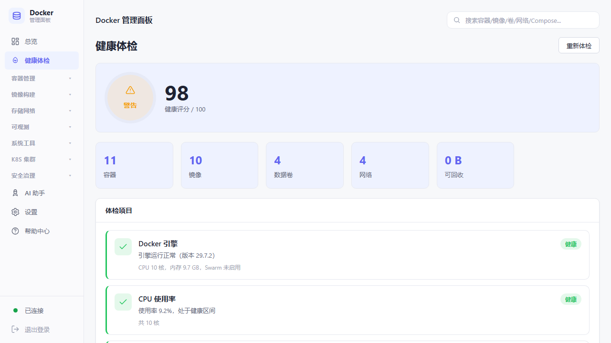

---

## 3. 容器管理

### 3.1 容器列表

菜单：**容器**（`/containers`）

- 列表展示容器名称、镜像、状态、端口、资源占用、创建时间。
- 顶部提供 **状态筛选**（运行中 / 全部）、**搜索框**（按名称 / 镜像过滤）。
- 统计条显示运行中容器数量。

### 3.2 创建容器

1. 点击 **「+ 创建容器」** 或列表上方创建按钮。
2. 在创建弹窗中填写：镜像、容器名、端口映射、环境变量、数据卷挂载等。
3. 也可选择 **「从模板创建」**：在选择框内选择容器页 `容器模板` 中已保存的模板，一键套用其配置。
4. 点击 **「创建」** 完成。

弹窗底部「资源限制」区可在创建时设置：

- **内存上限 (MB)**：如 512，留空表示不限制；
- **CPU 上限 (毫核)**：1000 = 1 核，留空表示不限制。

### 3.3 容器操作

列表每行的 **操作** 列提供：

- **启动 / 停止（启停）**：切换容器运行状态。
- **重启**：重启容器。
- **删除**：删除容器（可勾选是否删除关联数据卷）。
- **克隆**：基于当前容器配置复制生成新容器。
- **重命名**：修改容器名称。
- **查看日志 / 详情**：进入详情页；日志弹窗支持**全屏**、**跟随刷新**（3 秒轮询自动滚动到底，滚轮自动退出）、**行内搜索**（关键字高亮 + 命中计数）、**一键复制**、**自动换行开关**、行号与「到底部」跳转，可按 tail 行数（100/300/1000/全部）拉取并下载。
- **容器终端（1.32.2 优化）**：自动优先使用容器内 bash（支持 Tab 补全），无 bash 时回退 sh；修复多字节字符跨包导致的乱码显示。
- **设置重启策略**：`no` / `always` / `on-failure` / `unless-stopped`。

### 3.4 资源限制在线调整（CPU / 内存）

对已存在的容器修改 CPU / 内存限制（对应 `docker update`，**在线生效、无需重建、不中断运行**），共两个入口：

1. **列表批量调整**：在容器列表勾选一个或多个容器 → 顶部工具栏 **「编辑资源」** → 填写 CPU（核数，如 1 或 1.5）与内存（GB，如 2）→ 保存。留空表示不修改该项，填 **0** 表示取消该项限制。需要管理员或运维角色。
2. **单容器调整**：进入容器详情页的资源限制编辑字段，同样规则（留空不修改；填 0 取消限制）。

> 说明：限制值会被内核向上取整到合法刻度；对运行中容器缩小内存限制时，Docker 要求新值不低于当前已用内存，否则 update 会报错并提示。

### 3.5 容器详情页

点击容器名进入 `containerDetail` 详情页，提供：

1. **基本信息**：状态、镜像、端口、网络、挂载、环境变量、重启策略。
2. **日志**：实时查看容器标准输出日志。
3. **内置 Web 终端**：进入容器内的 `sh` / `bash` 交互（xterm.js + WebSocket），可直接执行命令。
4. **导出配置**：将当前容器配置导出为 JSON，可用于保存为模板。
5. **文件浏览**：见「文件管理」章节。
6. **资源限制调整**：CPU / 内存限制在线修改，见 3.4。
7. **镜像自动更新（1.29.2）**：详情页「镜像自动更新」卡片一键加入/退出。加入后配合「计划任务 → 镜像自动更新」类型任务按周期扫描：按 tag 拉取镜像 → 比较新旧镜像 ID → 有更新按原配置快照重建（端口 / 卷 / 环境变量 / 网络 / 能力位 / 资源限制 / 健康检查全保留）→ 15 秒健康检查 → 未通过自动用旧镜像回滚并推送告警；摘要（@sha256）固定的镜像自动跳过，容器被删除的条目自动停用。1.36.0 起新镜像与信任锁定摘要不符时自动更新被拦截（状态「信任锁定拦截」）。
8. **检查（Inspect）标签页（1.37.0 新增）**：页内格式化查看容器 Inspect 原始 JSON，支持一键复制与下载为 `容器名-inspect.json`，便于排障与归档。
9. **容器内进程（1.37.0 新增）**：「详情」标签页新增进程卡片（docker top），以表格展示容器内全部进程（用户 / PID / CPU / 内存 / 命令行等），可手动刷新。
10. **操作记录（1.37.0 新增）**：「详情」标签页按容器名 / 短 ID 匹配操作日志，展示最近 10 条对该容器的操作留痕（时间 / 操作人 / 动作 / 结果），启停 / 更新 / 删除等全部动作可追溯。


---

## 4. 容器模板 🔒

菜单：**容器模板**（`/templates`，仅管理员）

- 以 **卡片网格** 形式展示已保存的容器部署模板。
- 每张卡片显示：模板名称、镜像、描述、创建时间，并可 **折叠展开查看 config JSON**。

### 4.1 新建模板

1. 点击 **「+ 新建模板」**。
2. 填写：
   - **模板名称**（必填）
   - **描述**（可选）
   - **镜像**（可选，如 `nginx:latest`）
   - **config（JSON）**：与容器导出的配置结构一致，可直接粘贴。
3. 点击 **「创建」** 保存。

### 4.2 编辑模板

- 在卡片上点击 **「编辑」**，修改内容后点击 **「保存」**。

### 4.3 使用模板

- 模板需在 **容器 → 创建 → 从模板创建** 中选用。
- 点击卡片 **「使用」** 会提示前往容器页操作。

### 4.4 删除模板

- 点击卡片 **「删除」**，在确认框中点击 **「删除」**。删除后不可恢复。

### 4.5 搜索

- 顶部搜索框可按 **名称 / 描述 / 镜像** 实时过滤；标题显示当前匹配数与总数。

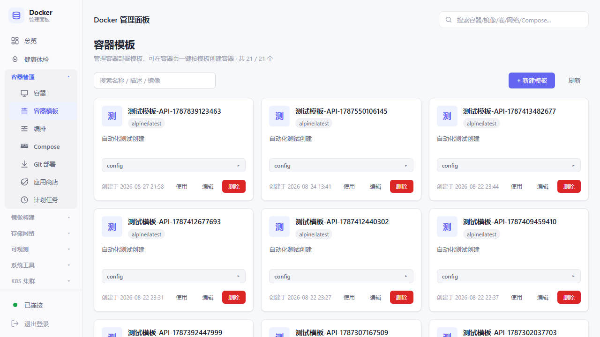

---

## 5. 容器编排 🔒

菜单：**编排**（`/orchestrate`，仅管理员）

- 对多容器应用进行统一编排管理（停止 / 启动 / 扩容等）。
- 该页面操作会记录到操作日志。

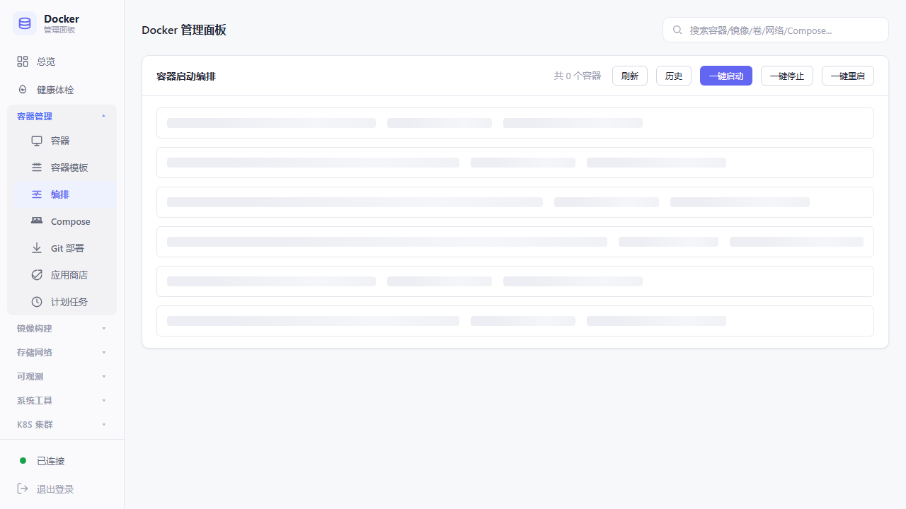

---

## 6. 镜像管理

菜单：**镜像**（`/images`）

### 6.1 镜像列表

- 展示镜像名称、标签、大小、镜像 ID、构建时间、拉取时间，并统计总镜像数、总大小、未使用镜像数。

### 6.2 拉取镜像

1. 点击 **「拉取镜像」**。
2. 输入镜像引用（如 `nginx:latest`）。
3. 选择镜像源（可走镜像加速源），系统自动按源顺序尝试、失败自动切换并重试。
4. 拉取成功后刷新列表。

### 6.3 镜像操作

- **删除**：删除指定镜像（有容器使用时需先删除容器）。
- **推送 / 导入 / 导出**：上传到仓库 / 导入导出镜像文件。
- **打标签**：为镜像添加新标签。
- **清理**：清理未使用的悬空镜像。
- **查看详情 / 构建历史**：进入 `imageDetail` 详情页查看层历史与构建信息。
- **信任锁定（1.34.0）**：工具栏「信任锁定」打开管理弹窗，为镜像仓库（如 `nginx`）锁定期望的 `sha256` 摘要。系统逐一校验运行中容器镜像的实际摘要：与锁定值一致显示「摘要一致」，仓库未锁定显示「未锁定」，不一致则标红「摘要漂移」——用于检测镜像仓库被覆盖、tag 被篡改等供应链漂移风险。支持新增 / 更新 / 解除锁定。
- **信任锁定联动自动更新（1.36.0 新增）**：镜像自动更新拉取新镜像后会校验信任锁定——新镜像摘要与锁定值不一致则拦截本次更新（自动更新状态显示「信任锁定拦截」，任务日志记录原因），防止供应链漂移被自动更新放大；摘要一致或仓库未锁定时正常更新。

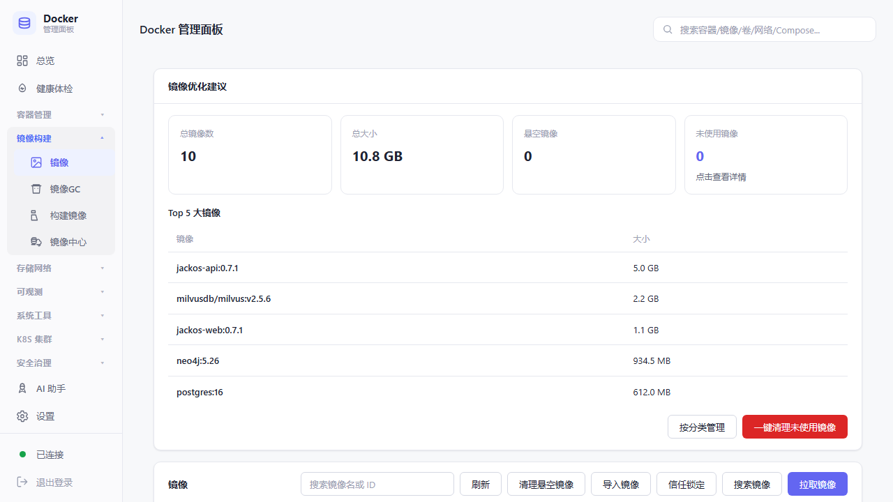

---

## 7. 镜像构建 🔒

菜单：**镜像构建**（`/build`，仅管理员）

1. 选择宿主机上包含 `Dockerfile` 的目录。
2. 配置 **构建参数**（构建参数 / 变量）与 **noCache** 开关。
3. 点击 **「开始构建」**，实时查看构建日志。
4. 构建结果持久化为 **构建历史**：可回溯历史日志、**一键复用**上次的构建配置、**清空**历史。

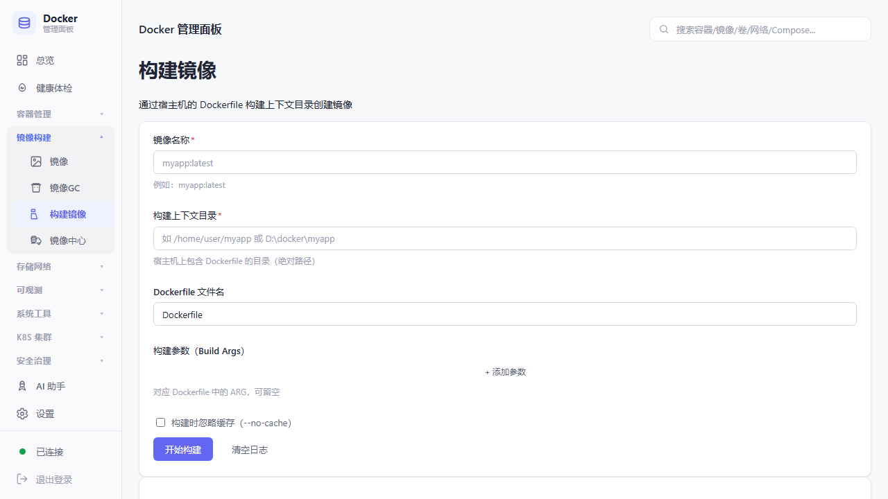

---

## 8. 数据卷 / 存储 / 网络

### 8.1 数据卷（`/volumes`）

- 列表展示卷名称、驱动、状态、挂载点、创建时间。
- **新建卷**：点击「新建卷」，填写名称与驱动后创建。
- **删除**：删除未被占用的卷（占用中的卷不可删）。
- **卷详情**：查看挂载点、使用容器等。
- **清理未使用卷**：一键回收不再被任何容器引用的**匿名卷**；未使用的命名卷（如 `deploy_pgdata` 等数据库卷）默认保留以防误删，结果中会提示保留数量。
- **清理全部未使用卷（含命名卷）**：⚠️ 高危，同时删除未被引用的命名卷（可能含数据库数据），需谨慎使用。

### 8.2 存储（`/storage`）

- 展示磁盘分区使用统计。
- **一键回收**：清理悬空镜像、无用数据卷等占用空间的资源。

### 8.3 网络（`/networks`）

- 列表展示网络名称、驱动、作用域、内部标志等。
- **新建网络**：点击「新建网络」，填写 **网络名称**（第一个输入框）等参数创建。
- **删除**：删除未使用的网络。
- **网络详情**：查看连接容器、IPAM 子网等。
- **清理未使用网络**：回收无容器的网络。

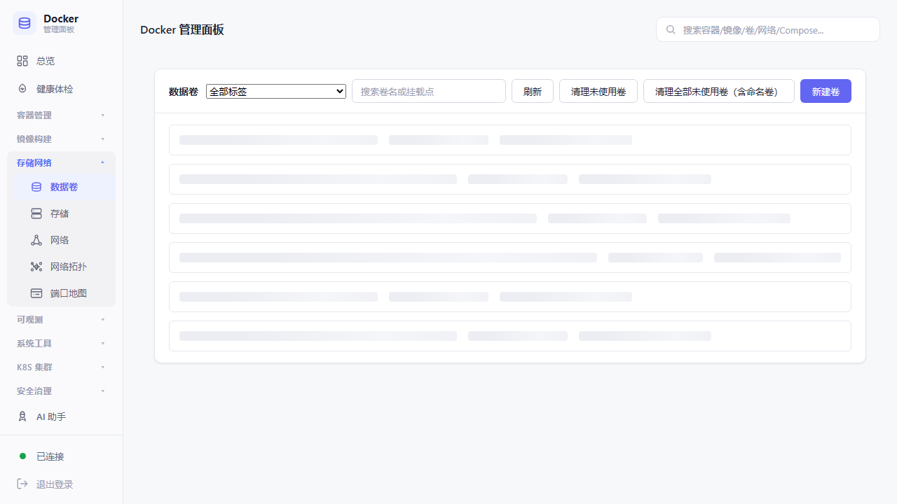

---

## 9. Compose 编排

菜单：**Compose**（`/compose`）

- 列表展示 Compose 项目名称、状态、Compose 文件与路径。
- **新建 / 编辑**：填写或多行粘贴 `docker-compose.yml` 内容。
- **从 docker run 导入（1.29.1）**：新建项目弹窗内点击「从 docker run 导入」，粘贴完整 `docker run` 命令即可自动转换为 compose service YAML 并填入编辑器。支持映射：`--name` / `-p` 端口 / `-v` 与 `--mount` 卷（bind、命名卷自动归集顶层声明、匿名卷）/ `-e` 环境变量 / `--restart` / 自定义网络 / `--label` / `--user` / `--workdir` / `--privileged` / `--cap-add` / `--cap-drop` / `--device` / `--cpus` / `-m --memory` / `--entrypoint` / `--health-*`，镜像后的命令参数映射为 `command`；`--gpus`、`--env-file`、host 网络与未知选项不会静默丢弃，而是逐条告警提示手动补充。
- 提供编排操作：**Up**（部署启动）、**Down**（停止移除）、**Pull**（拉取镜像）、**Build**（构建镜像）。
- **项目资源看板（1.34.0）**：每行「看板」按钮按服务聚合展示项目内全部容器的 CPU / 内存 / 网络收发 / 磁盘读写汇总，支持服务级**滚动更新**（pull 最新镜像后仅重建该服务，`--no-deps` 不影响其他服务）。1.35.0 起更新后自动**健康检查**（60 秒内容器须保持运行，配置了 healthcheck 的服务须达到 healthy），失败时自动把旧镜像打回原 tag 并重建回滚，结果在提示中明确反馈。
- **全项目滚动更新编排（1.38.0 新增）**：看板底部「全部滚动更新」按 compose 定义顺序逐个服务执行 pull → 重建 → 健康检查 → 失败自动回滚，单服务失败默认继续下一服务，完成后按服务汇总成功 / 失败与回滚状态；接口 `POST /api/compose/:name/rolling-update-all`。
- **远端配置漂移检测（1.38.0 新增）**：看板底部「漂移检测」将本地 compose 配置与目标引擎（留空 = 本地引擎）上带项目标签的实际容器逐服务比对镜像 / 端口 / 环境变量 / 重启策略，报告「一致 / 漂移 / 远端缺失 / 本地缺失」状态与差异项，用于发现绕过面板的手工改动；接口 `GET /api/compose/:name/drift`。**漂移自动修复（1.40.0 新增）**：检测结果中勾选要修复的服务后一键按本地配置重建——本地引擎直接 `docker compose up -d --force-recreate`，远端引擎先拉取镜像再逐服务重建；接口 `POST /api/compose/:name/fix-drift`。
- **跨引擎镜像分发与代理部署（1.34.0 / 1.35.0）**：看板内「分发镜像到其他引擎」可将项目全部服务镜像预拉取到指定远端引擎（每行一个 `tcp://host:port`）；勾选「分发后在远端启动（代理部署）」后，镜像就位即按 compose 配置在远端创建并启动全部服务容器——端口映射、卷挂载、环境变量、重启策略与项目默认网络完整还原，并写入 compose 项目标签，远端容器同样纳入面板看板与统计。已存在的同名容器自动跳过。也可用接口 `POST /api/compose/:name/remote-deploy` 单独部署（支持 `recreate: true` 强制重建）。
- 点击展开可查看 Compose 文件内容与结构（端口映射等）。

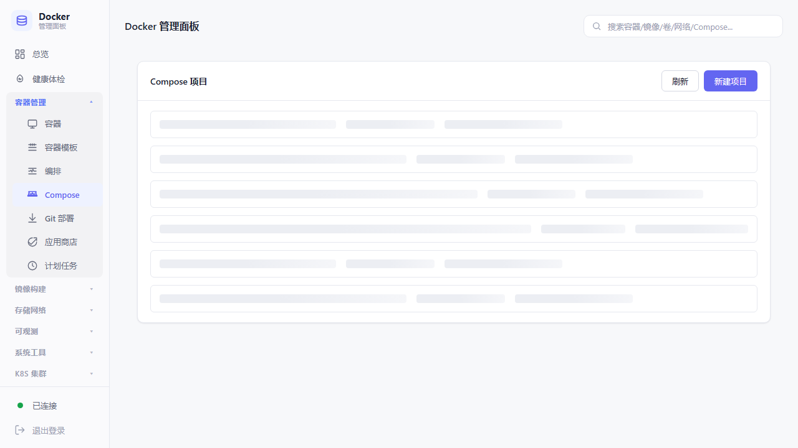

---

## 10. 应用商店

菜单：**应用商店**（`/appstore`）

1. 打开应用商店，浏览内置应用目录（卡片形式，含分类筛选）。
2. 点击应用卡片进入详情，可查看说明、版本、端口清单。
3. 根据提示填写 **应用参数**（如端口、镜像源等；可选择使用默认镜像源）。
4. 点击 **「安装」**，一键完成部署；已安装实例会标记状态。
5. 可对已安装实例执行停止 / 卸载等管理操作。

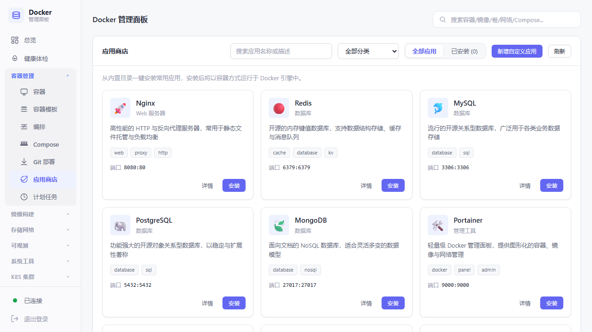

---

## 11. 计划任务

菜单：**计划任务**（`/tasks`）

- 管理定时自动化任务（周期执行 / 按依赖触发容器操作等）。
- **新建任务**：选择任务类型、执行周期（cron 表达式 / 间隔）、目标容器与操作。
- **安全基线扫描（baselineScan）**：定时对全部容器执行安全基线扫描；默认仅告警"警告及以上"且**与上次扫描对比后新增的违规**，命中后推送到已启用的通知渠道。可在任务配置中调整告警严重度下限、关闭"仅新增"改为每次有违规即推送。
- 支持启用 / 暂停、立即执行、删除、编辑。
- **执行日志**：查看每次任务的执行结果与失败原因。

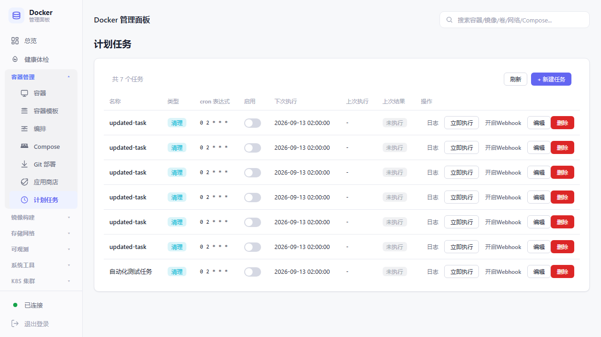

---

## 12. 文件管理 / 宿主机文件 / 宿主机终端

### 12.1 容器文件管理（`/files`）

- **容器内文件浏览**：进入某容器后浏览其文件系统。
- **上传 / 下载 / 编辑**：上传文件到容器、从容器下载、在线编辑文件内容。

### 12.2 宿主机文件（`/hostfiles`）

- 浏览宿主机文件系统（谨慎操作，涉及系统级读写）。
- 支持基本的上传 / 下载 / 编辑。

### 12.3 宿主机终端（`/hostterminal`）

- 打开宿主机远程终端（基于 xterm），直接执行宿主机命令。
- **仅建议管理员使用**，操作需谨慎。
- **root 提权（1.34.1）**：Linux 上若面板服务以低权限用户运行（默认 systemd `User=dockerman`），终端会自动检测并改经 **Docker 助手容器**进入宿主机 root shell（`--privileged --pid=host` + `nsenter` 进入 PID 1 命名空间，连接横幅会注明助手镜像）；本地无 docker CLI 或无可用助手镜像时回退为普通用户并在终端内给出提示。面板以 root 运行时直接获得 root shell。`sudo` 在服务账号下不可用（系统账号无密码且 systemd `NoNewPrivileges` 禁止 setuid），如需原生 root 也可将服务改为 `User=root` 运行。

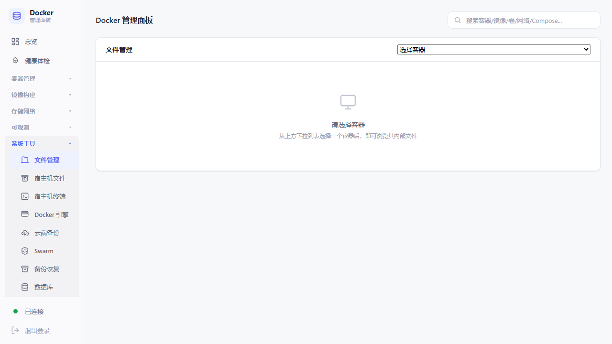

---

## 13. Docker 引擎 🔒

菜单：**Docker 引擎**（`/engines`，仅管理员）

- 管理多个 Docker 引擎端点（本地或远程）。
- **新增引擎**：填写端点地址（`npipe://` / `tcp://` 等）与可选的 TLS 配置。
- **编辑 / 删除**：管理已有端点。
- **设为当前**：切换当前使用的引擎端点。
- 端点连接自动探测与验证，便于连接多台主机的 Docker。
- **镜像拉取缓存（1.34.0）**：内置 pull-through 缓存（`registry:2` 代理模式，端口 5060）。引擎管理页一键部署后，其他引擎将 `dm-registry-cache:5060` 配置为 registry mirror，即可共享本地缓存，重复拉取同一镜像不再重复出外网流量；支持查看运行状态与一键移除。配合 Compose 看板的「分发镜像到其他引擎」可先把镜像预热到远端。


---

## 14. 云备份 🔒

菜单：**云备份**（`/cloudbackup`，仅管理员）

- 配置云端备份目标：**S3 / OSS / WebDAV**。
- **新增目标**：填写 AccessKey、Secret、Bucket / 路径、Endpoint 等。
- **连通性测试**：校验目标配置是否正确可写。
- **文件上传**：手动将备份文件上传到云端目标。
- 云端备份能力可在「备份恢复」中与本地备份配合使用。

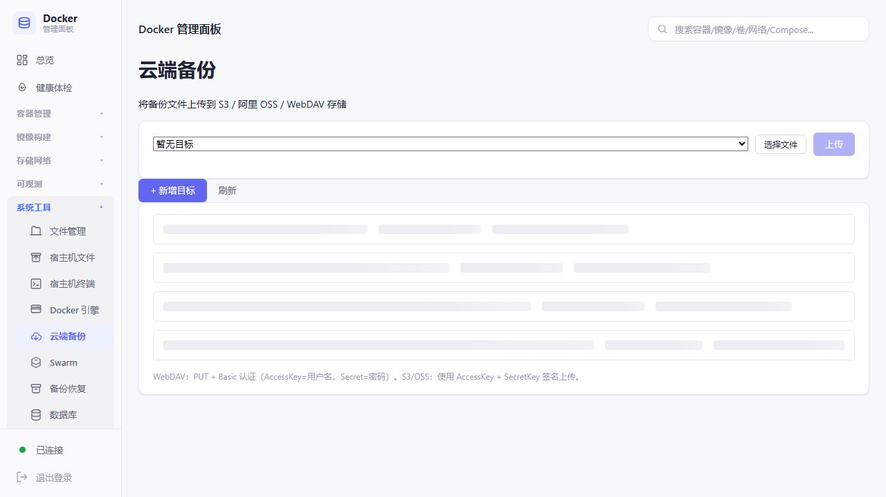

---

## 15. 备份恢复

菜单：**备份恢复**（`/backups`）

### 15.1 创建备份

- 支持备份类型：**DATA（全部数据）/ Compose / 数据卷 / 站点**。
- 点击「新建备份」选择类型后执行，生成备份记录。

### 15.2 恢复与下载

- 备份列表中可 **下载** 备份文件、**恢复** 到当前环境、**删除** 过期备份。
- 可将备份文件 **上传到云端**（此前需在「云备份」配置目标）。

### 15.3 数据迁移

- 复制整个 `data/` 目录（核心为 `docker-manager.db`）即可完成配置备份与迁移。

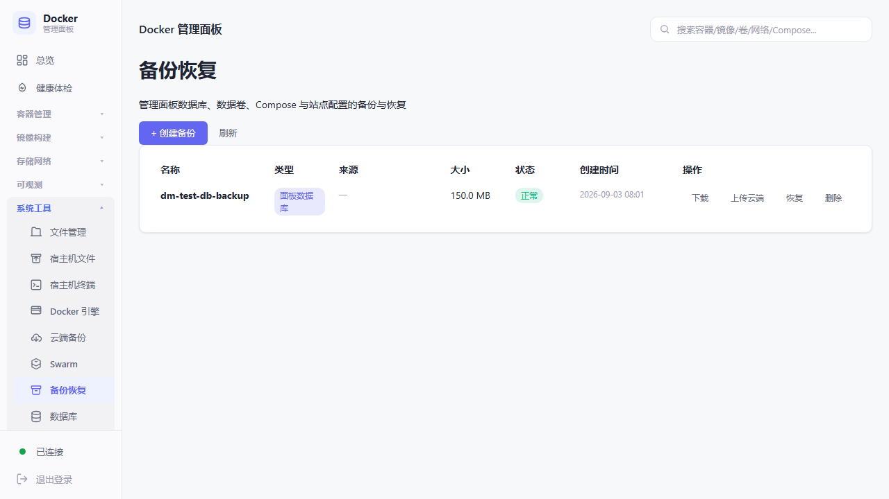

### 15.4 面板数据库备份管理（设置中心）

菜单：**设置 → 面板数据库备份管理**（仅管理员）

- **立即备份**：对面板自身 SQLite 数据库（docker-manager.db）做一致性快照（VACUUM INTO，不停服），保存在数据目录 db-backups/ 下。
- **恢复**：列表中一键恢复，当前数据被覆盖后立即生效（建议随后重启面板）；恢复前文件经 SQLite 格式校验与恢复后完整性检查。
- **下载 / 删除**：备份文件可下载留存或手动删除。
- **定时备份**：在「计划任务」新建类型为**数据库备份**的任务即可自动定时备份；保留份数由系统参数「面板数据库备份保留份数」控制（默认保留最近 7 份，0 表示不自动清理）。


---

## 16. Swarm 集群 🔒

菜单：**Swarm**（`/swarm`，仅管理员）

- 展示 / 管理 Docker Swarm 集群节点与服务。
- 当宿主机已初始化或加入 Swarm 时可用；不常用场景可忽略。

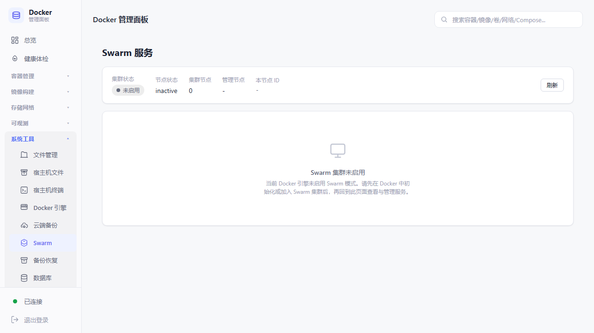

---

## 17. 数据库可视化

菜单：**数据库**（`/databases`）

- 可视化查看容器化的 **MySQL / PostgreSQL / Redis** 等数据库实例（**只读保护**，不直接修改数据）。

### 17.1 新增实例

1. 点击「新增实例」。
2. 填写实例名称、类型、连接信息（宿主 / 端口 / 账号 / 密码等）。
3. 保存后即可在列表中打开该实例进行可视化查询。

### 17.2 查询与信息查看

- 打开实例可查看表结构、执行只读查询、浏览数据。
- 仅提供信息展示，**不提供破坏性写操作**。

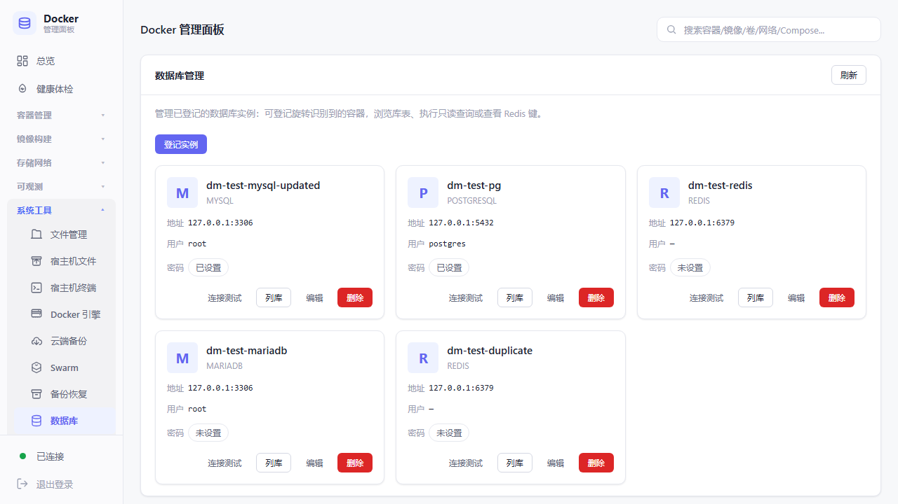

---

## 18. 镜像中心（Hub）

菜单：**镜像中心**（`/hub`）

### 18.1 镜像源配置

- 查看 / 配置 **Docker 镜像加速源**（内置轩辕、1ms 等默认源）。
- **搜索源**：用于在线搜索 Docker Hub 镜像。若默认源不支持搜索可更换为可搜索源（见 25.2 常见问题）。

### 18.2 在线搜索与快捷拉取

- 输入关键字 **在线搜索** Docker Hub 镜像。
- **常用镜像**：一键快捷拉取常用镜像（nginx、redis、mysql 等）。
- 搜索结果可一键跳转到镜像页拉取。


---

## 19. 事件流

菜单：**事件流**（`/events`）

- 实时查看 Docker 引擎事件流（create / start / stop / die 等）。
- 事件 **持久化到 SQLite**，可查询 **历史事件**。
- 支持 **导出 CSV**、**清空** 历史事件。

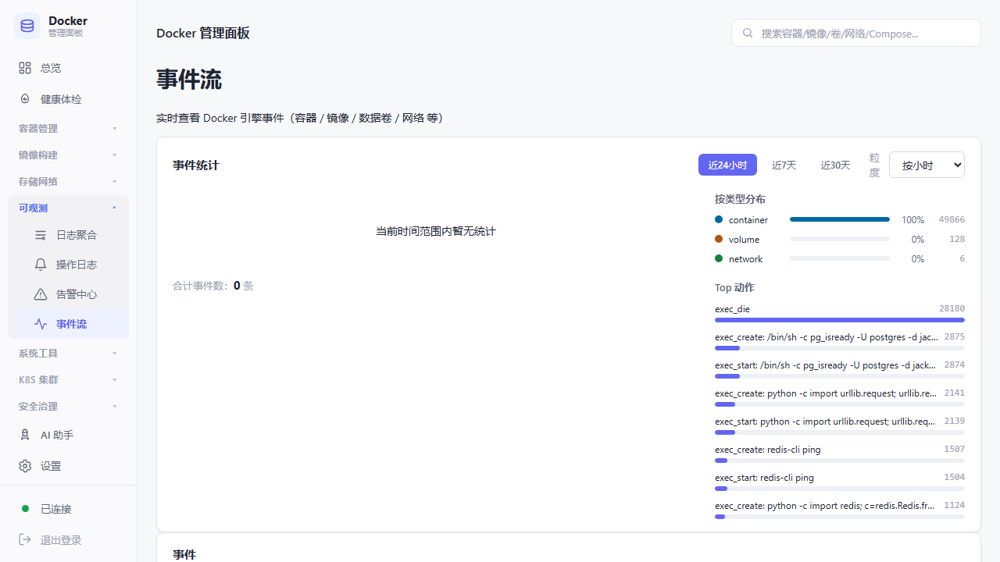

---

## 20. 操作日志

菜单：**操作日志**（`/operation-logs`）

- 审计管理员在系统中的管理操作（删除、创建、配置变更等），便于追溯与安全审计。

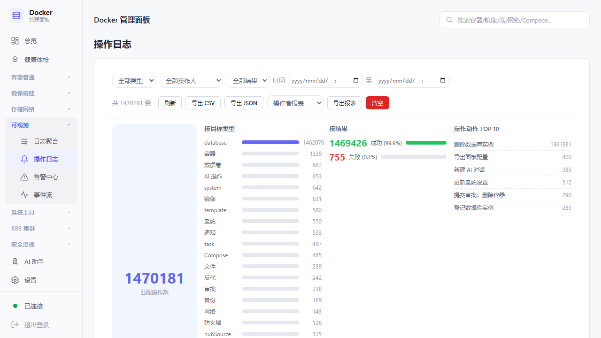

---

## 21. 通知告警 🔒

菜单：**通知告警**（`/notifications`，仅管理员）

- 配置系统告警通知渠道（Webhook / 邮件 / 钉钉 / 飞书 / Telegram / 企业微信 / Slack 等）与告警规则。
- 支持 **容器规则**：针对特定容器（如退出、频繁重启、资源异常）配置告警触发条件。
- 事件发生时按规则向目标推送告警；列表可查看已触发的告警记录与触发时间。
- 支持 **连续周期防抖**：规则可要求连续 N 个采样周期超阈值才触发，过滤瞬时毛刺。
- 支持 **多渠道路由**：「推送路由」卡片可选择仅首个启用渠道（兼容旧版）/ 全部启用渠道 / 按级别路由（warn / danger / recovery 各自勾选目标渠道，未勾选时回退首个启用渠道）。
- **渠道送达率统计**：「送达率统计」卡片按渠道汇总近 7 天的推送成功 / 失败次数与成功率、最近成功与失败时间，并列出最近失败明细（含失败原因），便于及时发现配置失效的渠道。覆盖告警 / 恢复 / 自愈 / 审批 / AI 诊断 / 周报 / 测试推送等全部推送链路。
- **磁盘写满趋势预测（1.34.0）**：基于近 24 小时磁盘使用历史做线性回归外推，预测 N 天内写满即告警（系统参数「通知告警 → 磁盘写满预测阈值（天）」，默认 7，设 0 关闭）。同一告警 24 小时内只重复推送一次，避免告警风暴。
- **内存耗尽趋势预测（1.35.0）**：与磁盘预测同框架，基于近 24 小时内存使用增长做线性回归，预计耗尽天数达到阈值（系统参数「内存耗尽预测阈值（天）」，默认 7，设 0 关闭）即推送告警；同一预测 24 小时内只推送一次。
- **预测留档（1.35.1）**：趋势预测告警与普通告警共用推送聚合与送达状态链路，并写入「告警记录」（类型：磁盘预测 / 内存预测），历史预测可在通知页回看。
- **静默期值班渠道（1.34.0）**：告警规则进入静默窗口期间，可将其摘要转发到指定值班渠道（系统参数「通知告警 → 静默期值班渠道」选择渠道 ID），静默不等于失联——值班人员仍能收到兜底通知，同一规则 30 分钟内只转发一次。

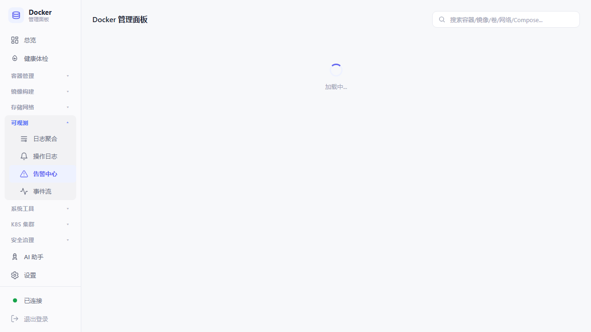

---

## 22. 站点反代 🔒

菜单：**站点（反代 / 端口映射）**（`/sites`，仅管理员）

- 基于反代容器的 **站点反向代理 / 端口映射** 管理。
- **新增站点**：填写站点域名、目标上游地址、端口等。
- 支持 **启停** 与配置 **reload**。
- **SSL 证书**：查看证书状态与有效期，可 **上传证书** 替换现有证书（「上传证书」按钮）。

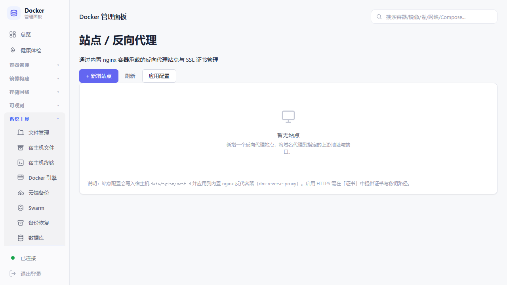

---

## 23. 防火墙 🔒

菜单：**防火墙**（`/firewall`，仅管理员）

- 管理 Windows 防火墙的 **入站端口放行** 规则（基于系统 `netsh`）。
- **新增规则**：填写端口、协议后放行入站访问。
- 删除不需要的放行规则。
- 需要管理员权限运行，操作时可能有系统提示。

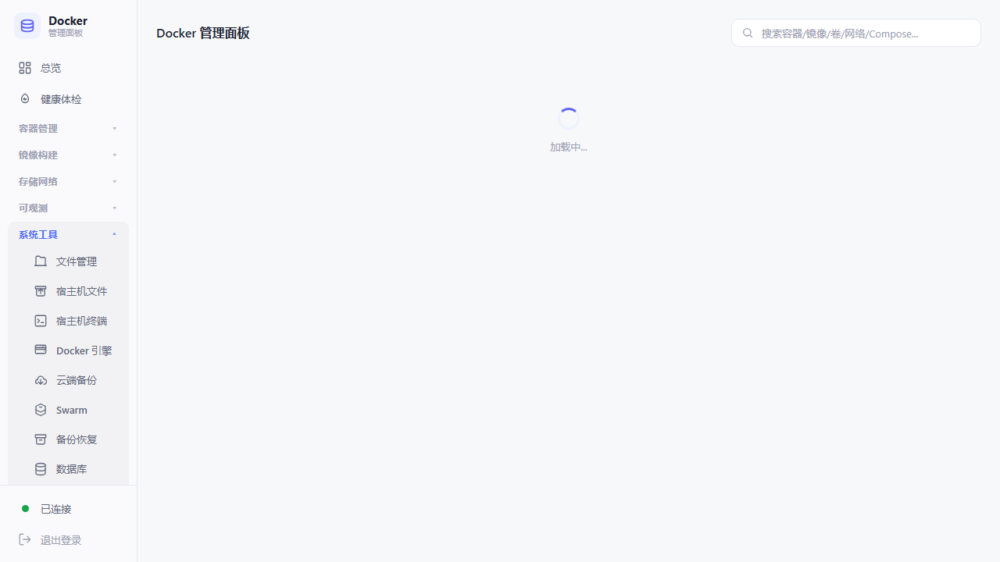

---

## 24. 应用商店与系统设置

### 24.1 系统设置（`/settings`）

- **主题**：切换浅色 / 深色主题。
- **语言**：在「关于」卡片的「界面语言」中切换 中文 / English，偏好即时生效并存于浏览器本地。0.6.0 起内置 i18n 骨架，1.0.0 起全部页面完成中英文覆盖（未收录文案自动回退中文显示）。
- **用户与密码管理**：管理员可在此新增 / 删除用户、修改用户密码（与登录鉴权关联）。
- **角色管理（RBAC）**：管理员可新建自定义角色并按操作白名单授权（容器 / 镜像 / 卷 / 网络 / 编排 / 自愈 6 组共 14 项资源域权限）；内置角色 admin / user / auditor 锁定，operator 权限集可调整；仍有用户使用的角色禁止删除。角色权限仅作用于资源管理域，用户管理、系统设置、引擎切换等系统级操作始终需要管理员。持有权限的角色成员可在对应页面直接看到可用的操作按钮（未授权的按钮自动隐藏），终端等高危入口同样按权限放行。
- **数据保留（自动清理）**：操作日志默认保留 90 天、AI 用量明细与 AI 巡检记录默认保留 30 天，超期数据在读取时每日自动清理一次；设为 `0` 表示永久保留（见「系统参数 → 数据保留」）。
- **统一留存策略（1.36.0 新增）**：「系统参数 → 数据保留」新增三项——「告警记录保留条数」（`alerts.recordLimit`，默认 800，最小 50，超出自动清理最旧记录）、「原始指标保留天数」（`metrics.rawRetentionDays`，默认 7）、「小时聚合保留天数」（`metrics.hourlyRetentionDays`，默认 90）；监控与告警数据的保留周期全部可调。
- **两步验证（2FA）**：1.1.0 起内置 TOTP 双因素认证（RFC 6238）。在「设置 → 安全加固 → 两步验证」点击「生成密钥」，用 Google Authenticator 等认证器 App 扫码或手动录入密钥，输入首枚验证码确认启用；此后登录需在密码之后输入 6 位验证码（密钥错误 2 分钟内可重试，票据过期需重新登录）。关闭 2FA 需输入当前验证码确认。
- **在线会话**：同一区块展示当前全部活跃会话（会话 ID / 用户 / IP / 登录时间），当前会话带「当前」标记；支持撤销单条会话或「撤销其他会话」一键下线其余设备。管理员可在「系统参数 → 安全」配置「单用户并发会话上限」（超出自动淘汰最早会话，0 = 不限制）。
- **IP 白名单**：支持全局白名单（系统参数 `security.ipAllowlist`）与按用户白名单（用户表格内联编辑），填写 IP 或 IPv4 CIDR（如 `192.168.1.0/24`），逗号分隔；用户级优先于全局，均留空不限制。白名单在登录与每次 API 请求时双重校验，未命中返回 403。**注意：全局白名单请务必包含管理机自身 IP，避免自锁。**
- **密码策略**：系统参数「安全」分组可配置密码最小长度（默认 6）、是否强制包含大小写与数字、密码有效期（天，过期后下次登录强制改密；0 = 不过期）；策略对新建用户与修改密码统一生效。
- **容器资源级授权（1.38.0 新增）**：账号管理表格新增「容器白名单」列（CSV，支持 `前缀*` 通配，留空 = 不限制）——配置后该用户的容器列表仅显示名单内容器，对名单外容器的详情 / 启停 / 日志 / 文件等访问返回 403，拦截记录写入操作日志；管理员不受限制。**终端 WebSocket 同样纳入拦截（1.40.0）**：名单外容器拒绝建立终端连接并留痕，拦截范围与 HTTP 接口同口径。
- **指标长周期历史（1.2.0）**：主机与容器指标在 7 天原始采样之外，自动做小时级聚合（CPU 均值/峰值、内存均值/峰值、磁盘、网络增量）并保留 **90 天**（1.36.0 起两档保留天数均可在「系统参数 → 数据保留」调整）。总览「资源监控」与容器详情「资源曲线」的时间窗新增 **30 天 / 90 天**（30d 每 6 小时一点、90d 每 12 小时一点），适合观察周级/月级容量与负载趋势。
- **漏洞定时扫描（1.2.0）**：「计划任务」新增类型「漏洞定时扫描」——可填镜像列表（英文逗号分隔，留空自动扫描本地镜像前 N 个，默认 20），勾选「新增高危时推送告警」后，扫描结果与上次对比，新增 Critical / High 漏洞会推送到全部启用通知渠道。扫描历史可在镜像详情页「漏洞扫描（Trivy）」卡片的「扫描历史（定时任务）」表格中查看（含较上次新增的高危 CVE）。Trivy 未安装时任务自动跳过并说明。
- **多级审批链（1.3.0）**：系统参数「安全 → 两级审批动作」填入动作类型（如 `container.delete,image.deleteBatch`），这些动作的审批单需**两级签批**——第一级运维（operator）或管理员通过后进入第二级，**末级必须管理员**签批方可执行；审批中心展示「第 1/2 级」进度与完整签批轨迹（决策人 / 时间 / 理由），每级通过均推送进度通知。审批记录自带唯一编号 `AP-YYYYMMDD-ID`（列表、通知与门禁响应统一携带，存量记录自动回填），便于在工单系统中引用。
- **审批超时提醒（1.3.0）**：待审批达到 TTL（`approvals.ttlHours`）的 3/4 时自动推送一次催办通知（每条记录仅提醒一次），超时后仍自动过期作废；过期清理由定时器主动执行，不再依赖查询时惰性触发。
- **OpenAPI 接口文档（1.4.0）**：`GET /api/openapi.json`（需登录）输出面板后端的 OpenAPI 3.0 核心端点骨架，覆盖认证 / 监控 / 容器 / 镜像 / 卷 / 网络 / 编排 / 计划任务 / 审批 / 系统管理共 34 个路径，含方法、说明、查询参数与 Bearer 鉴权声明。侧栏「API 文档」页按业务域分组浏览并支持搜索，可用于二次开发与自动化对接（完整字段以路由实现为准）。
- **MCP 接入（1.29.0）**：设置页「MCP 接入」卡片（管理员）可开启内置 MCP 服务端并生成 Bearer Token。MCP 客户端（Claude Desktop / Cursor 等）以 `<面板地址>/api/mcp` 为端点、请求头 `Authorization: Bearer <Token>` 鉴权，即可用自然语言管理面板。18 个工具覆盖：系统快照、容器（列表 / 详情 / 日志 / 启停 / 重启 / 强杀 / 删除，支持 id 前缀或名称寻址）、镜像（列表 / 拉取 / 删除）、数据卷、网络、告警规则与记录、计划任务（列表 / 立即执行）。协议为 JSON-RPC 2.0（Streamable HTTP），零额外依赖；所有调用写入操作日志（操作人 = mcp），重置 Token 立即失效旧凭据，未开启或未配置 Token 时端点整体 404。
- **PWA 与移动端**：面板支持添加到主屏（manifest + Service Worker 静态壳缓存，不拦截 /api 与 /ws）；768px 以下自动启用移动端布局（侧栏抽屉化、表格横向滚动、触控区域优化）。1.34.0 起移动端新增**底部导航栏**（总览 / 容器 / 镜像 / 日志 / 更多），并支持左右滑动手势打开或收起侧栏抽屉。


---

## 25. 详细参数表

下面是各功能新增 / 编辑弹窗的字段明细，方便填写时参考。标注「*」为必填项。

### 25.1 Docker 引擎端点（`/engines`）

| 字段 | 说明 | 是否必填 |
| --- | --- | --- |
| 引擎名称 * | 如「服务器B」 | 必填 |
| 端点地址 * | `npipe://` / `tcp://host:2375` / `unix://`，如 `tcp://192.168.1.10:2375` | 必填 |

> 引擎身份与连接由端点地址的 scheme（npipe / tcp / unix）决定，无独立 TLS 字段。

### 25.2 云端备份目标（`/cloudbackup`）

| 字段 | 说明 | 是否必填 |
| --- | --- | --- |
| 类型 | `WebDAV` / `S3` / `阿里 OSS` | 否 |
| 名称 * | 如「我的 NAS / 腾讯云 COS」 | 必填 |
| 端点地址 * | WebDAV 填服务器地址；OSS 填 `https://oss-cn-hangzhou.aliyuncs.com`；S3 填 `https://s3.region.amazonaws.com` | 必填 |
| 桶名（Bucket） | 仅 S3 / OSS 显示，如 `my-bucket` | S3/OSS 必填 |
| Region | 仅 S3 显示，如 `us-east-1` | 否 |
| 基路径（可选） | 如 `backup/app1` | 否 |
| AccessKey / 用户名 | WebDAV 用「用户名」，S3/OSS 用「访问密钥 ID」 | 否 |
| 密码 / SecretKey | WebDAV 用密码，S3/OSS 用 SecretKey（编辑留空则保持原密钥） | 否 |

### 25.3 数据库实例（`/databases`）

| 字段 | 说明 | 是否必填 |
| --- | --- | --- |
| 名称 * | 如「主数据库」 | 必填 |
| 类型 | `MySQL` / `PostgreSQL` / `MariaDB` / `Redis` | 必填 |
| 主机 * | `127.0.0.1` 或容器名 | 必填 |
| 端口 * | `3306` / `5432` / `6379` | 必填 |
| 用户名 | `root`（可空） | 否 |
| 密码 | 编辑留空则保持原密码 / 无密码连接 | 否 |

> 新建数据库（MySQL/MariaDB）：数据库名（必填）+ 字符集（`utf8mb4` / `utf8mb3` / `utf8` / `gbk` / `latin1`，创建后不可改）。
> Redis 查询：匹配模式（如 `*` / `user:*`）+ 限制条数。

### 25.4 站点（反代 / 端口映射，`/sites`）

| 字段 | 说明 | 是否必填 |
| --- | --- | --- |
| 域名 * | 如 `app.example.com` | 必填 |
| 上游地址 * | `localhost` / `127.0.0.1` / 容器名 | 必填 |
| 上游端口 * | 1–65535 | 必填 |
| 监听端口 | 宿主机对外端口（HTTP 默认 80，HTTPS 建议 443） | 否 |
| 启用 HTTPS | 勾选后显示「证书文件路径」 | 否 |
| 证书文件路径 | 宿主机绝对路径，如 `C:\certs\app.pem` | 仅 HTTPS |
| 高级：WebSocket 透传 / gzip / 访问控制 | 各为开关 | 否 |
| 访问控制用户名 / 密码 | 启用访问控制时显示 | 启用即必填 |
| 请求限速 | 如 `5r/s` 或 `10r/m` | 否 |
| 客户端请求体上限 | 如 `10m`（默认 `1m`） | 否 |
| 代理超时（秒） | 默认 60 | 否 |
| 自定义配置片段 | 额外 nginx 指令（TextArea） | 否 |

### 25.5 通知告警（`/notifications`）

**通知渠道**：渠道名称 *、渠道类型（`Webhook` / `邮件 SMTP` / `钉钉机器人` / `飞书机器人` / `Telegram Bot` / `企业微信` / `Slack`）。

| 类型 | 字段 |
| --- | --- |
| Webhook | Webhook 地址 *、Secret |
| 邮件 SMTP | SMTP 主机 *、端口 *、使用 SSL、账号、密码、发件人 *、收件人（逗号分隔）* |
| 钉钉机器人 | access_token *、加签密钥 Secret |
| 飞书机器人 | Webhook 地址 * |
| Telegram Bot | Bot Token *、Chat ID * |
| 企业微信 | Webhook 地址 * |
| Slack | Webhook 地址 * |

**推送路由**：决定告警实际发往哪些启用渠道。

| 策略 | 行为 |
| --- | --- |
| 仅首个启用渠道（默认） | 兼容旧版行为，告警只发第一个启用的渠道 |
| 全部启用渠道 | 告警同时推送到所有启用的渠道 |
| 按级别路由 | warn / danger / recovery 三级各自勾选目标渠道；某级别未勾选任何渠道时回退首个启用渠道；已停用的渠道自动剔除 |

**消息模板（渠道级）**：编辑渠道时可填写消息模板，支持变量 `{{level}}`（级别）、`{{message}}`（消息原文）、`{{time}}`（推送时间）、`{{channel}}`（渠道名）。留空保持默认文案；未识别的变量原样保留。告警、恢复、自愈、审批等全部推送链路均按渠道模板渲染。

**容器自愈**：按容器名（精确匹配，容器重建后依然生效）配置自动恢复规则。

| 字段 | 说明 |
| --- | --- |
| 容器名 | 精确匹配容器名（docker ps 的 NAME 列），容器重建后依然生效；与「匹配标签」二选一 |
| 匹配标签 *（1.40.0） | 按 Docker label 匹配一批容器，如 `team=api` 或仅 `key`；填写后优先于容器名 |
| 监控条件 * | 健康检查失败（unhealthy）/ 容器退出或死亡（exited/dead） |
| 恢复动作 * | 重启容器（restart）/ 启动容器（start） |
| 冷却期 * | 同一规则两次触发的最小间隔，10–86400 秒（默认 300），防止反复重启刷屏 |
| 触发上限（1.40.0） | 统计窗口内最多触发次数（0 / 留空 = 不限制），窗口默认 3600 秒（60–86400 可调）；超限后暂停自愈并发一次 danger 告警，防止崩溃循环无限重启 |
| 启用开关 | 停用的规则不参与巡检 |

后台每 10 秒巡检一次；命中即执行动作并写入告警记录（类型 = 自愈）：成功推 recovery 级通知、失败推 danger 级通知，均按推送路由与渠道模板发送。卡片右上角「立即巡检」可手动触发一轮检测。

**自愈执行记录（1.39.0）**：每次触发自愈动作都会写入执行留档（触发原因 / 动作 / 成败 / 详情 / 时间，保留最近 200 条），自愈卡片下方的「最近执行记录」表格展示最近 50 条，手动巡检后自动刷新；接口 `GET /api/selfheal/events`。

**告警规则（资源：CPU / 内存 / 磁盘 / GPU / 网络 / 容器资源）**：启用开关、警告阈值 *、危险阈值 *、连续周期（连续 N 个采样周期超阈值才触发，默认 1 = 立即告警）、静默时段、仅工作日、工作时段。前五类为宿主级资源（百分比，网络为 Mbps）；「容器资源」为容器资源异常规则，作用于**全部运行中容器**、无需逐个配置：CPU 阈值为容器口径（100% = 单核满载，多核机器可超过 100%，默认警告 100% / 危险 200%），内存阈值为**绝对占用量 MB**（默认警告 2048 MB / 危险 4096 MB，适用于未设置内存限制的容器）。任一容器命中即写入告警记录（类型 = 容器资源）并推送，每容器独立去重与恢复通知。

**容器告警规则**：目标容器 *、监控类型 *（退出 / 健康检查 / 端口 / CPU / 内存）、探测端口（端口类）、警告阈值 %、危险阈值 %、连续周期（仅 CPU / 内存类型生效）、启用开关、静默时段、仅工作日、工作时段。

**告警推送聚合（防风暴）**：系统参数 `alerts.pushAggWindowSec`（默认 60 秒，0 = 关闭）。窗口内多条 warn/danger 告警不会逐条刷屏，而是合并为一条摘要（最多展示 5 条原文并附总条数）；**恢复通知始终即时推送**，不受聚合影响。被聚合的告警记录仍逐条落库（推送状态标记为「已聚合」）；聚合推送不触发 AI 诊断。

**防抖四件套**：瞬时毛刺过滤（连续周期）→ 推送聚合 → 静默时段 / 工作时段 → 同类告警 30 分钟去重，可按需组合。

### 25.6 防火墙（`/firewall`）

| 字段 | 说明 | 是否必填 |
| --- | --- | --- |
| 端口号 * | 1–65535，如 `8080` | 必填 |
| 协议 | `TCP` / `UDP` | 否 |
| 备注（可选） | 如「Nginx 对外服务」 | 否 |

### 25.7 计划任务（`/tasks`）

通用字段：任务名称 *、任务类型 *、cron 表达式 *（5 段：分 时 日 月 星期）、启用开关。

任务类型与对应参数：
- **清理（prune）**：范围（未使用镜像 / 已停止容器 / 未使用数据卷 / 未使用网络 / Build Cache）
- **备份（backup）**：目标（面板数据库 / 命名卷）、卷名（命名卷时必填，逗号分隔）、保留备份数
- **拉取镜像（pull）**：镜像名称 *（如 `nginx:latest`）
- **重启容器（restart）/ 容器健康检查（healthcheck）**：目标容器 *（可多选）
- **自定义命令（command）**：执行命令 *、工作目录
- **拉起/停止 compose（composeUp / composeDown）**：Compose 项目 *
- **Git 自动部署（git-pull-build）**：部署模式（构建镜像 / Compose 部署）、Git 仓库地址 *、分支、镜像名 / Compose 项目、私有仓库凭证（HTTPS Token / SSH 私钥）

### 25.8 Compose 项目（`/compose`）

- 新建：项目名称 * + `docker-compose.yml`（必填，可从模板选择：空白 / WordPress / Nginx 静态站 / Redis / PostgreSQL / Node.js；支持上传 `.yml` / `.yaml` 文件）
- 编辑：仅 `docker-compose.yml`
- 保存为模板：模板名称 *、描述
- 删除：可勾选「同时删除该项目的数据卷」

### 25.9 应用商店（`/appstore`）

安装应用时配置：
- **环境变量**：按应用声明逐项填写 KEY / 值（有默认值无说明的标必填）
- **端口映射**（可增删）：容器端口、宿主机端口（可空）、协议（tcp / udp）
- **挂载卷**（单容器）：来源（宿主机路径或卷名）、容器路径（如 `/data`）、只读
- **镜像源**：默认镜像源 或 指定已启用源（留空则依次尝试，多源容灾）

### 25.10 备份恢复（`/backups`）

- 类型：`面板数据库` / `数据卷` / `Compose 配置` / `站点配置`
- 名称 *、来源（可选，如数据卷名）
- 上传云端需先在 `/cloudbackup` 配置目标

---

## 26. 常见问题

| 问题 | 处理办法 |
| --- | --- |
| 提示"无法连接 Docker 引擎" | 确认 Docker Desktop 已启动；必要时设置环境变量 `DOCKER_HOST` 指向可用端点。 |
| 镜像搜索失败（502 / 无法搜索） | 国内多数镜像加速站只代理拉取、不实现 Docker Hub 的搜索接口。在 **镜像中心 → 镜像源 → 搜索源** 填入支持搜索的源（如 `https://docker-0.unsee.tech`，备用 `https://docker.tbap.top`）；仍不可用可直接点选"常用镜像"或用已知镜像名拉取。 |
| 忘记管理密码 | 停止服务，删除 `data/docker-manager.db`（连同 `-wal` / `-shm` 文件），重启后以默认 `admin` / `admin888` 重新初始化。 |
| 备份 / 迁移数据 | 复制整个 `data/` 目录即可（核心为 `docker-manager.db`）。 |
| 登录按钮为何显示"登 录" | 按钮文字为「登 录」（带空格），为正常显示，输入账号密码后点击即可。 |
| Linux 安装后无法连接 Docker | 确保 `dockerman` 用户已加入 docker 组（`sudo usermod -aG docker dockerman`），并重启服务。 |
| Windows 安装后无法访问 | 确认 Docker Desktop 已启动，且 nssm 服务状态正常（`services.msc` 中查看 DockerManager 服务）。 |
| 防火墙拦截 | Linux：`firewall-cmd --permanent --add-port=9528/tcp && firewall-cmd --reload`；Windows：通过面板「防火墙」页面放行端口。 |

---

## 27. 镜像漏洞扫描

| 项目 | 说明 |
| --- | --- |
| 路径 | 镜像 → 镜像列表 → 漏洞扫描 |
| 权限 | 登录用户 |
| 后端依赖 | Trivy（自动检测，未安装时提示安装） |

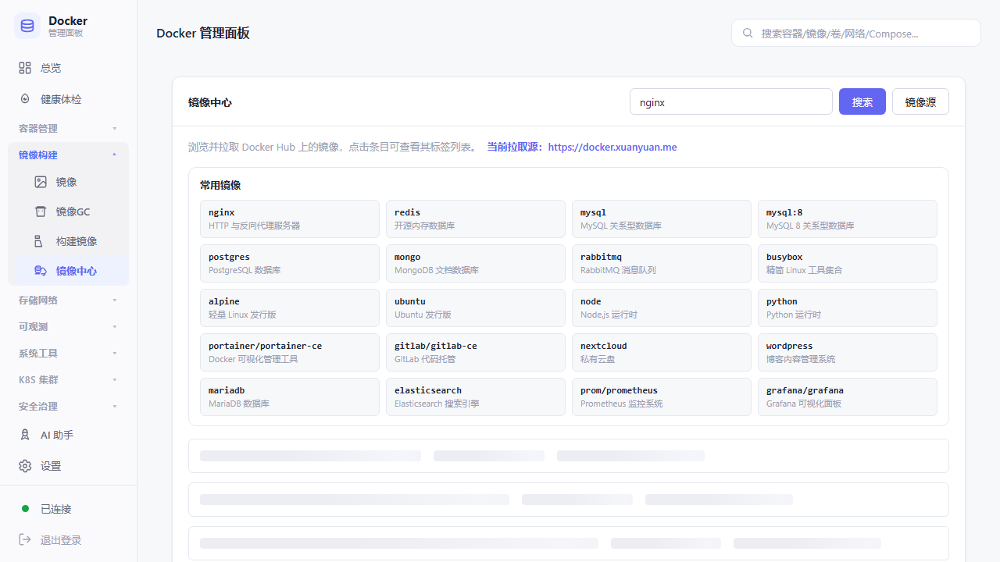

### 27.1 使用方法

1. 进入 **镜像管理** 页面，选择目标镜像；
2. 点击 **漏洞扫描** 按钮；
3. 系统调用 Trivy 扫描镜像层，返回 CVE 漏洞列表。

### 27.2 结果解读

| 字段 | 含义 |
| --- | --- |
| CVE ID | 漏洞编号 |
| Severity | 严重程度：Critical / High / Medium / Low / Unknown |
| Installed Version | 镜像中实际安装的包版本 |
| Fixed Version | 修复版本（如有） |
| Title | 漏洞描述 |

### 27.3 操作建议

- **Critical / High** 漏洞建议立即更新基础镜像或升级依赖包；
- 点击 **重新扫描** 确认修复结果；
- 可结合 **镜像构建** 功能使用更新后的基础镜像重新构建。

---

## 28. 跨引擎容器迁移 / 镜像传输

| 项目 | 说明 |
| --- | --- |
| 路径 | Docker 引擎 → 引擎详情 → 迁移 / 传输 |
| 权限 | 管理员 🔒 |

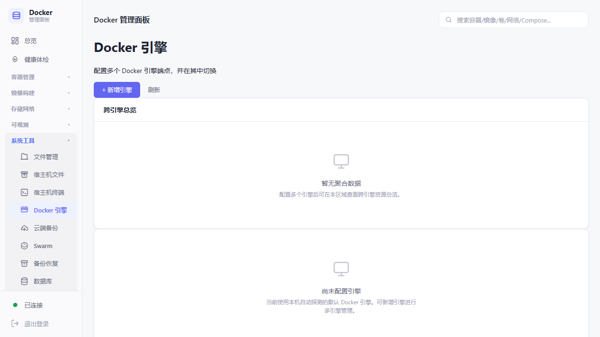

### 28.1 功能说明

支持将容器或镜像从一个 Docker 引擎迁移到另一个引擎，适用于：
- 更换宿主机时的数据迁移；
- 多引擎间的负载调整；
- 环境复制（从生产环境复制到测试环境）。

### 28.2 操作步骤

1. 进入 **Docker 引擎** 页面，选择源引擎；
2. 选择要迁移的容器或镜像；
3. 选择目标引擎；
4. 点击 **迁移 / 传输**；
5. 系统通过 `docker save` + `docker load` 完成传输。

### 28.3 注意事项

- 大镜像传输耗时较长，请确保网络稳定；
- 容器迁移需先停止源容器；
- 传输过程在服务端执行，浏览器关闭不影响进度。

---

## 29. 跨引擎聚合总览

| 项目 | 说明 |
| --- | --- |
| 路径 | 总览 → 多引擎聚合 |
| 权限 | 管理员 🔒 |


### 29.1 功能说明

当管理面板连接了多个 Docker 引擎时，聚合总览提供统一视角：
- 汇总所有引擎的容器数量（运行中 / 已停止 / 已暂停）；
- 汇总所有引擎的资源使用（CPU / 内存 / 磁盘）；
- 快速定位异常引擎。

### 29.2 页面元素

| 区域 | 内容 |
| --- | --- |
| 引擎卡片 | 每个引擎一张卡片，显示引擎名称、状态、容器数、资源使用 |
| 汇总指标 | 所有引擎的容器总数、总 CPU 使用率、总内存使用率 |
| 引擎切换 | 点击卡片可跳转到该引擎的详细管理页面 |

### 29.3 跨引擎批量清理（1.39.0）

引擎管理页（`/engines`）工具栏新增「批量清理」（仅管理员）：勾选多台引擎并选择清理范围（停止的容器 / 悬空镜像 / 未使用卷 / 未使用网络，可多选）后批量执行 Docker prune。可选**按年龄过滤**（仅清理 N 小时前未使用的对象；卷的 prune 不支持年龄过滤，勾选年龄过滤时卷自动跳过）。清理**不涉及运行中容器与在用镜像**，结果按引擎逐台展示（成功 / 失败与清理数量），全程留痕操作日志；接口 `POST /api/engines/batch-prune`。

---

## 30. 全局搜索

| 项目 | 说明 |
| --- | --- |
| 位置 | 顶部导航栏搜索框 |
| 权限 | 登录用户 |

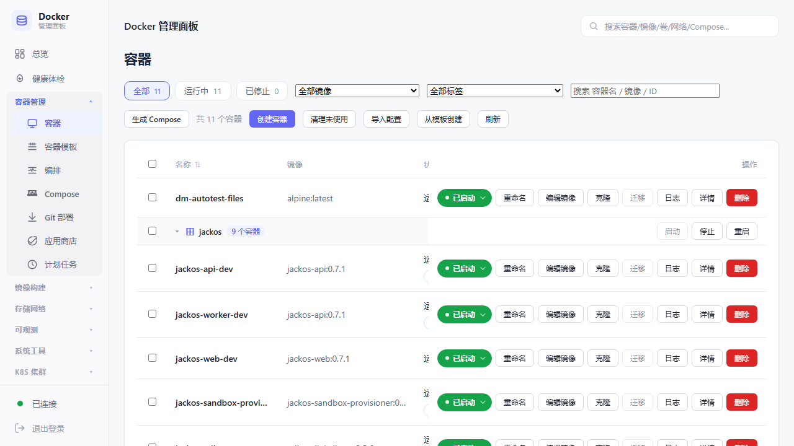

### 30.1 功能说明

全局搜索支持在所有资源中快速查找目标，无需逐页面浏览。

### 30.2 搜索范围

| 资源类型 | 搜索字段 |
| --- | --- |
| 容器 | 名称、ID、镜像名、状态 |
| 镜像 | 名称、标签、ID |
| 数据卷 | 名称、驱动 |
| 网络 | 名称、驱动 |
| Compose 项目 | 项目名、路径 |
| 宿主机文件 | 文件名、路径 |

### 30.3 使用方法

1. 点击顶部导航栏的搜索框（或按 `/` 快捷键）；
2. 输入关键词；
3. 下拉列表实时显示匹配结果；
4. 点击结果直接跳转到对应页面。

---

## 31. 容器资源占用看板

| 项目 | 说明 |
| --- | --- |
| 路径 | 总览 → 资源看板 |
| 权限 | 登录用户 |

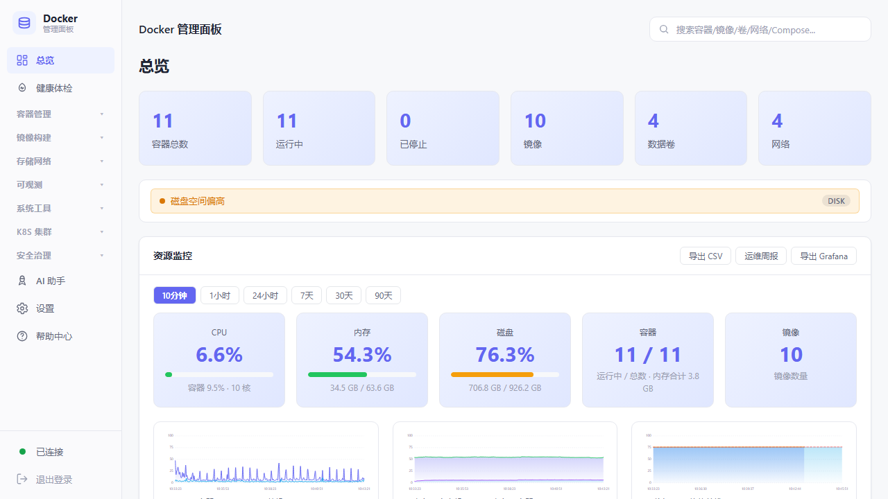

### 31.1 功能说明

实时展示所有运行中容器的资源占用排名，快速定位资源消耗最高的容器。

### 31.2 看板内容

| 指标 | 说明 |
| --- | --- |
| Top CPU | 按 CPU 使用率降序排列的容器列表 |
| Top Memory | 按内存使用量降序排列的容器列表 |
| 网络 I/O | 各容器的网络收发流量 |
| 磁盘 I/O | 各容器的磁盘读写量 |

### 31.3 操作

- 点击容器名称可跳转到容器详情页；
- 支持按引擎筛选；
- 数据每 5 秒自动刷新。

---

## 32. 监控持久化历史

| 项目 | 说明 |
| --- | --- |
| 路径 | 总览 → 监控历史 |
| 权限 | 登录用户 |


### 32.1 功能说明

系统自动保存监控数据，支持查看不同时间范围的历史趋势：
- **1 小时**：5 秒粒度，适合排查瞬时异常；
- **24 小时**：1 分钟粒度，适合日常巡检；
- **7 天**：5 分钟粒度，适合趋势分析。

### 32.2 图表说明

| 图表 | 内容 |
| --- | --- |
| CPU 使用率 | 各引擎/容器的 CPU 使用率变化曲线 |
| 内存使用 | 各引擎/容器的内存使用量变化曲线 |
| 网络流量 | 各引擎/容器的网络收发流量变化曲线 |
| 磁盘 I/O | 各引擎/容器的磁盘读写量变化曲线 |

### 32.3 数据管理

- 监控数据存储在 SQLite 数据库中；
- 默认保留 30 天，可在 **系统设置 → 监控** 中调整；
- 支持导出 CSV 格式的历史数据。

---

## 33. 模板 / 镜像中心增强

| 项目 | 说明 |
| --- | --- |
| 路径 | 镜像中心 / 容器模板 |
| 权限 | 登录用户 |


### 33.1 镜像中心增强功能

| 功能 | 说明 |
| --- | --- |
| 镜像分类批量清理 | 按分类（如 `library`、`bitnami`）批量清理未使用镜像 |
| 端口冲突检测 | 创建容器前自动检测端口是否被占用 |
| 漏洞扫描入口 | 镜像列表直接发起漏洞扫描（见第 27 章） |
| 构建历史 | 查看通过面板构建的镜像历史记录 |

### 33.2 模板库增强功能

| 功能 | 说明 |
| --- | --- |
| Compose 模板库 | 预置常用应用的 Compose 模板（如 WordPress、MySQL、Redis） |
| 一键部署 | 选择模板后一键生成并启动 Compose 项目 |
| 模板收藏 | 收藏常用模板，快速访问 |
| 自定义模板 | 将现有 Compose 配置保存为自定义模板 |

---

## 34. 配置导入 / 导出

| 项目 | 说明 |
| --- | --- |
| 路径 | 系统设置 → 配置管理 |
| 权限 | 管理员 🔒 |


### 34.1 功能说明

支持将面板配置导出为 JSON 文件，也可从 JSON 文件导入配置，方便：
- 多实例间同步配置；
- 重装后恢复配置；
- 环境迁移。

### 34.2 导出配置

1. 进入 **系统设置 → 配置管理**；
2. 选择要导出的配置项（可多选）；
3. 点击 **导出**；
4. 浏览器下载 JSON 文件。

### 34.3 可导出的配置项

| 配置项 | 内容 |
| --- | --- |
| 引擎配置 | Docker 引擎连接信息 |
| 模板配置 | 容器模板和 Compose 模板 |
| 计划任务 | 所有定时任务配置 |
| 站点配置 | 反代和端口映射配置 |
| 通知配置 | 告警规则和通知渠道 |
| 系统设置 | 面板全局设置 |

### 34.4 导入配置

1. 进入 **系统设置 → 配置管理**；
2. 点击 **导入**，选择 JSON 文件；
3. 预览将要导入的配置项；
4. 确认导入。

> **注意**：导入会覆盖同名配置，建议先导出当前配置作为备份。

---

## 35. Webhook / Git 自动部署

| 项目 | 说明 |
| --- | --- |
| 路径 | 计划任务 → 新建任务 → Webhook / Git 部署 |
| 权限 | 登录用户 |

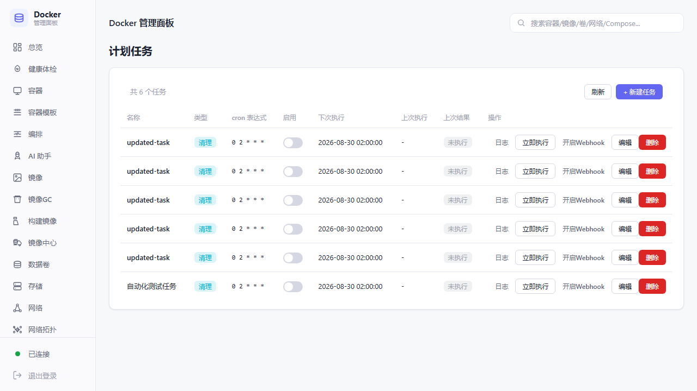

### 35.1 Webhook 触发

支持通过 HTTP 请求触发容器操作：

| 参数 | 说明 |
| --- | --- |
| 任务类型 | 选择「Webhook 触发」 |
| 目标容器 | 选择要操作的容器 |
| 操作 | 启动 / 停止 / 重启 |
| Token | 自动生成的鉴权令牌，请求时需携带 |

触发方式：`POST /api/webhook/{taskId}?token={token}`

### 35.2 Git 自动部署

支持 Git 仓库的自动拉取和部署：

| 参数 | 说明 |
| --- | --- |
| 任务类型 | 选择「Git 部署」 |
| 仓库地址 | Git 仓库 URL |
| 分支 | 目标分支（默认 main） |
| 部署路径 | 本地克隆路径 |
| 部署命令 | 克隆/拉取后执行的命令（如 `docker compose up -d`） |

### 35.3 执行方式

| 方式 | 说明 |
| --- | --- |
| 定时执行 | 按 Cron 表达式定时拉取并部署 |
| Webhook 触发 | 推送代码后通过 Webhook 触发部署 |
| 手动执行 | 在任务列表点击「立即执行」 |

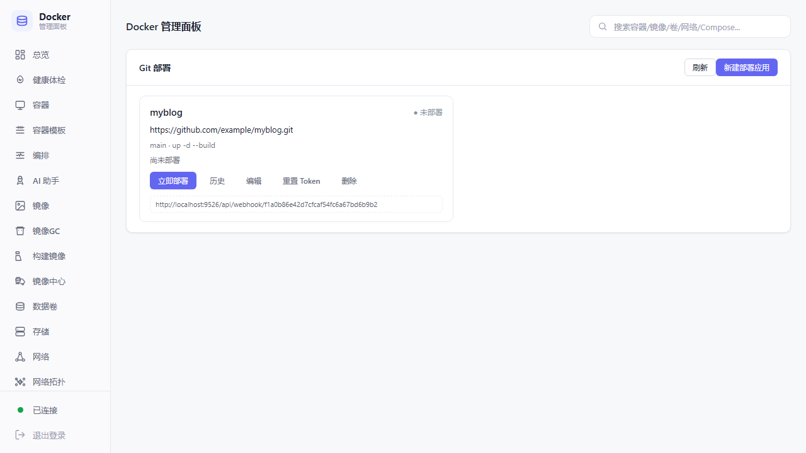

### 35.4 Git 部署工作台（1.30.0 新增）

侧栏「Git 部署」页提供面向单应用的可视化部署流，把 Git 仓库绑定为「部署应用」：

| 字段 | 说明 |
| --- | --- |
| 应用名 | 同时作为 compose 项目名，仅允许字母数字与 `. _ -` |
| Git 仓库地址 | 支持 https / ssh；私有仓库可按应用保存凭据（AES 加密存储） |
| 分支 | 可选，留空使用默认分支 |
| compose 文件相对路径 | 可选，留空自动探测 compose.yaml / docker-compose.yml 等 |
| 构建开关 | 勾选后执行 `docker compose up -d --build` |

部署动作 = clone / pull 仓库到 Compose 项目目录 → `docker compose up -d [--build]`。卡片实时展示部署状态（部署中 / 成功 / 失败）与最近部署时间；每次部署的完整 git 与 compose 输出记录在「历史」弹窗中（最多 50 条）。

自动部署：每应用独立 Webhook token，卡片下方输入框展示完整地址（点击全选复制），Git 仓库 push 事件指向该地址即可触发；支持 `X-Docker-Panel-Token` Header 二次校验，Token 泄露可在「重置 Token」一键更换。部署失败自动推送告警通知。

> 与 35.2 的区别：35.2 是「计划任务」里的通用 Git 部署任务（可配 Cron 与目标路径）；35.4 是面向单应用的工作台（状态面板 + 历史回看 + 独立 Webhook），二者共用同一套 clone/pull 与 compose 执行逻辑。

---

## 36. 运维工具箱

| 项目 | 说明 |
| --- | --- |
| 路径 | `/tools` |
| 权限 | 登录用户 |

纯前端实现的常用运维小工具集合，数据不出浏览器：

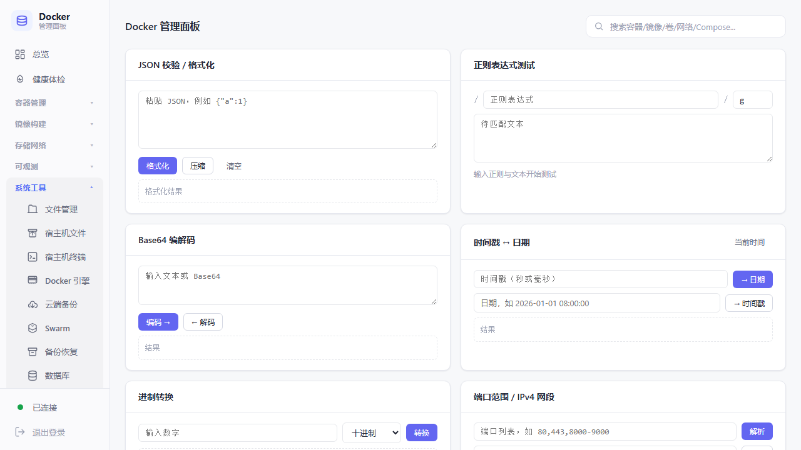

| 工具 | 用途 |
| --- | --- |
| JSON 工具 | 格式化 / 压缩 / 校验 JSON |
| 正则测试 | 实时匹配测试与高亮 |
| Base64 | 编码 / 解码 |
| 时间戳 | Unix 时间戳与可读时间互转 |
| 进制转换 | 2 / 8 / 10 / 16 进制互转 |
| 端口与网段 | 端口网段计算（CIDR / 子网） |

---

## 37. 端口地图

| 项目 | 说明 |
| --- | --- |
| 路径 | `/ports` |
| 权限 | 登录用户 |
| 接口 | `GET /api/ports/map` |

- **跨引擎聚合**：一次性汇总所有已配置 Docker 引擎（含本机引擎）的容器端口映射
- **冲突检测**：同一引擎内多个容器绑定相同宿主端口时高亮告警
- **分布图**：按端口段（32 桶）统计占用分布，快速定位拥挤网段

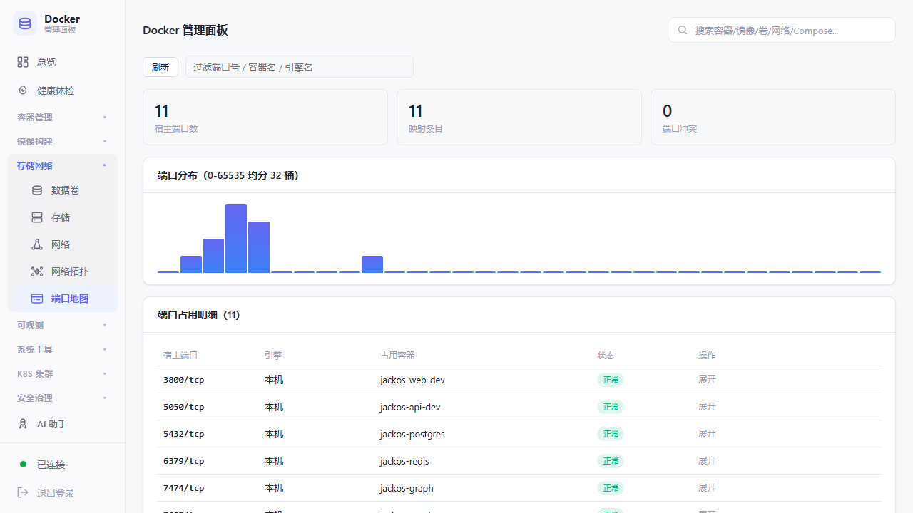

---

## 38. Prometheus / Grafana 监控对接

| 项目 | 说明 |
| --- | --- |
| 指标端点 | `GET /metrics`（Prometheus 文本格式，`dm_*` 指标族） |
| 鉴权 | 可选，设置 → 系统参数 → 监控抓取 Token（Query `?token=` 或 `Authorization: Bearer`） |
| Dashboard | 总览 → 资源监控 → 「导出 Grafana」，下载 JSON 后在 Grafana 导入 |

`/metrics` 输出主机与容器级 CPU / 内存 / 网络等指标，可直接被 Prometheus 抓取；Grafana Dashboard JSON 包含总览、容器排行等常用面板。

---

## 39. 安全基线扫描 🔒

| 项目 | 说明 |
| --- | --- |
| 路径 | `/policy` |
| 权限 | 管理员 🔒 |
| 接口 | `GET /api/policy/scan`（只读扫描）；`POST /api/policy/fix`（在线修复） |

内置 6 条基线规则，对全部运行容器做只读检查：

| 规则 | 级别 | 在线修复 |
| --- | --- | --- |
| 特权容器（--privileged） | 危险 | ❌ 需重建容器 |
| 敏感挂载（docker.sock 等） | 危险 | ❌ 需重建容器 |
| 未配置内存限制 | 建议 | ✅ 默认 512MB（可传 params.memoryBytes） |
| 未配置 CPU 限制 | 建议 | ✅ 默认 1 核（可传 params.cpus） |
| 重启策略为 no / none | 建议 | ✅ 默认 unless-stopped（可传 params.policy） |
| 缺少属主标签 | 提示 | ❌ 需重建容器 |

**一键修复**：内存 / CPU / 重启策略三类违规支持在线修复（Docker Container Update API，修复后自动复检并在报告中确认违规消除）；特权模式、敏感挂载、属主标签需重建容器，页面展示加固建议。修复动作走审批门禁（`container.fix`）：开启审批流后非管理员提交修复会转入审批中心，批准后自动执行。


### 39.1 基线扫描页（`/bench`，1.33.0 新增）

「安全治理 → 基线扫描」提供 **CIS 风格的一键安全体检**，覆盖守护进程与主机侧检查（与 `/policy` 的容器维度规则互补，后者聚焦容器违规与在线修复）：

| 分类 | 检查项 |
| --- | --- |
| Docker 守护进程 | live-restore 开启、容器日志轮转（log-opts max-size）、Swarm 模式状态、远程访问 TLS |
| 宿主机 | docker.sock 文件权限（Linux）、daemon.json 文件权限（Linux）、未加密的 2375 端口监听 |
| 镜像 | 避免使用 latest / 无标签镜像、避免以 root 运行容器 |
| 容器运行时 | Seccomp 配置（是否 unconfined）、PIDs 上限 |

- 每项检查给出等级：**通过 / 提示 / 建议加固 / 高危 / 不适用**（不适用项按平台自动跳过，如 Windows 无 docker.sock）
- 命中对象以容器名 / 镜像名标签列出；未通过项附加加固建议
- 扫描结果持久化（保留最近 100 次），工具栏「历史报告」下拉可回看任意一次报告；摘要计入操作日志
- **容器逃逸风险 Top（1.34.0）**：每次扫描对运行中容器按特征打分——privileged（40 分）、挂载 docker.sock（30 分）、host PID / host 网络（各 10 分）、root 运行（5 分）、latest 镜像（5 分），取最高 10 项以横条图展示，评分越高越危险，并记录当次「逃逸风险峰值」
- **扫描趋势（1.34.0）**：折线图展示最近 30 次扫描的通过 / 警告 / 高危与逃逸风险峰值走势，观察加固效果
- 运行扫描为管理员专属；普通用户可查看最近一次报告
- 接口：`POST /api/bench/run`（管理员）、`GET /api/bench/latest`、`GET /api/bench/history`、`GET /api/bench/trend`（1.34.0）、`GET /api/bench/:id`

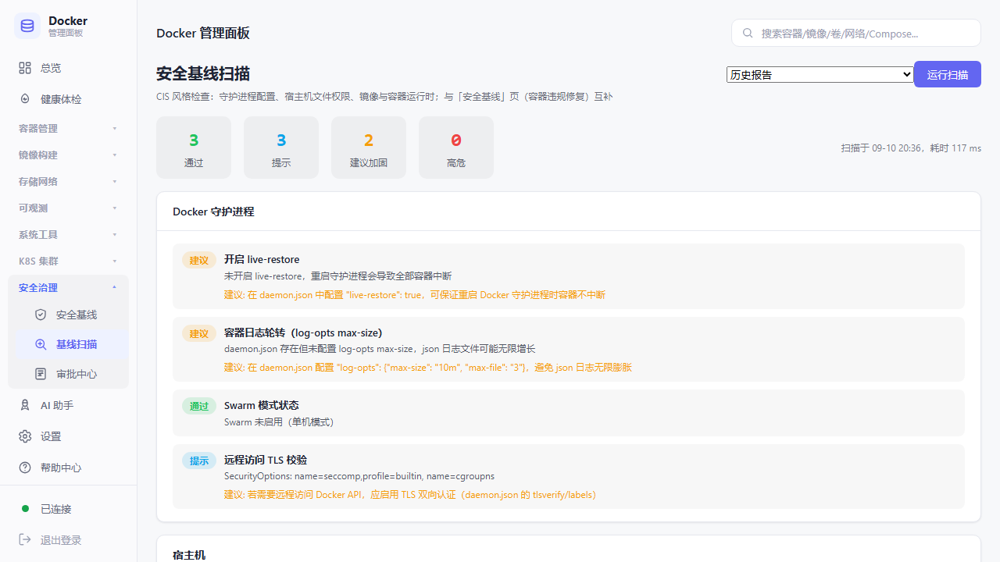

---

## 40. 高危操作审批流

| 项目 | 说明 |
| --- | --- |
| 路径 | `/approvals` |
| 权限 | 登录用户（普通用户仅见自己的申请） |
| 开关 | 设置 → 系统参数 → 安全 → 「高危操作审批流」（默认关闭） |

开启审批流后：

1. **非管理员**执行删除容器（含批量删除）、删除卷、删除镜像（含批量）、清理悬空/未使用镜像、清理未使用卷、清理网络、停止 Compose 项目等操作时不再直接执行，操作转入「审批中心」待审批（返回 202）
2. **管理员**在审批中心批准后系统自动执行；拒绝必须填写理由并随审批留痕
3. 普通用户也可在审批中心**主动提交**镜像删除、卷删除、网络清理等申请，由管理员批准后执行；批量删除容器会为每个目标生成一条审批记录
4. 管理员及已获得对应操作权限（角色管理中授权，如「删除容器」「清理未使用卷」）的角色不受门禁限制
5. 同一用户对同一目标的重复待审批申请会自动合并
6. 审批列表中的「目标」自动解析为**容器名**等人类可读标识（容器已删除时回退短 ID），待审批记录同时展示执行参数（强制删除 / 同时删除卷）
7. **批量处理**：管理员可勾选多条待审批记录后批量批准/批量拒绝（单批最多 50 条，拒绝理由必填，逐条顺序执行，单条失败不影响其余）
8. **AI 高危操作转审批**：AI 建议的删除容器/镜像操作在审批流开启且执行者为非管理员时，自动转成管理员审批单（AI 操作进入「待管理员审批」状态，批准执行后结果自动回写 AI 操作记录）

**审批流关闭时**：删除 / 清理类入口对非管理员返回 403（保持管理员专属）；持有对应权限的自定义角色（RBAC）始终直接执行、不走审批。

**可审批动作一览**：删除容器（`container.delete`）、删除镜像（`image.delete`）、批量删除镜像（`image.deleteBatch`）、清理悬空镜像（`image.prune`）、删除卷（`volume.delete`）、清理未使用卷（`volume.prune`）、清理网络（`network.prune`）、停止编排项目（`compose.down`）、修复容器配置（`container.fix`）。

所有申请、审批、执行结果（含执行失败原因）全程留痕，可在审批中心按状态筛选查询，也可在「操作日志」按目标类型「审批」筛选管理员的批准/拒绝/撤销记录。

**审批统计**：管理员可见「审批统计」卡片（近 30 天），展示执行成功 / 失败速览、按动作类型分布（总数 / 已批准 / 已拒绝 / 待审批）与提交人 Top 榜，便于掌握高危操作的整体态势。

**记录导出**：工具栏「导出CSV」按钮可将审批记录导出为 CSV 文件（跟随当前状态筛选；管理员导出全部，其他用户仅导出自己提交的；带 UTF-8 BOM，Excel 可直接打开）。


---

## 41. AI 智能助手

| 项目 | 说明 |
| --- | --- |
| 路径 | `/assistant` |
| 权限 | 登录用户（模型配置仅管理员 🔒） |
| 前提 | 设置 → AI 配置中心 添加任意 OpenAI 兼容端点 |

- **多模型配置中心**：本地（Ollama / LM Studio / Docker Model Runner）与云端（OpenAI / DeepSeek / Kimi / 智谱等）预设一键填充，多套配置并存切换，密钥加密存储；每个配置可单独**启用 / 停用**（停用后不进入「当前模型」下拉；停用默认配置时自动切换默认到最早启用的配置，禁止停用最后一个启用配置）；预设卡片点击即预填表单，「手动新建（自定义模型）」支持任意 OpenAI 兼容端点
- **AI 能力**：对话问答、文件分析（Dockerfile / Compose / 日志）、智能巡检、告警诊断、运维周报、知识库问答、Token 用量治理
- **告警自动 AI 诊断**：danger 级别告警推送成功后自动调用 AI 分析根因，诊断作为后续消息推送到同一通知渠道；可在设置 → 系统参数 → 通知 → 「告警自动 AI 诊断」开关控制（默认开启，宿主级与容器级 danger 告警均生效）。被聚合推送（推送聚合窗口开启时）的告警不触发 AI 诊断，仅即时单条告警触发
- **安全边界**：AI 只生成建议不直接执行，写操作由用户在对应页面确认；未配置 AI 时所有入口自动隐藏，不影响其它功能

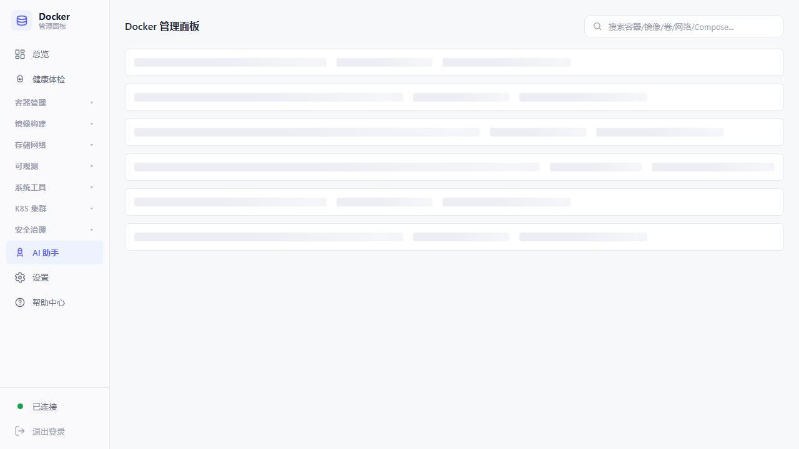

---


**Prompt 模板管理**：AI 助手顶栏的「模板」区支持**导入 / 导出**：导出为 `ai-templates.json` 备份文件；导入时逐条校验（重名跳过），并统计导入与跳过数量。模板列表支持按分类筛选，「使用」按钮一键把模板内容填入输入框。
## 42. 帮助中心

| 项目 | 说明 |
| --- | --- |
| 路径 | `/help` |
| 权限 | 登录用户 |

内置三块内容：**快速上手**（六步引导）、**常见问题 FAQ**（密码找回、远程引擎、审批流开启、AI 配置等 8 条）、**功能速查表**（全部页面路径与用途索引）。

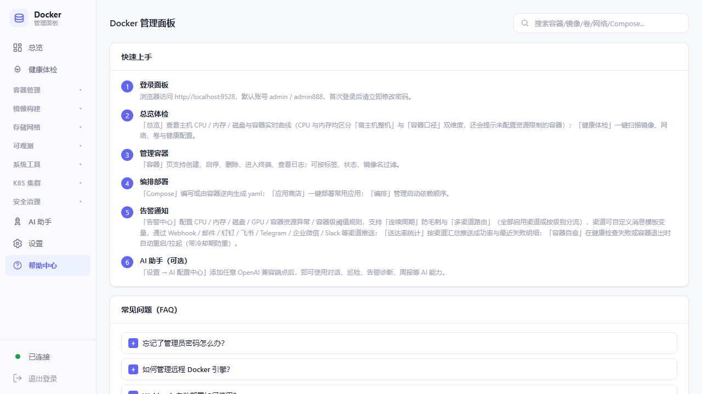

---

## 43. Kubernetes 只读巡检

> 1.5.0 新增只读巡检，1.6.0 起支持有限写操作。面向同时维护 Kubernetes 集群的团队：在不影响 Docker 管理功能的前提下巡检集群并执行扩缩容 / 滚动重启 / 删除 Pod。

| 项目 | 说明 |
| --- | --- |
| 路径 | `/k8s`（集群概览）、`/k8s/workloads`（工作负载）、`/k8s/pod/:ns/:name`（Pod 详情）、`/k8s/events`（集群事件） |
| 权限 | 登录用户 |

### 43.1 接入集群

面板按以下优先级加载集群凭证，无需在界面里填写密码：

1. 环境变量 `KUBECONFIG` 指向的 kubeconfig 文件；
2. 面板运行用户的 `~/.kube/config`；
3. 面板以 Pod 方式部署在集群内时自动使用 InCluster 配置。

kubeconfig 中包含多个 context（多个集群）时，「集群概览」页顶部的下拉框可随时切换；切换仅作用于当前面板进程，不会写回 kubeconfig 文件。

> 面板检测不到 kubeconfig 且非集群内部署时，K8s 页面会展示配置引导（而非报错），Docker 域功能不受影响。

### 43.2 集群概览（/k8s)

- 顶部统计卡：节点 / Pod / Service / PVC 数量；
- 节点表：名称、角色（control-plane / worker）、Ready 状态、CPU 与内存占用条、kubelet 版本、内网 IP；
- 资源占用数据来自 metrics-server；集群未安装 metrics-server 时该列自动降级为「—」并给出提示；
- **节点资源趋势**（1.9.0）：节点快照定时采样（60 秒）落库并接入小时级聚合（保留 90 天），支持 1d / 7d / 30d / 90d 时间窗查看集群 CPU 与内存总量曲线；
- **节点详情页**（1.11.0）：点击节点名称进入 `/k8s/node/:name`，展示节点元信息（角色 / 可分配资源 / OS / 版本）与单节点趋势曲线。

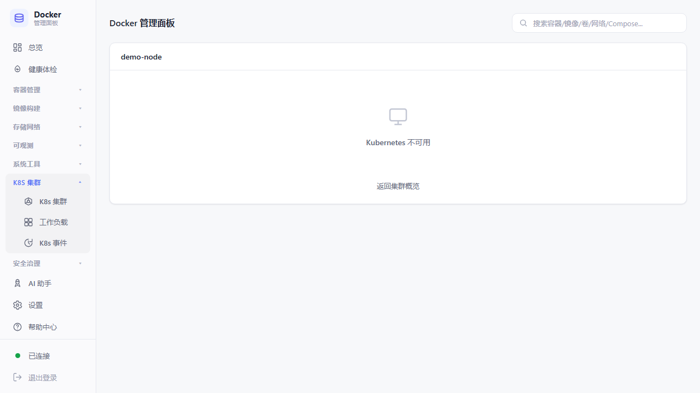

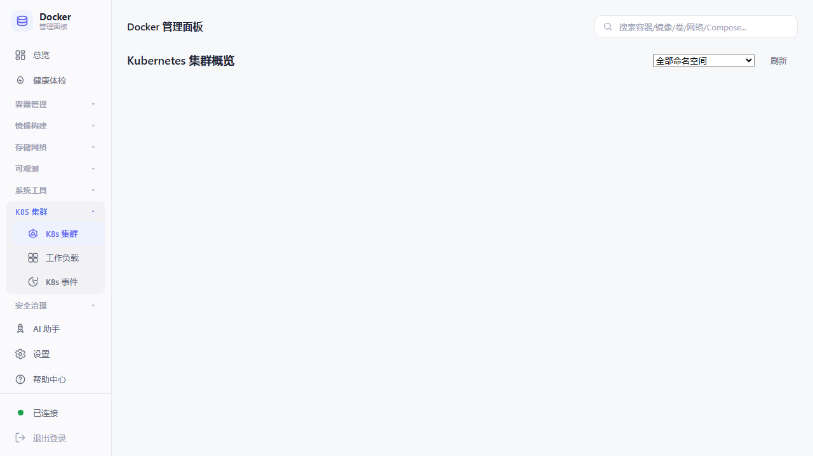

### 43.3 工作负载（/k8s/workloads)

标签页：**Pod / Deployment / Service / PVC / ConfigMap / Ingress / Helm / CRD / 配额**，均支持命名空间过滤与关键字搜索。「Helm」标签页展示 Release 名称 / 命名空间 / Revision / 状态（deployed 等）/ 最近发布时间（1.13.0）。Secret 列表与 ConfigMap 同页展示，**值已脱敏**（仅显示键名与类型，1.8.0）。

- Pod 列表展示状态（含 CrashLoopBackOff 等容器级细化原因）、就绪容器数、重启次数、所在节点；点击任意行进入 Pod 详情；
- Deployment 展示期望 / 就绪副本数；Service 展示类型、ClusterIP 与端口；PVC 展示 Bound 状态、容量与 StorageClass；
- **CRD 标签页**（1.22.0）：列出集群中的 CustomResourceDefinition（名称 / Group / 版本 / Kind / 作用域 / 创建时间），行内「查看资源」按钮弹窗展示该 CRD 的资源实例与 spec JSON，便于巡检 Prometheus、Argo 等 Operator 应用；
- **配额标签页**（1.24.0）：ResourceQuota（逐项展示用量 / 上限，如 `requests.cpu: 1500m / 4`）、LimitRange（容器级 min / max / default / defaultRequest）与 NetworkPolicy（策略类型 / Pod 选择器 / 规则数）三段式只读展示。

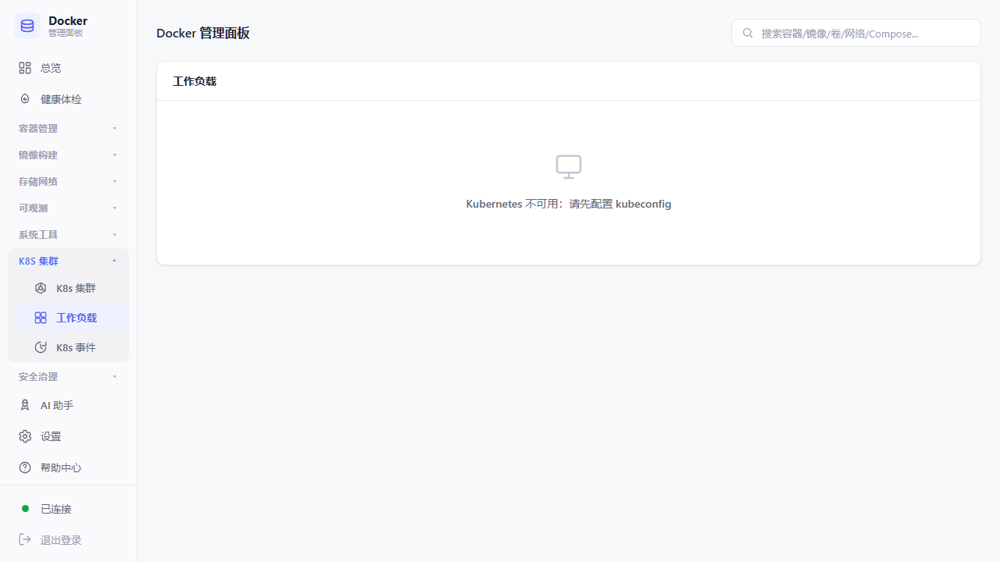

### 43.4 Pod 详情（/k8s/pod/:ns/:name)

- 基本信息：命名空间、状态、就绪、重启、节点、创建时间；
- 容器列表：每个容器的 Ready / 镜像 / 重启次数；
- 日志：多容器时可切换容器，默认返回最近 500 行（上限 2000），可手动刷新；
- 资源曲线：CPU（毫核）与内存（KiB），在页面停留期间每 15 秒采样一次（不落库，离开页面即停止）；
- 相关事件：与该 Pod 相关的 Warning / Normal 事件；
- **Pod 历史曲线**（1.11.0）：Pod 级指标采样落库（小时级聚合，保留 90 天），经 `/api/k8s/pods/:ns/:name/metrics-history` 查询。
- **Pod 终端**（1.7.0，管理员可见）：详情页「打开终端」按钮启动 xterm.js 交互式 shell（`/ws/k8sterminal/:ns/:pod/:container`，client-node Exec TTY 模式，1.14.0 起支持运行期尺寸调整），多容器时默认连接首个，输入 exit 或关闭按钮退出。

### 43.5 写操作（1.6.0 二期）

| 操作 | 端点 | 权限 |
| --- | --- | --- |
| 扩缩容 | 调整 Deployment 副本数（0-500 整数） | 管理员，或持 `k8s.write` 权限的角色 |
| 滚动重启 | 更新 restartedAt 注解触发滚动更新 | 管理员，或持 `k8s.write` 权限的角色 |
| 删除 Pod | 删除指定 Pod（Deployment 管理的 Pod 自动重建） | 管理员，或持 `k8s.delete` 权限的角色 |
| Deployment 回滚（1.17.0） | 回滚到上一个 revision | 管理员，或持 `k8s.write` 权限的角色 |
| PVC 扩容（1.17.0） | 在线扩容 PVC 容量 | 管理员，或持 `k8s.write` 权限的角色 |
| Pod 重建（1.17.0） | 删除后由所属控制器重建 | 管理员，或持 `k8s.write` 权限的角色 |
| ConfigMap / Secret 在线编辑（1.19.0） | 键值在线编辑保存 | 管理员，或持 `k8s.write` 权限的角色 |
| StatefulSet / DaemonSet 重启（1.19.0） | 滚动重启 | 管理员，或持 `k8s.write` 权限的角色 |
| 删除 Ingress / Service / PVC / ConfigMap（1.21.0） | 删除对应资源（不可恢复） | 管理员，或持 `k8s.delete` 权限的角色 |
| Helm Chart 部署（1.23.0） | 调用面板主机 helm CLI 执行 install/upgrade | 管理员，或持 `k8s.write` 权限的角色 |

开启「高危操作审批流」后，无对应直接权限的操作会自动转入「审批中心」待审批（携带 AP- 单号），管理员批准后系统执行；删除 Pod 等破坏性操作可在系统参数中配置为两级双签。前端操作入口：工作负载页 Deployment 行「扩缩容 / 滚动重启 / 回滚」按钮、Pod 详情页「删除 Pod」按钮、Ingress / Service / PVC / ConfigMap 行「删除」按钮、Helm 标签页「部署 Chart」按钮（管理员可见）。

#### Helm Chart 部署（1.23.0）

「Helm」标签页点击「部署 Chart」按钮（管理员可见）打开部署表单：release 名称 / 命名空间 / Chart（如 `bitnami/nginx` 或 `.tgz` 地址）/ 版本（可选）/ `--set` 参数（每行一个 `key=value`）。提交后通过面板主机的 helm CLI 执行 `helm upgrade --install`（已存在即升级），需面板主机已安装 helm（可用 `HELM_BIN` 环境变量指定路径）；无直接权限时自动转入审批流。部署过程为无 shell 的白名单参数执行，release 名称与命名空间不允许路径分隔符。

**仓库管理**（1.25.0）：Helm 标签页「仓库管理」区块（管理员）可添加 / 删除 chart 仓库（`helm repo add/remove`，走审批门禁）；部署表单内「浏览仓库」按钮弹出仓库 chart 列表（名称 / 版本 / 描述，关键字过滤搜索），点击自动填充 Chart 与版本。

**本地上传**（1.27.0）：部署表单「上传」按钮支持选择本地 chart 包（.tgz，上限 50MB），上传到服务器临时目录后自动填充 chart 路径，可直接部署；临时文件 24 小时自动清理。


### 43.6 集群事件（/k8s/events)

按命名空间、级别（Warning / Normal）与关键字过滤集群事件，展示对象、原因、消息、发生次数与最近时间，便于配合工作负载巡检定位异常。1.10.0 起支持「实时」开关：开启后通过 WebSocket 接收新事件并实时插入列表（后端断线自动重连）。

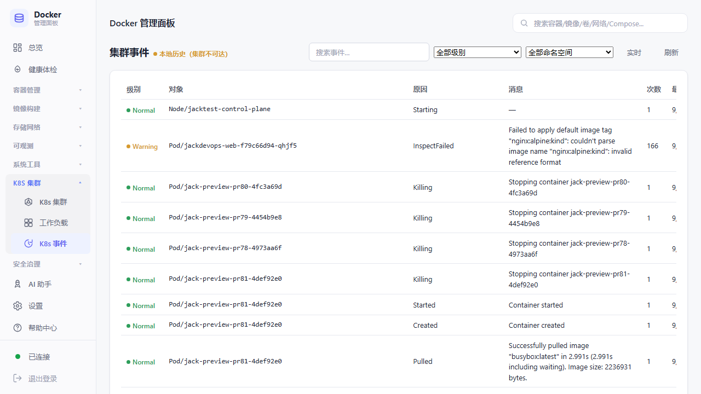

### 43.7 Prometheus 指标暴露（1.21.0）

面板可作为 Prometheus exporter 输出指标，接入已有 Grafana 监控体系：

| 项目 | 说明 |
| --- | --- |
| 端点 | `GET /metrics`（Prometheus 文本格式） |
| 开关 | 「设置 → 系统参数 → prometheus.enabled」（默认关闭，开启前请评估暴露面） |
| 鉴权 | 可选：设置环境变量 `PROMETHEUS_TOKEN` 后，请求需携带 `Authorization: Bearer <token>` 或 `?token=<token>` |
| 指标 | dockermanager_host_cpu_percent / mem_percent / disk_percent（最新主机指标）；dockermanager_k8s_node_cpu_cores / mem_bytes（K8s 节点最新采样，label：node） |

Prometheus 侧仅需在 `prometheus.yml` 中加入抓取目标即可：

```yaml
scrape_configs:
  - job_name: dockermanager
    metrics_path: /metrics
    bearer_token: <PROMETHEUS_TOKEN>   # 未设置 PROMETHEUS_TOKEN 时可省略
    static_configs:
      - targets: ['<面板地址>:9528']
```

---

---

## 44. 网络拓扑与日志聚合

### 44.1 网络拓扑（/topology)

- **可视化视图**：以图形方式展示容器 — 网络 — 端口的关系，节点连线反映实际连接；
- 支持拖拽与缩放，便于排查网络可达性与端口占用关系。

### 44.2 日志聚合（/logs)

- **跨容器日志检索**：一次搜索跨多个容器的输出日志，支持关键字过滤与高亮；
- **导出**：检索结果可导出保存，便于留档与提交问题。
- **历史检索（1.31.0 新增）**：在「设置 → 系统参数」开启「容器日志持久化索引」（`logs.indexEnabled`）后，后台每分钟增量采集各运行中容器的新日志行入库，容器重启或删除后仍可检索历史；页面顶部「历史检索」模式按时间范围 / 容器 / 关键字查询持久化索引（返回行数上限 500-5000）；
- **保留策略**：`logs.retentionDays`（默认 7 天，1-90 可调）+ 总行数上限 100 万，超期与超限的最旧行自动清理；索引状态（行数 / 容器数 / 最早时间）在历史检索模式顶部实时展示，支持手动清理过期行。

## 45. 系统更新

菜单入口：**设置 → 关于 → 检查更新**（管理员）

| 项目 | 说明 |
| --- | --- |
| 检查 | 一键对比当前版本与 GitHub Releases 最新版本 |
| 更新包 | 有新版时列出全部更新包下载链接（按平台标注 windows / macos / linux，含大小） |
| 更新说明 | 展示最新 Release Notes 摘要 |
| 镜像加速 | 系统参数 `update.githubMirror` 可配置 GitHub 镜像前缀，检查与下载均走镜像（国内网络可用） |
| 缓存 | 检查结果缓存 10 分钟，避免频繁外呼 |

> 更新方式（按安装方式选择，数据库均不受影响）：
>
> | 安装方式 | 更新命令 |
> | --- | --- |
> | APT 源（Ubuntu/Debian） | `sudo apt-get update && sudo apt-get install -y docker-manager` |
> | YUM 源（RHEL 9 系） | `sudo dnf update -y docker-manager` |
> | deb / rpm 手动安装 | 从 Releases 下载新版包，`dpkg -i` / `dnf install` 覆盖 |
> | Docker | `docker pull ghcr.io/13861419/docker-desktop:latest` 后按 0.6 节重建容器 |
> | npm 全局 | `npm update -g @13861419/docker-manager` |
> | Windows | 下载新版 zip 解压替换或 setup exe 覆盖安装 |
>
> deb/rpm 升级会覆盖 `/opt/docker-manager/server/.env`（端口等自定义配置请先备份）。更新前建议先做一次「备份恢复」中的配置导出。
>
> 无法访问 GitHub 时：在能联网的电脑下载更新包拷贝到服务器（`dpkg -i` / `dnf install` 覆盖），或给下载链接加镜像前缀，详见 0.4 节「无法访问 GitHub 时」。
## 附：模块与访问路径速查

| 菜单 | 路径 | 权限 |
| --- | --- | --- |
| 总览 | `/` | 登录用户 |
| 健康体检 | `/health` | 登录用户 |
| 容器 | `/containers` | 登录用户 |
| 容器模板 | `/templates` | 管理员 🔒 |
| 编排 | `/orchestrate` | 管理员 🔒 |
| 镜像 | `/images` | 登录用户 |
| 镜像构建 | `/build` | 管理员 🔒 |
| 数据卷 | `/volumes` | 登录用户 |
| 存储 | `/storage` | 登录用户 |
| 网络 | `/networks` | 登录用户 |
| Compose | `/compose` | 登录用户 |
| 应用商店 | `/appstore` | 登录用户 |
| 计划任务 | `/tasks` | 登录用户 |
| 文件管理 | `/files` | 登录用户 |
| 宿主机文件 | `/hostfiles` | 登录用户 |
| 宿主机终端 | `/hostterminal` | 登录用户 |
| Docker 引擎 | `/engines` | 管理员 🔒 |
| 云备份 | `/cloudbackup` | 管理员 🔒 |
| Swarm | `/swarm` | 管理员 🔒 |
| 备份恢复 | `/backups` | 登录用户 |
| 数据库 | `/databases` | 登录用户 |
| 系统设置 | `/settings` | 登录用户 |
| 镜像中心 | `/hub` | 登录用户 |
| 操作日志 | `/operation-logs` | 登录用户 |
| 通知告警 | `/notifications` | 管理员 🔒 |
| 事件流 | `/events` | 登录用户 |
| 站点（反代 / 端口映射） | `/sites` | 管理员 🔒 |
| 防火墙 | `/firewall` | 管理员 🔒 |
| 镜像漏洞扫描 | `/images` → 漏洞扫描 | 登录用户 |
| 跨引擎迁移 | `/engines` → 引擎详情 | 管理员 🔒 |
| 跨引擎聚合总览 | 多引擎模式下总览页自动显示 | 管理员 🔒 |
| 全局搜索 | 顶部导航栏搜索框 | 登录用户 |
| 资源占用看板 | 总览页底部 | 登录用户 |
| 监控历史 | 总览 → 监控历史 | 登录用户 |
| 镜像中心增强 | `/hub` | 登录用户 |
| 配置导入/导出 | `/settings` → 配置管理 | 管理员 🔒 |
| Webhook / Git 部署 | `/tasks` → 新建任务 | 登录用户 |
| 运维工具箱 | `/tools` | 登录用户 |
| 端口地图 | `/ports` | 登录用户 |
| 安全基线 | `/policy` | 管理员 🔒 |
| 审批中心 | `/approvals` | 登录用户 |
| 面板数据库备份 | `/settings` → 面板数据库备份管理 | 管理员 🔒 |
| AI 助手 | `/assistant` | 登录用户（配置仅管理员 🔒） |
| 帮助中心 | `/help` | 登录用户 |
| K8s 集群 | `/k8s` | 登录用户 |
| 工作负载 | `/k8s/workloads` | 登录用户 |
| K8s 事件 | `/k8s/events` | 登录用户 |
| Prometheus 指标 | `/metrics` | 可选 Token 鉴权 |

> 本文档基于当前版本功能编写，实际界面以安装版本为准。管理员专属（🔒）页面在普通用户登录后菜单与路由均不可见。
