# Docker Manager 功能操作手册

> 本手册面向 Docker Manager（Docker 管理面板）的使用者，介绍系统各功能模块的用途与操作步骤。
> 适用于手册编写时的当前版本。部分页面标注 🔒 的为**管理员专属**，普通用户登录后不可见、无法操作。

---

## 目录

- [0. 安装部署](#0-安装部署)
- [1. 登录与使用准备](#1-登录与使用准备)
- [2. 总览与健康体检](#2-总览与健康体检)
- [3. 容器管理](#3-容器管理)
- [4. 容器模板 🔒](#4-容器模板-)
- [5. 容器编排 🔒](#5-容器编排-)
- [6. 镜像管理](#6-镜像管理)
- [7. 镜像构建 🔒](#7-镜像构建-)
- [8. 数据卷 / 存储 / 网络](#8-数据卷--存储--网络)
- [9. Compose 编排](#9-compose-编排)
- [10. 应用商店](#10-应用商店)
- [11. 计划任务](#11-计划任务)
- [12. 文件管理 / 宿主机文件 / 宿主机终端](#12-文件管理--宿主机文件--宿主机终端)
- [13. Docker 引擎 🔒](#13-docker-引擎-)
- [14. 云备份 🔒](#14-云备份-)
- [15. 备份恢复](#15-备份恢复)
- [16. Swarm 集群 🔒](#16-swarm-集群-)
- [17. 数据库可视化](#17-数据库可视化)
- [18. 镜像中心（Hub）](#18-镜像中心-hub)
- [19. 事件流](#19-事件流)
- [20. 操作日志](#20-操作日志)
- [21. 通知告警 🔒](#21-通知告警-)
- [22. 站点反代 🔒](#22-站点反代-)
- [23. 防火墙 🔒](#23-防火墙-)
- [24. 应用商店与系统设置](#24-应用商店与系统设置)
- [25. 详细参数表](#25-详细参数表)
- [26. 常见问题](#26-常见问题)
- [27. 镜像漏洞扫描](#27-镜像漏洞扫描)
- [28. 跨引擎容器迁移 / 镜像传输](#28-跨引擎容器迁移--镜像传输)
- [29. 跨引擎聚合总览](#29-跨引擎聚合总览)
- [30. 全局搜索](#30-全局搜索)
- [31. 容器资源占用看板](#31-容器资源占用看板)
- [32. 监控持久化历史](#32-监控持久化历史)
- [33. 模板 / 镜像中心增强](#33-模板--镜像中心增强)
- [34. 配置导入 / 导出](#34-配置导入--导出)
- [35. Webhook / Git 自动部署](#35-webhook--git-自动部署)
- [36. 运维工具箱](#36-运维工具箱)
- [37. 端口地图](#37-端口地图)
- [38. Prometheus / Grafana 监控对接](#38-prometheus--grafana-监控对接)
- [39. 安全基线扫描 🔒](#39-安全基线扫描-)
- [40. 高危操作审批流](#40-高危操作审批流)
- [41. AI 智能助手](#41-ai-智能助手)
- [42. 帮助中心](#42-帮助中心)

---

## 0. 安装部署

### 0.1 环境要求

| 依赖 | 版本要求 | 说明 |
| --- | --- | --- |
| Node.js | ≥ 22 | 安装脚本会自动安装 |
| Docker Engine | 最新稳定版 | 安装脚本会自动安装 |
| Docker Compose | v2 插件 | 安装脚本会自动安装 |
| 操作系统 | Ubuntu 24.04 / Debian 12+ / CentOS 7+ / RHEL / Windows 10+ | |

> 默认账号 `admin` / `admin888`，默认端口 `9528`。首次登录后请立即修改密码。

### 0.2 方式一：APT 源安装（Ubuntu / Debian，推荐）

```bash
# 添加 GPG 密钥
curl -fsSL https://13861419.github.io/dockerDesktop/apt/gpg.key | sudo gpg --dearmor -o /usr/share/keyrings/docker-manager.gpg

# 添加 APT 源
echo "deb [arch=amd64 signed-by=/usr/share/keyrings/docker-manager.gpg] https://13861419.github.io/dockerDesktop/apt stable main" \
  | sudo tee /etc/apt/sources.list.d/docker-manager.list

# 安装
sudo apt-get update
sudo apt-get install -y docker-manager

# 查看服务状态
sudo systemctl status docker-manager
```

安装完成后访问 `http://<服务器IP>:9528`。

### 0.3 方式二：YUM 源安装（CentOS / RHEL）

```bash
# 添加 YUM 源
sudo tee /etc/yum.repos.d/docker-manager.repo <<'EOF'
[docker-manager]
name=Docker Manager
baseurl=https://13861419.github.io/dockerDesktop/yum
enabled=1
gpgcheck=0
EOF

# 安装
sudo yum install -y docker-manager
# 或 CentOS 8+ / RHEL 使用 dnf
sudo dnf install -y docker-manager

# 查看服务状态
sudo systemctl status docker-manager
```

安装完成后访问 `http://<服务器IP>:9528`。

### 0.4 方式三：Deb / RPM 手动安装

从 [GitHub Releases](https://github.com/13861419/dockerDesktop/releases/latest) 下载对应安装包：

```bash
# Ubuntu / Debian
sudo dpkg -i docker-manager-*.deb
sudo apt-get install -f    # 自动补齐依赖

# CentOS / RHEL
sudo rpm -ivh docker-manager-*.rpm
# 或
sudo yum install -y docker-manager-*.rpm
```

安装脚本会自动完成：创建用户、配置 systemd 服务、放行防火墙端口。

### 0.5 方式四：Windows 安装

从 [GitHub Releases](https://github.com/13861419/dockerDesktop/releases/latest) 下载 `DockerManager-windows-amd64.zip`。

#### 手动安装（批处理）

1. 解压 zip 到目标目录（如 `C:\DockerManager`）
2. 右键 `install.bat` → **以管理员身份运行**
3. 等待服务注册并启动完成

安装内容：
- 注册为 Windows 服务（通过 NSSM），开机自启
- 创建开始菜单快捷方式
- 启动系统托盘图标

#### NSIS 安装包

运行 `DockerManager-setup-*.exe`，按向导完成安装，支持标准的「安装→卸载」流程。

### 0.6 方式五：Docker 运行

```bash
# 从 Docker Hub 拉取
docker pull ghcr.io/13861419/dockerdesktop:latest

# 启动
docker run -d \
  --name docker-manager \
  -p 9528:9528 \
  -v /var/run/docker.sock:/var/run/docker.sock \
  -v docker-manager-data:/data \
  --restart=unless-stopped \
  ghcr.io/13861419/dockerdesktop:latest
```

> 注意：必须挂载 Docker Socket（`/var/run/docker.sock`）才能管理宿主机的 Docker。

### 0.7 方式六：npm 全局安装

```bash
npm install -g @13861419/docker-manager
docker-manager
```

### 0.8 方式七：源码开发模式

```bash
# 克隆仓库
git clone https://github.com/13861419/dockerDesktop.git
cd dockerDesktop

# 安装依赖
npm install

# 启动后端（端口 9528）
npm run dev:server

# 另开终端启动前端（端口 9526）
npm run dev:web
```

访问 `http://localhost:9526`。

### 0.9 服务管理（Linux）

```bash
# systemd 服务管理
sudo systemctl start docker-manager     # 启动
sudo systemctl stop docker-manager      # 停止
sudo systemctl restart docker-manager   # 重启
sudo systemctl status docker-manager    # 查看状态
sudo systemctl enable docker-manager    # 开机自启

# 查看日志
journalctl -u docker-manager -f
```

### 0.10 数据目录

| 平台 | 数据目录 | 说明 |
| --- | --- | --- |
| Linux | `/var/lib/docker-manager/` | 核心为 `docker-manager.db`（SQLite） |
| Windows | `%PROGRAMDATA%\DockerManager\data\` | 同上 |
| Docker | 容器内 `/data`（通过 `-v` 挂载） | 同上 |

备份数据只需复制整个数据目录即可。

---

## 1. 登录与使用准备

### 1.1 访问入口

| 方式 | 访问地址 | 适用场景 |
| --- | --- | --- |
| 开发模式 | `http://localhost:9526` | 源码开发 |
| 生产 / 安装后 | `http://localhost:9528` | 打包部署 |

> 生产模式下由后端统一托管前端静态文件，访问后端端口即可。

### 1.2 默认账号

| 项目 | 字段 |
| --- | --- |
| 默认登录账号 | `admin` |
| 默认登录密码 | `admin888` |
| 会话有效期 | 24 小时 |

### 1.3 登录步骤

1. 浏览器打开访问地址，进入 **登录页**。
2. 输入用户名与密码，点击 **「登 录」** 按钮（注意按钮文字带空格）。
3. 登录成功后自动跳转到 **总览**。右上角显示当前用户名与角色（管理员 / 普通用户）。
4. 点击右上角头像 / 菜单可 **退出登录**。

> 后端支持内存 Token 会话，服务重启后会话失效，需重新登录。

---

## 2. 总览与健康体检

### 2.1 总览（`/`）

进入系统默认页面，集中展示：

- **Docker 引擎信息**：版本、运行状态、容器 / 镜像 / 数据卷 / 网络数量统计。
- **系统资源实时曲线**：CPU、内存、网络、磁盘分区使用情况（ECharts 曲线）。
- **GPU 监控（可选）**：若宿主机为 NVIDIA 显卡，展示 GPU 利用率 / 显存 / 温度（调用 `nvidia-smi`）。

所有数据随时间实时刷新，无需手动操作即可掌握集群健康度。

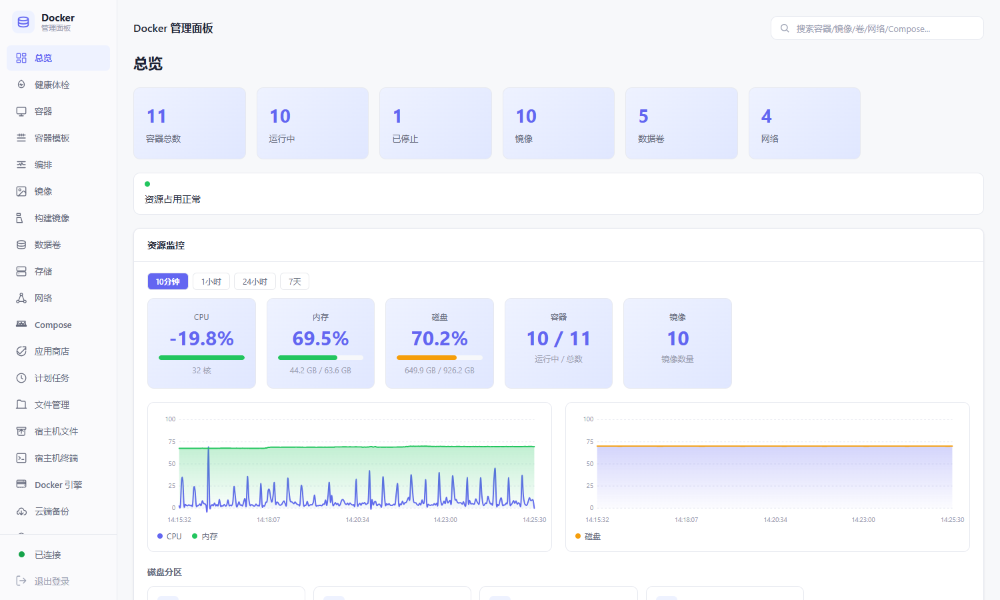

### 2.2 健康体检（`/health`）

- 展示引擎连接健康状态与关键组件运行情况。
- 当引擎掉线或资源异常时，可在此快速定位。

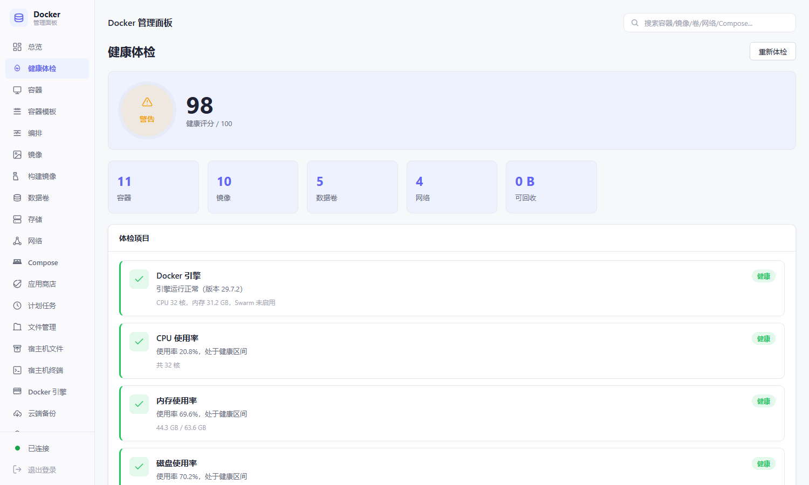

---

## 3. 容器管理

### 3.1 容器列表

菜单：**容器**（`/containers`）

- 列表展示容器名称、镜像、状态、端口、资源占用、创建时间。
- 顶部提供 **状态筛选**（运行中 / 全部）、**搜索框**（按名称 / 镜像过滤）。
- 统计条显示运行中容器数量。

### 3.2 创建容器

1. 点击 **「+ 创建容器」** 或列表上方创建按钮。
2. 在创建弹窗中填写：镜像、容器名、端口映射、环境变量、数据卷挂载等。
3. 也可选择 **「从模板创建」**：在选择框内选择容器页 `容器模板` 中已保存的模板，一键套用其配置。
4. 点击 **「创建」** 完成。

### 3.3 容器操作

列表每行的 **操作** 列提供：

- **启动 / 停止（启停）**：切换容器运行状态。
- **重启**：重启容器。
- **删除**：删除容器（可勾选是否删除关联数据卷）。
- **克隆**：基于当前容器配置复制生成新容器。
- **重命名**：修改容器名称。
- **查看日志 / 详情**：进入详情页。
- **设置重启策略**：`no` / `always` / `on-failure` / `unless-stopped`。

### 3.4 容器详情页

点击容器名进入 `containerDetail` 详情页，提供：

1. **基本信息**：状态、镜像、端口、网络、挂载、环境变量、重启策略。
2. **日志**：实时查看容器标准输出日志。
3. **内置 Web 终端**：进入容器内的 `sh` / `bash` 交互（xterm.js + WebSocket），可直接执行命令。
4. **导出配置**：将当前容器配置导出为 JSON，可用于保存为模板。
5. **文件浏览**：见「文件管理」章节。

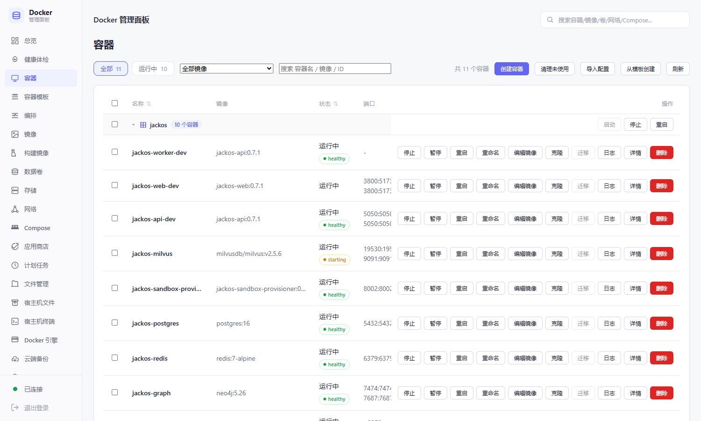

---

## 4. 容器模板 🔒

菜单：**容器模板**（`/templates`，仅管理员）

- 以 **卡片网格** 形式展示已保存的容器部署模板。
- 每张卡片显示：模板名称、镜像、描述、创建时间，并可 **折叠展开查看 config JSON**。

### 4.1 新建模板

1. 点击 **「+ 新建模板」**。
2. 填写：
   - **模板名称**（必填）
   - **描述**（可选）
   - **镜像**（可选，如 `nginx:latest`）
   - **config（JSON）**：与容器导出的配置结构一致，可直接粘贴。
3. 点击 **「创建」** 保存。

### 4.2 编辑模板

- 在卡片上点击 **「编辑」**，修改内容后点击 **「保存」**。

### 4.3 使用模板

- 模板需在 **容器 → 创建 → 从模板创建** 中选用。
- 点击卡片 **「使用」** 会提示前往容器页操作。

### 4.4 删除模板

- 点击卡片 **「删除」**，在确认框中点击 **「删除」**。删除后不可恢复。

### 4.5 搜索

- 顶部搜索框可按 **名称 / 描述 / 镜像** 实时过滤；标题显示当前匹配数与总数。

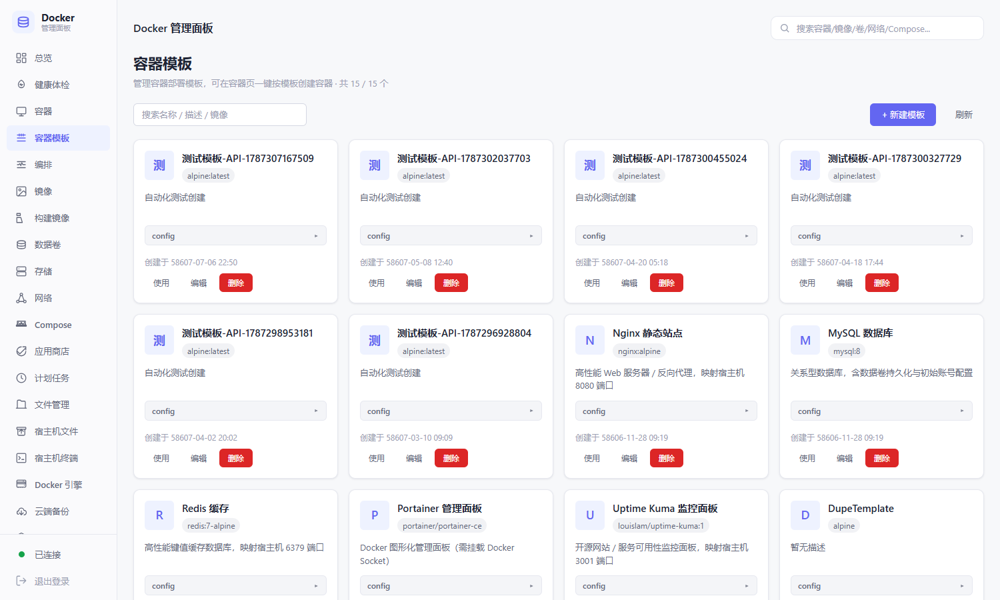

---

## 5. 容器编排 🔒

菜单：**编排**（`/orchestrate`，仅管理员）

- 对多容器应用进行统一编排管理（停止 / 启动 / 扩容等）。
- 该页面操作会记录到操作日志。

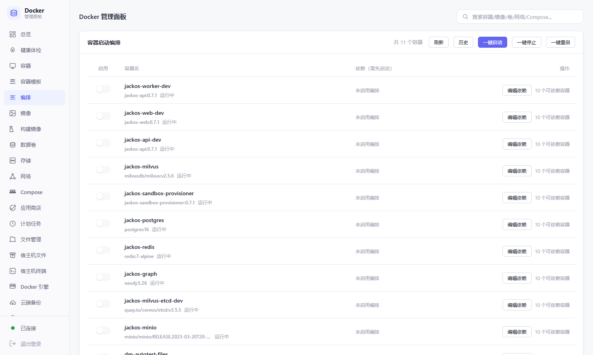

---

## 6. 镜像管理

菜单：**镜像**（`/images`）

### 6.1 镜像列表

- 展示镜像名称、标签、大小、镜像 ID、构建时间、拉取时间，并统计总镜像数、总大小、未使用镜像数。

### 6.2 拉取镜像

1. 点击 **「拉取镜像」**。
2. 输入镜像引用（如 `nginx:latest`）。
3. 选择镜像源（可走镜像加速源），系统自动按源顺序尝试、失败自动切换并重试。
4. 拉取成功后刷新列表。

### 6.3 镜像操作

- **删除**：删除指定镜像（有容器使用时需先删除容器）。
- **推送 / 导入 / 导出**：上传到仓库 / 导入导出镜像文件。
- **打标签**：为镜像添加新标签。
- **清理**：清理未使用的悬空镜像。
- **查看详情 / 构建历史**：进入 `imageDetail` 详情页查看层历史与构建信息。

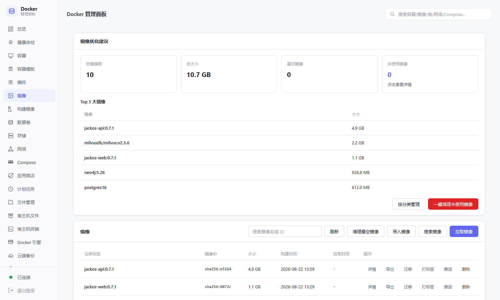

---

## 7. 镜像构建 🔒

菜单：**镜像构建**（`/build`，仅管理员）

1. 选择宿主机上包含 `Dockerfile` 的目录。
2. 配置 **构建参数**（构建参数 / 变量）与 **noCache** 开关。
3. 点击 **「开始构建」**，实时查看构建日志。
4. 构建结果持久化为 **构建历史**：可回溯历史日志、**一键复用**上次的构建配置、**清空**历史。

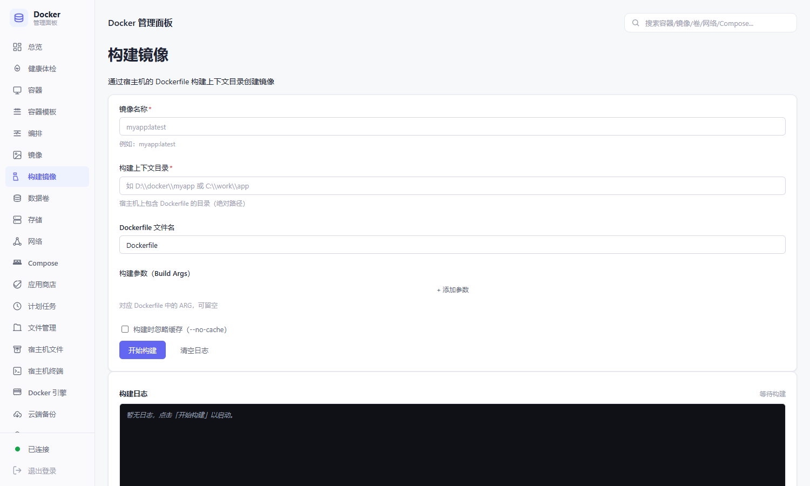

---

## 8. 数据卷 / 存储 / 网络

### 8.1 数据卷（`/volumes`）

- 列表展示卷名称、驱动、状态、挂载点、创建时间。
- **新建卷**：点击「新建卷」，填写名称与驱动后创建。
- **删除**：删除未被占用的卷（占用中的卷不可删）。
- **卷详情**：查看挂载点、使用容器等。
- **清理未使用卷**：一键回收不再被任何容器引用的卷。

### 8.2 存储（`/storage`）

- 展示磁盘分区使用统计。
- **一键回收**：清理悬空镜像、无用数据卷等占用空间的资源。

### 8.3 网络（`/networks`）

- 列表展示网络名称、驱动、作用域、内部标志等。
- **新建网络**：点击「新建网络」，填写 **网络名称**（第一个输入框）等参数创建。
- **删除**：删除未使用的网络。
- **网络详情**：查看连接容器、IPAM 子网等。
- **清理未使用网络**：回收无容器的网络。

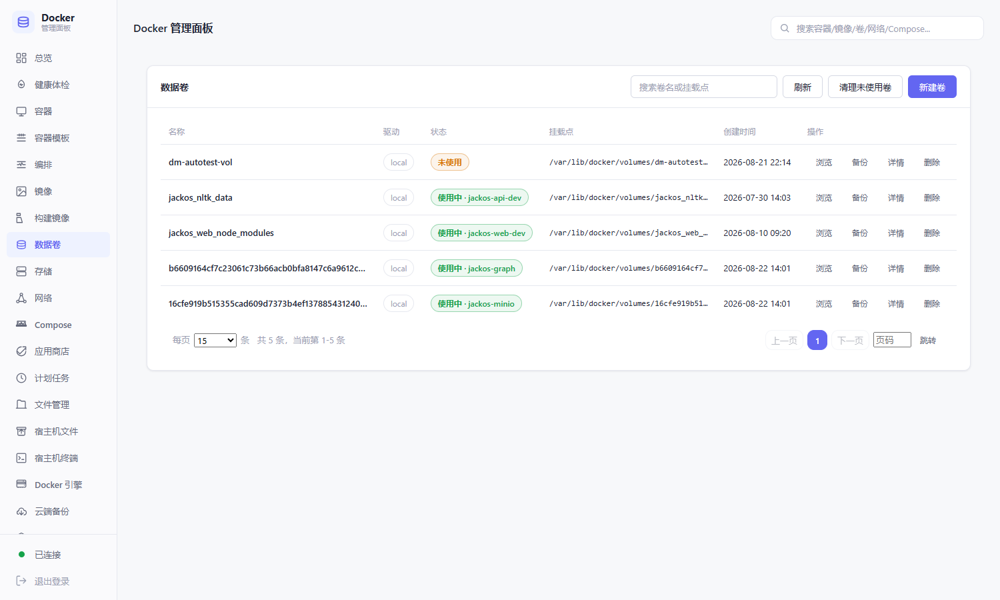

---

## 9. Compose 编排

菜单：**Compose**（`/compose`）

- 列表展示 Compose 项目名称、状态、Compose 文件与路径。
- **新建 / 编辑**：填写或多行粘贴 `docker-compose.yml` 内容。
- 提供编排操作：**Up**（部署启动）、**Down**（停止移除）、**Pull**（拉取镜像）、**Build**（构建镜像）。
- 点击展开可查看 Compose 文件内容与结构（端口映射等）。

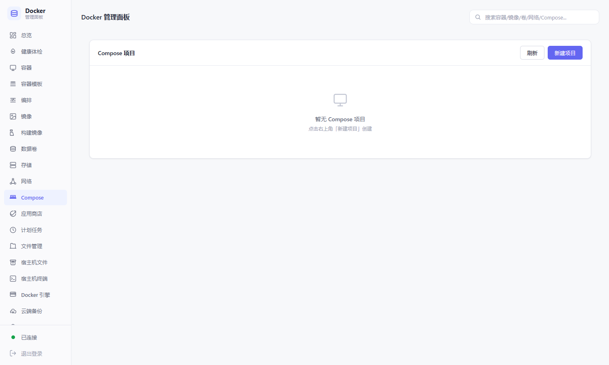

---

## 10. 应用商店

菜单：**应用商店**（`/appstore`）

1. 打开应用商店，浏览内置应用目录（卡片形式，含分类筛选）。
2. 点击应用卡片进入详情，可查看说明、版本、端口清单。
3. 根据提示填写 **应用参数**（如端口、镜像源等；可选择使用默认镜像源）。
4. 点击 **「安装」**，一键完成部署；已安装实例会标记状态。
5. 可对已安装实例执行停止 / 卸载等管理操作。

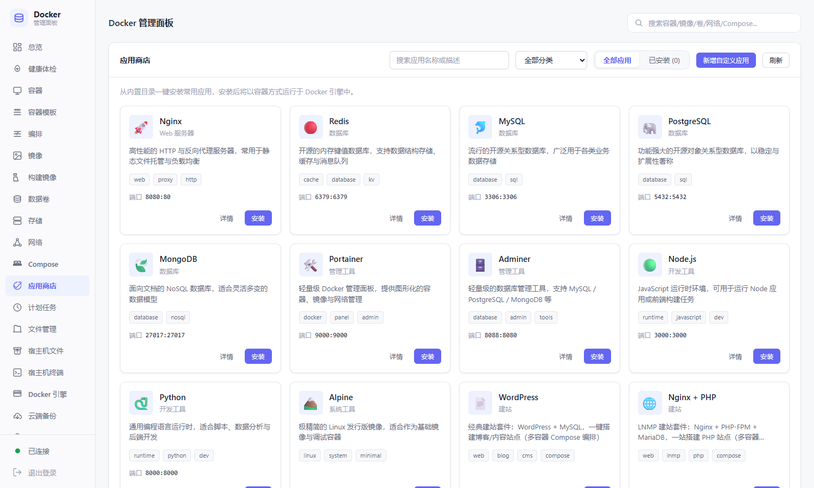

---

## 11. 计划任务

菜单：**计划任务**（`/tasks`）

- 管理定时自动化任务（周期执行 / 按依赖触发容器操作等）。
- **新建任务**：选择任务类型、执行周期（cron 表达式 / 间隔）、目标容器与操作。
- **安全基线扫描（baselineScan）**：定时对全部容器执行安全基线扫描；默认仅告警"警告及以上"且**与上次扫描对比后新增的违规**，命中后推送到已启用的通知渠道。可在任务配置中调整告警严重度下限、关闭"仅新增"改为每次有违规即推送。
- 支持启用 / 暂停、立即执行、删除、编辑。
- **执行日志**：查看每次任务的执行结果与失败原因。

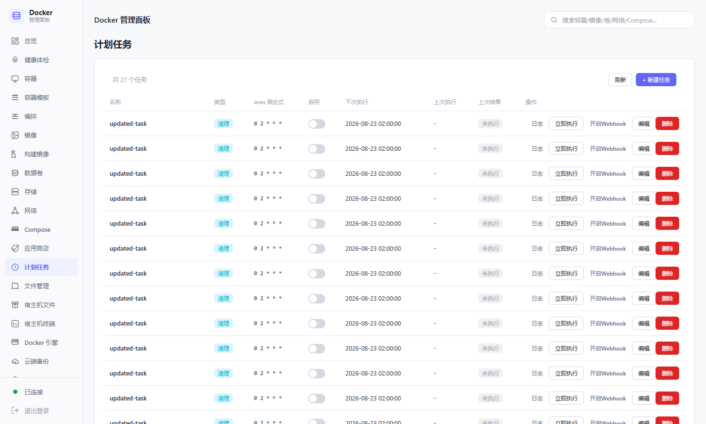

---

## 12. 文件管理 / 宿主机文件 / 宿主机终端

### 12.1 容器文件管理（`/files`）

- **容器内文件浏览**：进入某容器后浏览其文件系统。
- **上传 / 下载 / 编辑**：上传文件到容器、从容器下载、在线编辑文件内容。

### 12.2 宿主机文件（`/hostfiles`）

- 浏览宿主机文件系统（谨慎操作，涉及系统级读写）。
- 支持基本的上传 / 下载 / 编辑。

### 12.3 宿主机终端（`/hostterminal`）

- 打开宿主机远程终端（基于 xterm），直接执行宿主机命令。
- **仅建议管理员使用**，操作需谨慎。

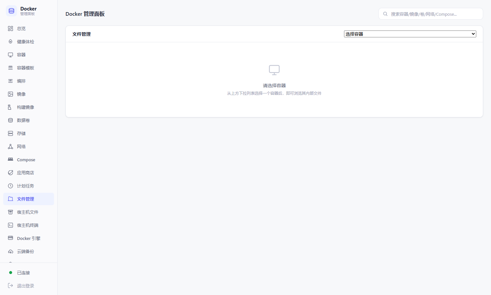

---

## 13. Docker 引擎 🔒

菜单：**Docker 引擎**（`/engines`，仅管理员）

- 管理多个 Docker 引擎端点（本地或远程）。
- **新增引擎**：填写端点地址（`npipe://` / `tcp://` 等）与可选的 TLS 配置。
- **编辑 / 删除**：管理已有端点。
- **设为当前**：切换当前使用的引擎端点。
- 端点连接自动探测与验证，便于连接多台主机的 Docker。

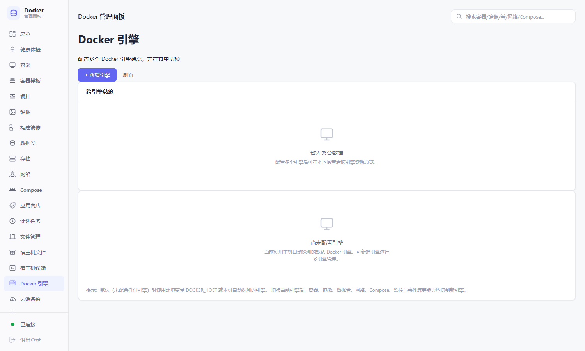

---

## 14. 云备份 🔒

菜单：**云备份**（`/cloudbackup`，仅管理员）

- 配置云端备份目标：**S3 / OSS / WebDAV**。
- **新增目标**：填写 AccessKey、Secret、Bucket / 路径、Endpoint 等。
- **连通性测试**：校验目标配置是否正确可写。
- **文件上传**：手动将备份文件上传到云端目标。
- 云端备份能力可在「备份恢复」中与本地备份配合使用。

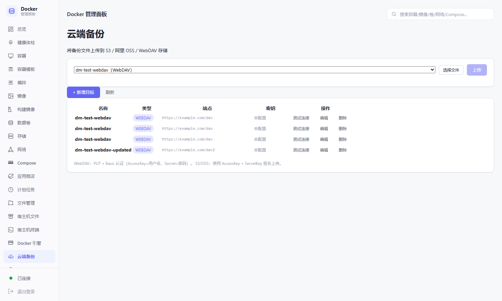

---

## 15. 备份恢复

菜单：**备份恢复**（`/backups`）

### 15.1 创建备份

- 支持备份类型：**DATA（全部数据）/ Compose / 数据卷 / 站点**。
- 点击「新建备份」选择类型后执行，生成备份记录。

### 15.2 恢复与下载

- 备份列表中可 **下载** 备份文件、**恢复** 到当前环境、**删除** 过期备份。
- 可将备份文件 **上传到云端**（此前需在「云备份」配置目标）。

### 15.3 数据迁移

- 复制整个 `data/` 目录（核心为 `docker-manager.db`）即可完成配置备份与迁移。

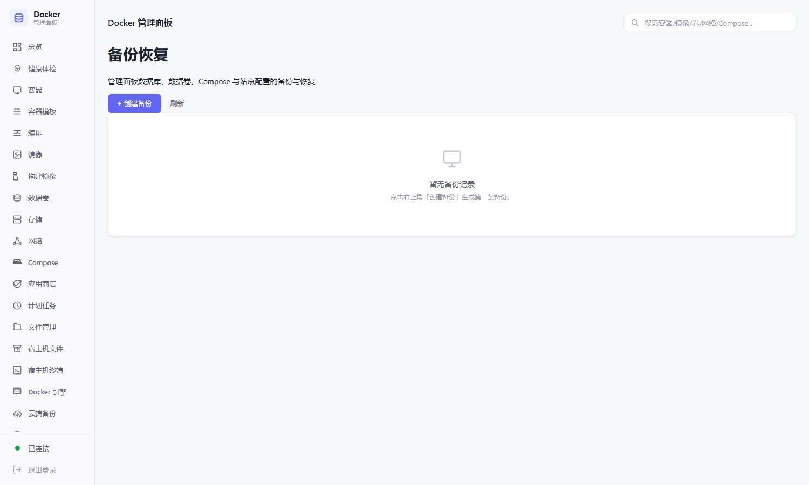

---

## 16. Swarm 集群 🔒

菜单：**Swarm**（`/swarm`，仅管理员）

- 展示 / 管理 Docker Swarm 集群节点与服务。
- 当宿主机已初始化或加入 Swarm 时可用；不常用场景可忽略。

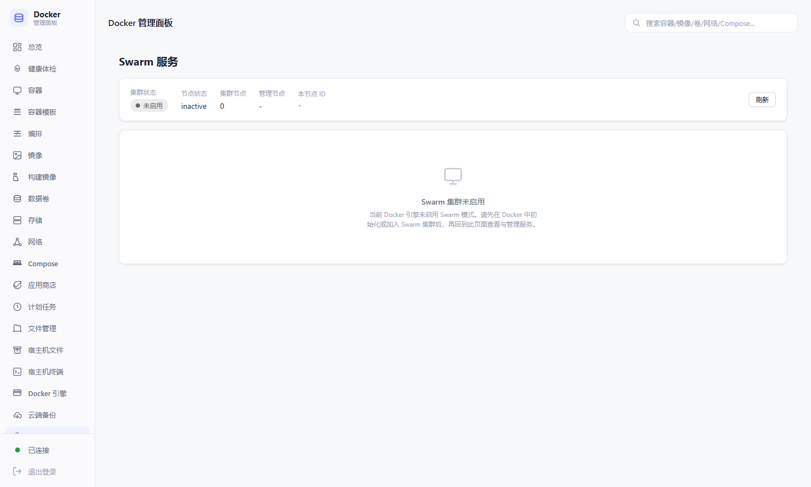

---

## 17. 数据库可视化

菜单：**数据库**（`/databases`）

- 可视化查看容器化的 **MySQL / PostgreSQL / Redis** 等数据库实例（**只读保护**，不直接修改数据）。

### 17.1 新增实例

1. 点击「新增实例」。
2. 填写实例名称、类型、连接信息（宿主 / 端口 / 账号 / 密码等）。
3. 保存后即可在列表中打开该实例进行可视化查询。

### 17.2 查询与信息查看

- 打开实例可查看表结构、执行只读查询、浏览数据。
- 仅提供信息展示，**不提供破坏性写操作**。

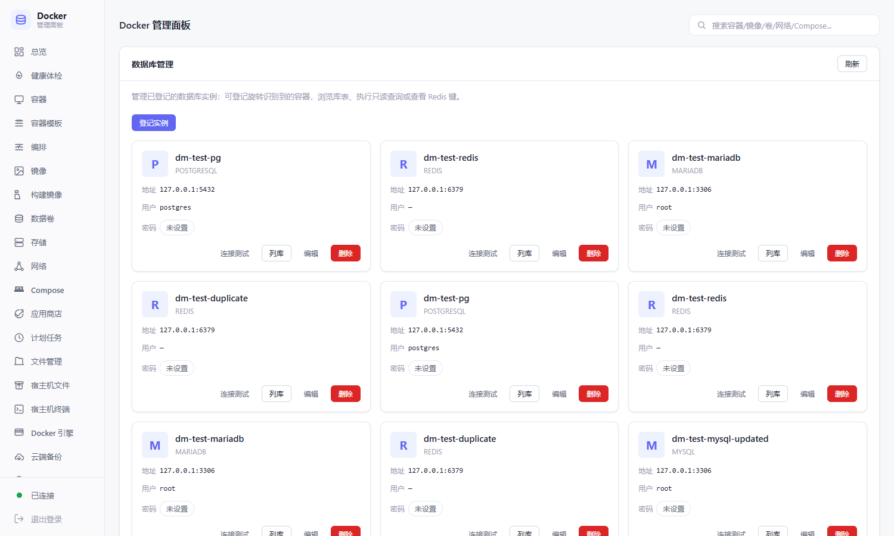

---

## 18. 镜像中心（Hub）

菜单：**镜像中心**（`/hub`）

### 18.1 镜像源配置

- 查看 / 配置 **Docker 镜像加速源**（内置轩辕、1ms 等默认源）。
- **搜索源**：用于在线搜索 Docker Hub 镜像。若默认源不支持搜索可更换为可搜索源（见 25.2 常见问题）。

### 18.2 在线搜索与快捷拉取

- 输入关键字 **在线搜索** Docker Hub 镜像。
- **常用镜像**：一键快捷拉取常用镜像（nginx、redis、mysql 等）。
- 搜索结果可一键跳转到镜像页拉取。

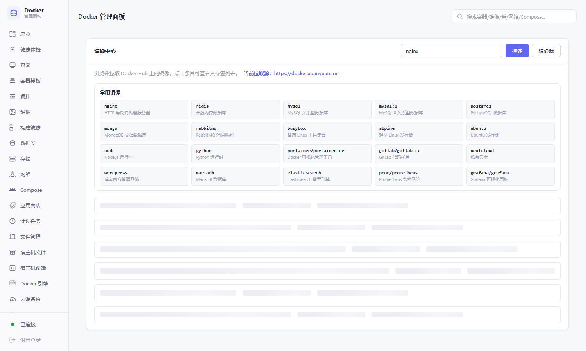

---

## 19. 事件流

菜单：**事件流**（`/events`）

- 实时查看 Docker 引擎事件流（create / start / stop / die 等）。
- 事件 **持久化到 SQLite**，可查询 **历史事件**。
- 支持 **导出 CSV**、**清空** 历史事件。

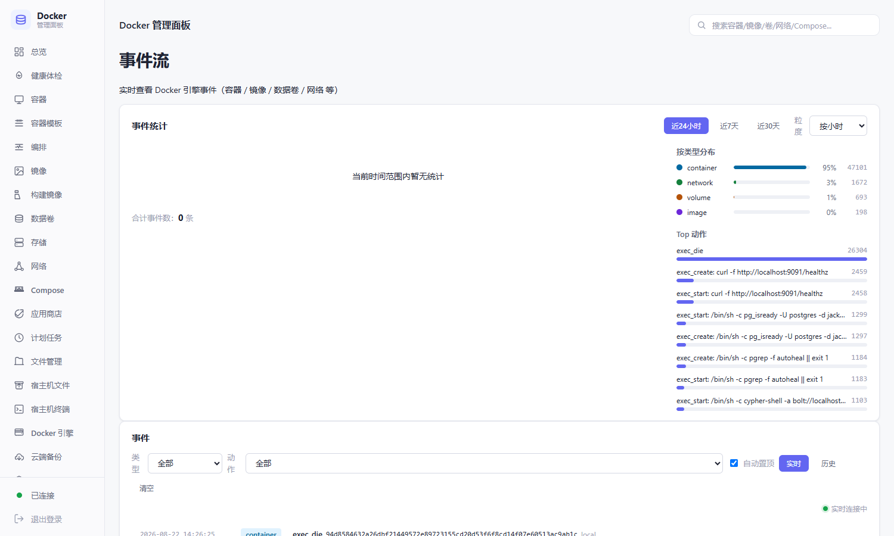

---

## 20. 操作日志

菜单：**操作日志**（`/operation-logs`）

- 审计管理员在系统中的管理操作（删除、创建、配置变更等），便于追溯与安全审计。

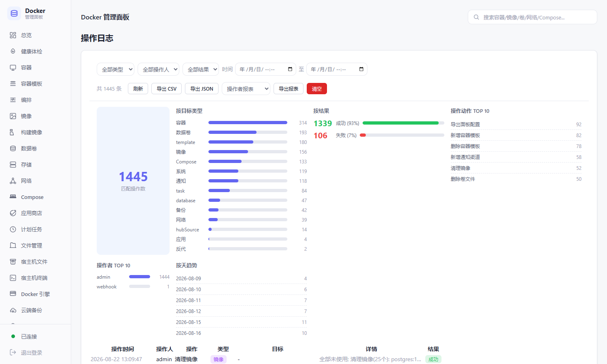

---

## 21. 通知告警 🔒

菜单：**通知告警**（`/notifications`，仅管理员）

- 配置系统告警通知渠道（Webhook / 邮件等）与告警规则。
- 支持 **容器规则**：针对特定容器（如退出、频繁重启、资源异常）配置告警触发条件。
- 事件发生时按规则向目标推送告警；列表可查看已触发的告警记录与触发时间。

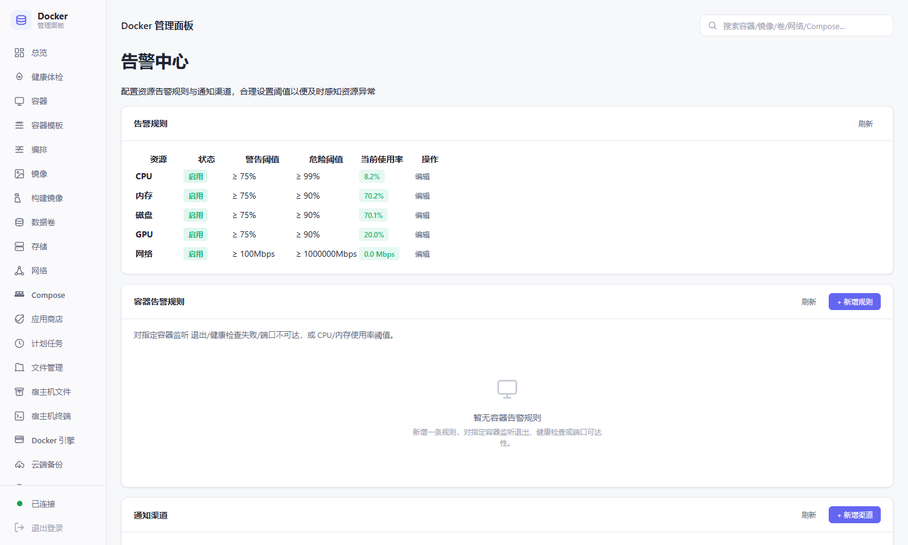

---

## 22. 站点反代 🔒

菜单：**站点（反代 / 端口映射）**（`/sites`，仅管理员）

- 基于反代容器的 **站点反向代理 / 端口映射** 管理。
- **新增站点**：填写站点域名、目标上游地址、端口等。
- 支持 **启停** 与配置 **reload**。
- **SSL 证书**：查看证书状态与有效期，可 **上传证书** 替换现有证书（「上传证书」按钮）。

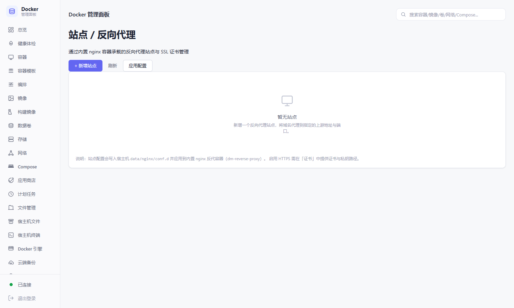

---

## 23. 防火墙 🔒

菜单：**防火墙**（`/firewall`，仅管理员）

- 管理 Windows 防火墙的 **入站端口放行** 规则（基于系统 `netsh`）。
- **新增规则**：填写端口、协议后放行入站访问。
- 删除不需要的放行规则。
- 需要管理员权限运行，操作时可能有系统提示。

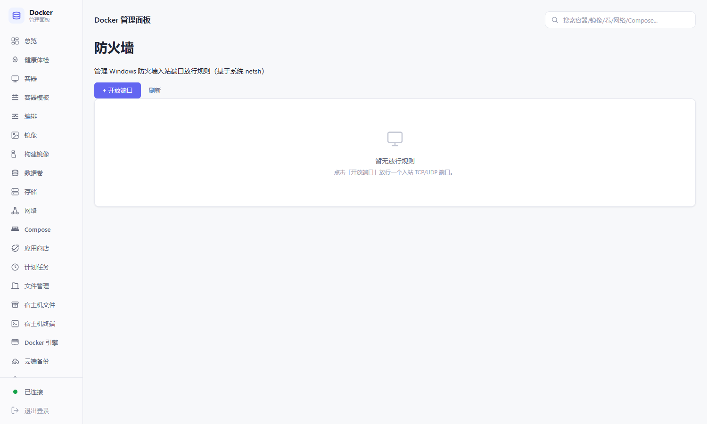

---

## 24. 应用商店与系统设置

### 24.1 系统设置（`/settings`）

- **主题**：切换浅色 / 深色主题。
- **语言**：切换界面语言。
- **用户与密码管理**：管理员可在此新增 / 删除用户、修改用户密码（与登录鉴权关联）。
- **数据保留（自动清理）**：操作日志默认保留 90 天、AI 用量明细与 AI 巡检记录默认保留 30 天，超期数据在读取时每日自动清理一次；设为 `0` 表示永久保留（见「系统参数 → 数据保留」）。

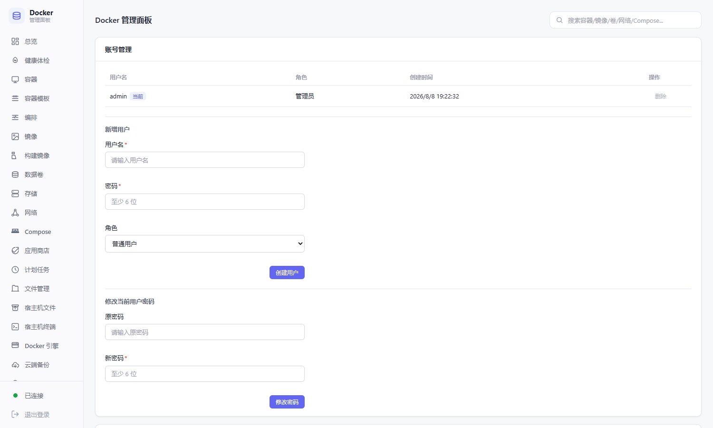

---

## 25. 详细参数表

下面是各功能新增 / 编辑弹窗的字段明细，方便填写时参考。标注「*」为必填项。

### 25.1 Docker 引擎端点（`/engines`）

| 字段 | 说明 | 是否必填 |
| --- | --- | --- |
| 引擎名称 * | 如「服务器B」 | 必填 |
| 端点地址 * | `npipe://` / `tcp://host:2375` / `unix://`，如 `tcp://192.168.1.10:2375` | 必填 |

> 引擎身份与连接由端点地址的 scheme（npipe / tcp / unix）决定，无独立 TLS 字段。

### 25.2 云端备份目标（`/cloudbackup`）

| 字段 | 说明 | 是否必填 |
| --- | --- | --- |
| 类型 | `WebDAV` / `S3` / `阿里 OSS` | 否 |
| 名称 * | 如「我的 NAS / 腾讯云 COS」 | 必填 |
| 端点地址 * | WebDAV 填服务器地址；OSS 填 `https://oss-cn-hangzhou.aliyuncs.com`；S3 填 `https://s3.region.amazonaws.com` | 必填 |
| 桶名（Bucket） | 仅 S3 / OSS 显示，如 `my-bucket` | S3/OSS 必填 |
| Region | 仅 S3 显示，如 `us-east-1` | 否 |
| 基路径（可选） | 如 `backup/app1` | 否 |
| AccessKey / 用户名 | WebDAV 用「用户名」，S3/OSS 用「访问密钥 ID」 | 否 |
| 密码 / SecretKey | WebDAV 用密码，S3/OSS 用 SecretKey（编辑留空则保持原密钥） | 否 |

### 25.3 数据库实例（`/databases`）

| 字段 | 说明 | 是否必填 |
| --- | --- | --- |
| 名称 * | 如「主数据库」 | 必填 |
| 类型 | `MySQL` / `PostgreSQL` / `MariaDB` / `Redis` | 必填 |
| 主机 * | `127.0.0.1` 或容器名 | 必填 |
| 端口 * | `3306` / `5432` / `6379` | 必填 |
| 用户名 | `root`（可空） | 否 |
| 密码 | 编辑留空则保持原密码 / 无密码连接 | 否 |

> 新建数据库（MySQL/MariaDB）：数据库名（必填）+ 字符集（`utf8mb4` / `utf8mb3` / `utf8` / `gbk` / `latin1`，创建后不可改）。
> Redis 查询：匹配模式（如 `*` / `user:*`）+ 限制条数。

### 25.4 站点（反代 / 端口映射，`/sites`）

| 字段 | 说明 | 是否必填 |
| --- | --- | --- |
| 域名 * | 如 `app.example.com` | 必填 |
| 上游地址 * | `localhost` / `127.0.0.1` / 容器名 | 必填 |
| 上游端口 * | 1–65535 | 必填 |
| 监听端口 | 宿主机对外端口（HTTP 默认 80，HTTPS 建议 443） | 否 |
| 启用 HTTPS | 勾选后显示「证书文件路径」 | 否 |
| 证书文件路径 | 宿主机绝对路径，如 `C:\certs\app.pem` | 仅 HTTPS |
| 高级：WebSocket 透传 / gzip / 访问控制 | 各为开关 | 否 |
| 访问控制用户名 / 密码 | 启用访问控制时显示 | 启用即必填 |
| 请求限速 | 如 `5r/s` 或 `10r/m` | 否 |
| 客户端请求体上限 | 如 `10m`（默认 `1m`） | 否 |
| 代理超时（秒） | 默认 60 | 否 |
| 自定义配置片段 | 额外 nginx 指令（TextArea） | 否 |

### 25.5 通知告警（`/notifications`）

**通知渠道**：渠道名称 *、渠道类型（`Webhook` / `邮件 SMTP` / `钉钉机器人` / `飞书机器人`）。

| 类型 | 字段 |
| --- | --- |
| Webhook | Webhook 地址 *、Secret |
| 邮件 SMTP | SMTP 主机 *、端口 *、使用 SSL、账号、密码、发件人 *、收件人（逗号分隔）* |
| 钉钉机器人 | access_token *、加签密钥 Secret |
| 飞书机器人 | Webhook 地址 * |

**告警规则（资源：CPU / 内存 / 磁盘 / GPU / 网络）**：启用开关、警告阈值 % *、危险阈值 % *、静默时段、仅工作日、工作时段。

**容器告警规则**：目标容器 *、监控类型 *（退出 / 健康检查 / 端口 / CPU / 内存）、探测端口（端口类）、警告阈值 %、危险阈值 %、启用开关、静默时段、仅工作日、工作时段。

### 25.6 防火墙（`/firewall`）

| 字段 | 说明 | 是否必填 |
| --- | --- | --- |
| 端口号 * | 1–65535，如 `8080` | 必填 |
| 协议 | `TCP` / `UDP` | 否 |
| 备注（可选） | 如「Nginx 对外服务」 | 否 |

### 25.7 计划任务（`/tasks`）

通用字段：任务名称 *、任务类型 *、cron 表达式 *（5 段：分 时 日 月 星期）、启用开关。

任务类型与对应参数：
- **清理（prune）**：范围（未使用镜像 / 已停止容器 / 未使用数据卷 / 未使用网络 / Build Cache）
- **备份（backup）**：目标（面板数据库 / 命名卷）、卷名（命名卷时必填，逗号分隔）、保留备份数
- **拉取镜像（pull）**：镜像名称 *（如 `nginx:latest`）
- **重启容器（restart）/ 容器健康检查（healthcheck）**：目标容器 *（可多选）
- **自定义命令（command）**：执行命令 *、工作目录
- **拉起/停止 compose（composeUp / composeDown）**：Compose 项目 *
- **Git 自动部署（git-pull-build）**：部署模式（构建镜像 / Compose 部署）、Git 仓库地址 *、分支、镜像名 / Compose 项目、私有仓库凭证（HTTPS Token / SSH 私钥）

### 25.8 Compose 项目（`/compose`）

- 新建：项目名称 * + `docker-compose.yml`（必填，可从模板选择：空白 / WordPress / Nginx 静态站 / Redis / PostgreSQL / Node.js；支持上传 `.yml` / `.yaml` 文件）
- 编辑：仅 `docker-compose.yml`
- 保存为模板：模板名称 *、描述
- 删除：可勾选「同时删除该项目的数据卷」

### 25.9 应用商店（`/appstore`）

安装应用时配置：
- **环境变量**：按应用声明逐项填写 KEY / 值（有默认值无说明的标必填）
- **端口映射**（可增删）：容器端口、宿主机端口（可空）、协议（tcp / udp）
- **挂载卷**（单容器）：来源（宿主机路径或卷名）、容器路径（如 `/data`）、只读
- **镜像源**：默认镜像源 或 指定已启用源（留空则依次尝试，多源容灾）

### 25.10 备份恢复（`/backups`）

- 类型：`面板数据库` / `数据卷` / `Compose 配置` / `站点配置`
- 名称 *、来源（可选，如数据卷名）
- 上传云端需先在 `/cloudbackup` 配置目标

---

## 26. 常见问题

| 问题 | 处理办法 |
| --- | --- |
| 提示"无法连接 Docker 引擎" | 确认 Docker Desktop 已启动；必要时设置环境变量 `DOCKER_HOST` 指向可用端点。 |
| 镜像搜索失败（502 / 无法搜索） | 国内多数镜像加速站只代理拉取、不实现 Docker Hub 的搜索接口。在 **镜像中心 → 镜像源 → 搜索源** 填入支持搜索的源（如 `https://docker-0.unsee.tech`，备用 `https://docker.tbap.top`）；仍不可用可直接点选"常用镜像"或用已知镜像名拉取。 |
| 忘记管理密码 | 停止服务，删除 `data/docker-manager.db`（连同 `-wal` / `-shm` 文件），重启后以默认 `admin` / `admin888` 重新初始化。 |
| 备份 / 迁移数据 | 复制整个 `data/` 目录即可（核心为 `docker-manager.db`）。 |
| 登录按钮为何显示"登 录" | 按钮文字为「登 录」（带空格），为正常显示，输入账号密码后点击即可。 |
| Linux 安装后无法连接 Docker | 确保 `dockerman` 用户已加入 docker 组（`sudo usermod -aG docker dockerman`），并重启服务。 |
| Windows 安装后无法访问 | 确认 Docker Desktop 已启动，且 nssm 服务状态正常（`services.msc` 中查看 DockerManager 服务）。 |
| 防火墙拦截 | Linux：`firewall-cmd --permanent --add-port=9528/tcp && firewall-cmd --reload`；Windows：通过面板「防火墙」页面放行端口。 |

---

## 27. 镜像漏洞扫描

| 项目 | 说明 |
| --- | --- |
| 路径 | 镜像 → 镜像列表 → 漏洞扫描 |
| 权限 | 登录用户 |
| 后端依赖 | Trivy（自动检测，未安装时提示安装） |

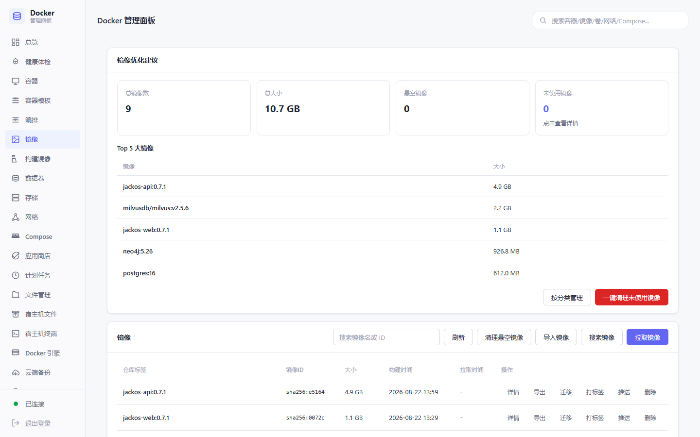

### 27.1 使用方法

1. 进入 **镜像管理** 页面，选择目标镜像；
2. 点击 **漏洞扫描** 按钮；
3. 系统调用 Trivy 扫描镜像层，返回 CVE 漏洞列表。

### 27.2 结果解读

| 字段 | 含义 |
| --- | --- |
| CVE ID | 漏洞编号 |
| Severity | 严重程度：Critical / High / Medium / Low / Unknown |
| Installed Version | 镜像中实际安装的包版本 |
| Fixed Version | 修复版本（如有） |
| Title | 漏洞描述 |

### 27.3 操作建议

- **Critical / High** 漏洞建议立即更新基础镜像或升级依赖包；
- 点击 **重新扫描** 确认修复结果；
- 可结合 **镜像构建** 功能使用更新后的基础镜像重新构建。

---

## 28. 跨引擎容器迁移 / 镜像传输

| 项目 | 说明 |
| --- | --- |
| 路径 | Docker 引擎 → 引擎详情 → 迁移 / 传输 |
| 权限 | 管理员 🔒 |

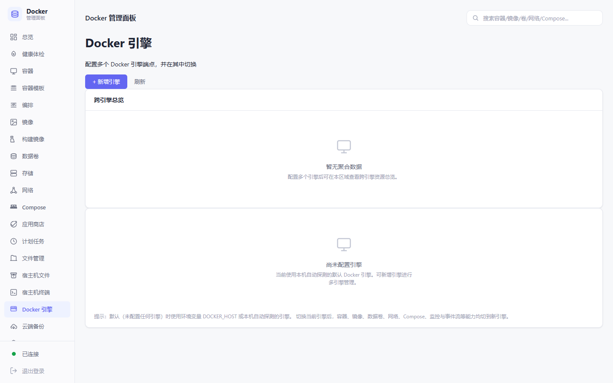

### 28.1 功能说明

支持将容器或镜像从一个 Docker 引擎迁移到另一个引擎，适用于：
- 更换宿主机时的数据迁移；
- 多引擎间的负载调整；
- 环境复制（从生产环境复制到测试环境）。

### 28.2 操作步骤

1. 进入 **Docker 引擎** 页面，选择源引擎；
2. 选择要迁移的容器或镜像；
3. 选择目标引擎；
4. 点击 **迁移 / 传输**；
5. 系统通过 `docker save` + `docker load` 完成传输。

### 28.3 注意事项

- 大镜像传输耗时较长，请确保网络稳定；
- 容器迁移需先停止源容器；
- 传输过程在服务端执行，浏览器关闭不影响进度。

---

## 29. 跨引擎聚合总览

| 项目 | 说明 |
| --- | --- |
| 路径 | 总览 → 多引擎聚合 |
| 权限 | 管理员 🔒 |

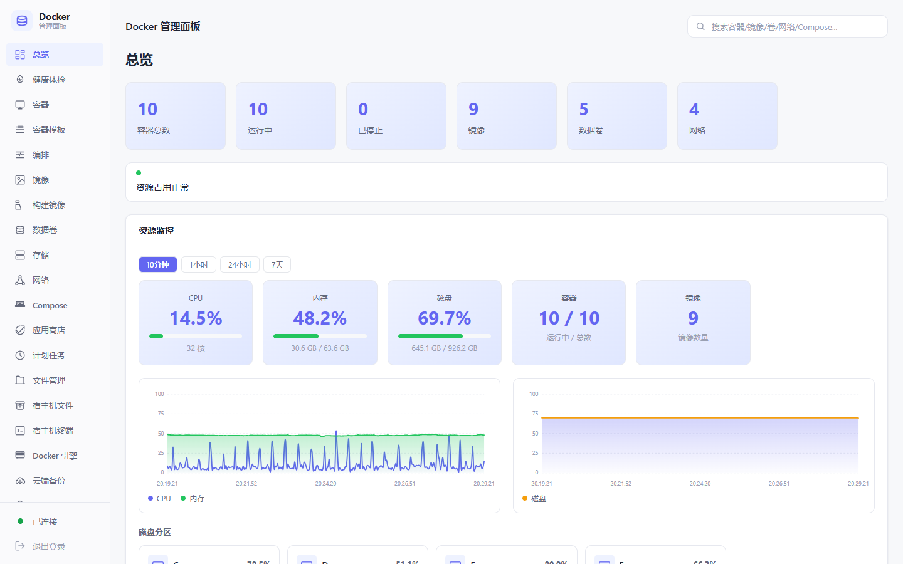

### 29.1 功能说明

当管理面板连接了多个 Docker 引擎时，聚合总览提供统一视角：
- 汇总所有引擎的容器数量（运行中 / 已停止 / 已暂停）；
- 汇总所有引擎的资源使用（CPU / 内存 / 磁盘）；
- 快速定位异常引擎。

### 29.2 页面元素

| 区域 | 内容 |
| --- | --- |
| 引擎卡片 | 每个引擎一张卡片，显示引擎名称、状态、容器数、资源使用 |
| 汇总指标 | 所有引擎的容器总数、总 CPU 使用率、总内存使用率 |
| 引擎切换 | 点击卡片可跳转到该引擎的详细管理页面 |

---

## 30. 全局搜索

| 项目 | 说明 |
| --- | --- |
| 位置 | 顶部导航栏搜索框 |
| 权限 | 登录用户 |


### 30.1 功能说明

全局搜索支持在所有资源中快速查找目标，无需逐页面浏览。

### 30.2 搜索范围

| 资源类型 | 搜索字段 |
| --- | --- |
| 容器 | 名称、ID、镜像名、状态 |
| 镜像 | 名称、标签、ID |
| 数据卷 | 名称、驱动 |
| 网络 | 名称、驱动 |
| Compose 项目 | 项目名、路径 |
| 宿主机文件 | 文件名、路径 |

### 30.3 使用方法

1. 点击顶部导航栏的搜索框（或按 `/` 快捷键）；
2. 输入关键词；
3. 下拉列表实时显示匹配结果；
4. 点击结果直接跳转到对应页面。

---

## 31. 容器资源占用看板

| 项目 | 说明 |
| --- | --- |
| 路径 | 总览 → 资源看板 |
| 权限 | 登录用户 |

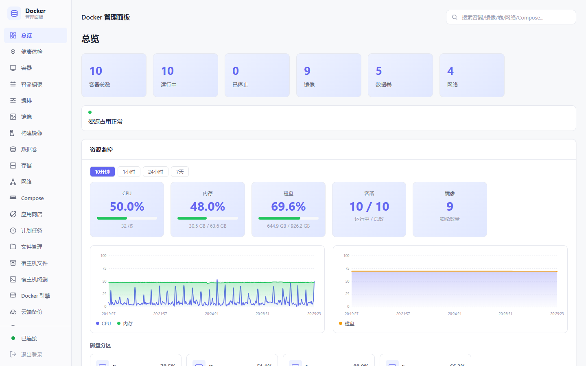

### 31.1 功能说明

实时展示所有运行中容器的资源占用排名，快速定位资源消耗最高的容器。

### 31.2 看板内容

| 指标 | 说明 |
| --- | --- |
| Top CPU | 按 CPU 使用率降序排列的容器列表 |
| Top Memory | 按内存使用量降序排列的容器列表 |
| 网络 I/O | 各容器的网络收发流量 |
| 磁盘 I/O | 各容器的磁盘读写量 |

### 31.3 操作

- 点击容器名称可跳转到容器详情页；
- 支持按引擎筛选；
- 数据每 5 秒自动刷新。

---

## 32. 监控持久化历史

| 项目 | 说明 |
| --- | --- |
| 路径 | 总览 → 监控历史 |
| 权限 | 登录用户 |

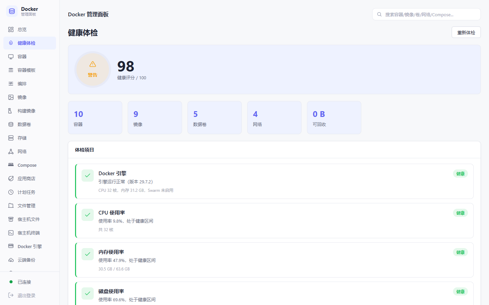

### 32.1 功能说明

系统自动保存监控数据，支持查看不同时间范围的历史趋势：
- **1 小时**：5 秒粒度，适合排查瞬时异常；
- **24 小时**：1 分钟粒度，适合日常巡检；
- **7 天**：5 分钟粒度，适合趋势分析。

### 32.2 图表说明

| 图表 | 内容 |
| --- | --- |
| CPU 使用率 | 各引擎/容器的 CPU 使用率变化曲线 |
| 内存使用 | 各引擎/容器的内存使用量变化曲线 |
| 网络流量 | 各引擎/容器的网络收发流量变化曲线 |
| 磁盘 I/O | 各引擎/容器的磁盘读写量变化曲线 |

### 32.3 数据管理

- 监控数据存储在 SQLite 数据库中；
- 默认保留 30 天，可在 **系统设置 → 监控** 中调整；
- 支持导出 CSV 格式的历史数据。

---

## 33. 模板 / 镜像中心增强

| 项目 | 说明 |
| --- | --- |
| 路径 | 镜像中心 / 容器模板 |
| 权限 | 登录用户 |


### 33.1 镜像中心增强功能

| 功能 | 说明 |
| --- | --- |
| 镜像分类批量清理 | 按分类（如 `library`、`bitnami`）批量清理未使用镜像 |
| 端口冲突检测 | 创建容器前自动检测端口是否被占用 |
| 漏洞扫描入口 | 镜像列表直接发起漏洞扫描（见第 27 章） |
| 构建历史 | 查看通过面板构建的镜像历史记录 |

### 33.2 模板库增强功能

| 功能 | 说明 |
| --- | --- |
| Compose 模板库 | 预置常用应用的 Compose 模板（如 WordPress、MySQL、Redis） |
| 一键部署 | 选择模板后一键生成并启动 Compose 项目 |
| 模板收藏 | 收藏常用模板，快速访问 |
| 自定义模板 | 将现有 Compose 配置保存为自定义模板 |

---

## 34. 配置导入 / 导出

| 项目 | 说明 |
| --- | --- |
| 路径 | 系统设置 → 配置管理 |
| 权限 | 管理员 🔒 |

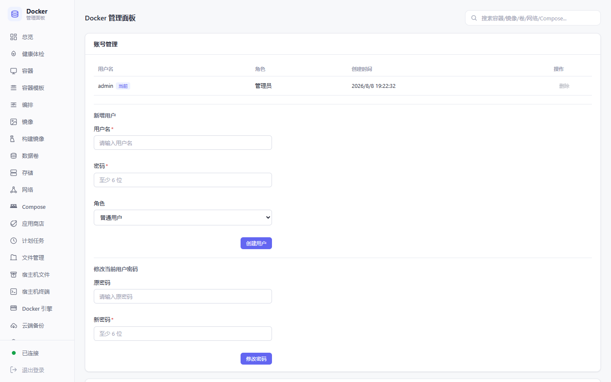

### 34.1 功能说明

支持将面板配置导出为 JSON 文件，也可从 JSON 文件导入配置，方便：
- 多实例间同步配置；
- 重装后恢复配置；
- 环境迁移。

### 34.2 导出配置

1. 进入 **系统设置 → 配置管理**；
2. 选择要导出的配置项（可多选）；
3. 点击 **导出**；
4. 浏览器下载 JSON 文件。

### 34.3 可导出的配置项

| 配置项 | 内容 |
| --- | --- |
| 引擎配置 | Docker 引擎连接信息 |
| 模板配置 | 容器模板和 Compose 模板 |
| 计划任务 | 所有定时任务配置 |
| 站点配置 | 反代和端口映射配置 |
| 通知配置 | 告警规则和通知渠道 |
| 系统设置 | 面板全局设置 |

### 34.4 导入配置

1. 进入 **系统设置 → 配置管理**；
2. 点击 **导入**，选择 JSON 文件；
3. 预览将要导入的配置项；
4. 确认导入。

> **注意**：导入会覆盖同名配置，建议先导出当前配置作为备份。

---

## 35. Webhook / Git 自动部署

| 项目 | 说明 |
| --- | --- |
| 路径 | 计划任务 → 新建任务 → Webhook / Git 部署 |
| 权限 | 登录用户 |

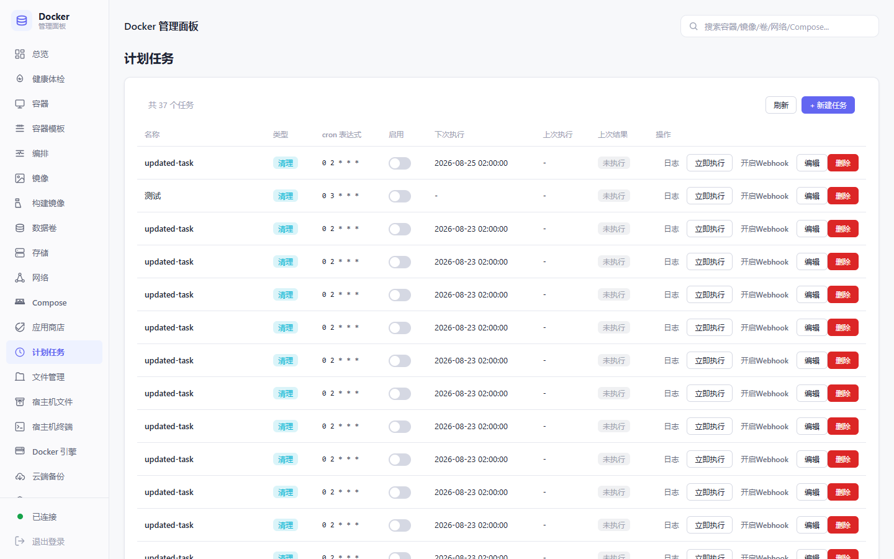

### 35.1 Webhook 触发

支持通过 HTTP 请求触发容器操作：

| 参数 | 说明 |
| --- | --- |
| 任务类型 | 选择「Webhook 触发」 |
| 目标容器 | 选择要操作的容器 |
| 操作 | 启动 / 停止 / 重启 |
| Token | 自动生成的鉴权令牌，请求时需携带 |

触发方式：`POST /api/webhook/{taskId}?token={token}`

### 35.2 Git 自动部署

支持 Git 仓库的自动拉取和部署：

| 参数 | 说明 |
| --- | --- |
| 任务类型 | 选择「Git 部署」 |
| 仓库地址 | Git 仓库 URL |
| 分支 | 目标分支（默认 main） |
| 部署路径 | 本地克隆路径 |
| 部署命令 | 克隆/拉取后执行的命令（如 `docker compose up -d`） |

### 35.3 执行方式

| 方式 | 说明 |
| --- | --- |
| 定时执行 | 按 Cron 表达式定时拉取并部署 |
| Webhook 触发 | 推送代码后通过 Webhook 触发部署 |
| 手动执行 | 在任务列表点击「立即执行」 |

---

## 36. 运维工具箱

| 项目 | 说明 |
| --- | --- |
| 路径 | `/tools` |
| 权限 | 登录用户 |

纯前端实现的常用运维小工具集合，数据不出浏览器：

| 工具 | 用途 |
| --- | --- |
| JSON 工具 | 格式化 / 压缩 / 校验 JSON |
| 正则测试 | 实时匹配测试与高亮 |
| Base64 | 编码 / 解码 |
| 时间戳 | Unix 时间戳与可读时间互转 |
| 进制转换 | 2 / 8 / 10 / 16 进制互转 |
| 端口与网段 | 端口网段计算（CIDR / 子网） |

---

## 37. 端口地图

| 项目 | 说明 |
| --- | --- |
| 路径 | `/ports` |
| 权限 | 登录用户 |
| 接口 | `GET /api/ports/map` |

- **跨引擎聚合**：一次性汇总所有已配置 Docker 引擎（含本机引擎）的容器端口映射
- **冲突检测**：同一引擎内多个容器绑定相同宿主端口时高亮告警
- **分布图**：按端口段（32 桶）统计占用分布，快速定位拥挤网段

---

## 38. Prometheus / Grafana 监控对接

| 项目 | 说明 |
| --- | --- |
| 指标端点 | `GET /metrics`（Prometheus 文本格式，`dm_*` 指标族） |
| 鉴权 | 可选，设置 → 系统参数 → 监控抓取 Token（Query `?token=` 或 `Authorization: Bearer`） |
| Dashboard | 总览 → 资源监控 → 「导出 Grafana」，下载 JSON 后在 Grafana 导入 |

`/metrics` 输出主机与容器级 CPU / 内存 / 网络等指标，可直接被 Prometheus 抓取；Grafana Dashboard JSON 包含总览、容器排行等常用面板。

---

## 39. 安全基线扫描 🔒

| 项目 | 说明 |
| --- | --- |
| 路径 | `/policy` |
| 权限 | 管理员 🔒 |
| 接口 | `GET /api/policy/scan`（只读扫描）；`POST /api/policy/fix`（在线修复） |

内置 6 条基线规则，对全部运行容器做只读检查：

| 规则 | 级别 | 在线修复 |
| --- | --- | --- |
| 特权容器（--privileged） | 危险 | ❌ 需重建容器 |
| 敏感挂载（docker.sock 等） | 危险 | ❌ 需重建容器 |
| 未配置内存限制 | 建议 | ✅ 默认 512MB（可传 params.memoryBytes） |
| 未配置 CPU 限制 | 建议 | ✅ 默认 1 核（可传 params.cpus） |
| 重启策略为 no / none | 建议 | ✅ 默认 unless-stopped（可传 params.policy） |
| 缺少属主标签 | 提示 | ❌ 需重建容器 |

**一键修复**：内存 / CPU / 重启策略三类违规支持在线修复（Docker Container Update API，修复后自动复检并在报告中确认违规消除）；特权模式、敏感挂载、属主标签需重建容器，页面展示加固建议。修复动作走审批门禁（`container.fix`）：开启审批流后非管理员提交修复会转入审批中心，批准后自动执行。

---

## 40. 高危操作审批流

| 项目 | 说明 |
| --- | --- |
| 路径 | `/approvals` |
| 权限 | 登录用户（普通用户仅见自己的申请） |
| 开关 | 设置 → 系统参数 → 安全 → 「高危操作审批流」（默认关闭） |

开启审批流后：

1. **非管理员**执行「删除容器」（含批量删除）时不再直接删除，操作转入「审批中心」待审批（返回 202）
2. **管理员**在审批中心批准后系统自动执行；拒绝必须填写理由并随审批留痕
3. 普通用户也可在审批中心**主动提交**镜像删除、卷删除、网络清理等申请，由管理员批准后执行；批量删除容器会为每个目标生成一条审批记录
4. 管理员自身操作不受门禁限制（管理员即审批人）
5. 同一用户对同一目标的重复待审批申请会自动合并
6. 审批列表中的「目标」自动解析为**容器名**等人类可读标识（容器已删除时回退短 ID），待审批记录同时展示执行参数（强制删除 / 同时删除卷）
7. **批量处理**：管理员可勾选多条待审批记录后批量批准/批量拒绝（单批最多 50 条，拒绝理由必填，逐条顺序执行，单条失败不影响其余）
8. **AI 高危操作转审批**：AI 建议的删除容器/镜像操作在审批流开启且执行者为非管理员时，自动转成管理员审批单（AI 操作进入「待管理员审批」状态，批准执行后结果自动回写 AI 操作记录）

所有申请、审批、执行结果（含执行失败原因）全程留痕，可在审批中心按状态筛选查询，也可在「操作日志」按目标类型「审批」筛选管理员的批准/拒绝/撤销记录。

---

## 41. AI 智能助手

| 项目 | 说明 |
| --- | --- |
| 路径 | `/assistant` |
| 权限 | 登录用户（模型配置仅管理员 🔒） |
| 前提 | 设置 → AI 配置中心 添加任意 OpenAI 兼容端点 |

- **多模型配置中心**：本地（Ollama / LM Studio / Docker Model Runner）与云端（OpenAI / DeepSeek / Kimi / 智谱等）预设一键填充，多套配置并存切换，密钥加密存储
- **AI 能力**：对话问答、文件分析（Dockerfile / Compose / 日志）、智能巡检、告警诊断、运维周报、知识库问答、Token 用量治理
- **告警自动 AI 诊断**：danger 级别告警推送成功后自动调用 AI 分析根因，诊断作为后续消息推送到同一通知渠道；可在设置 → 系统参数 → 通知 → 「告警自动 AI 诊断」开关控制（默认开启，宿主级与容器级 danger 告警均生效）
- **安全边界**：AI 只生成建议不直接执行，写操作由用户在对应页面确认；未配置 AI 时所有入口自动隐藏，不影响其它功能

---

## 42. 帮助中心

| 项目 | 说明 |
| --- | --- |
| 路径 | `/help` |
| 权限 | 登录用户 |

内置三块内容：**快速上手**（六步引导）、**常见问题 FAQ**（密码找回、远程引擎、审批流开启、AI 配置等 8 条）、**功能速查表**（全部页面路径与用途索引）。

---

## 附：模块与访问路径速查

| 菜单 | 路径 | 权限 |
| --- | --- | --- |
| 总览 | `/` | 登录用户 |
| 健康体检 | `/health` | 登录用户 |
| 容器 | `/containers` | 登录用户 |
| 容器模板 | `/templates` | 管理员 🔒 |
| 编排 | `/orchestrate` | 管理员 🔒 |
| 镜像 | `/images` | 登录用户 |
| 镜像构建 | `/build` | 管理员 🔒 |
| 数据卷 | `/volumes` | 登录用户 |
| 存储 | `/storage` | 登录用户 |
| 网络 | `/networks` | 登录用户 |
| Compose | `/compose` | 登录用户 |
| 应用商店 | `/appstore` | 登录用户 |
| 计划任务 | `/tasks` | 登录用户 |
| 文件管理 | `/files` | 登录用户 |
| 宿主机文件 | `/hostfiles` | 登录用户 |
| 宿主机终端 | `/hostterminal` | 登录用户 |
| Docker 引擎 | `/engines` | 管理员 🔒 |
| 云备份 | `/cloudbackup` | 管理员 🔒 |
| Swarm | `/swarm` | 管理员 🔒 |
| 备份恢复 | `/backups` | 登录用户 |
| 数据库 | `/databases` | 登录用户 |
| 系统设置 | `/settings` | 登录用户 |
| 镜像中心 | `/hub` | 登录用户 |
| 操作日志 | `/operation-logs` | 登录用户 |
| 通知告警 | `/notifications` | 管理员 🔒 |
| 事件流 | `/events` | 登录用户 |
| 站点（反代 / 端口映射） | `/sites` | 管理员 🔒 |
| 防火墙 | `/firewall` | 管理员 🔒 |
| 镜像漏洞扫描 | `/images` → 漏洞扫描 | 登录用户 |
| 跨引擎迁移 | `/engines` → 引擎详情 | 管理员 🔒 |
| 跨引擎聚合总览 | 多引擎模式下总览页自动显示 | 管理员 🔒 |
| 全局搜索 | 顶部导航栏搜索框 | 登录用户 |
| 资源占用看板 | 总览页底部 | 登录用户 |
| 监控历史 | 总览 → 监控历史 | 登录用户 |
| 镜像中心增强 | `/hub` | 登录用户 |
| 配置导入/导出 | `/settings` → 配置管理 | 管理员 🔒 |
| Webhook / Git 部署 | `/tasks` → 新建任务 | 登录用户 |
| 运维工具箱 | `/tools` | 登录用户 |
| 端口地图 | `/ports` | 登录用户 |
| 安全基线 | `/policy` | 管理员 🔒 |
| 审批中心 | `/approvals` | 登录用户 |
| AI 助手 | `/assistant` | 登录用户（配置仅管理员 🔒） |
| 帮助中心 | `/help` | 登录用户 |
| Prometheus 指标 | `/metrics` | 可选 Token 鉴权 |

> 本文档基于当前版本功能编写，实际界面以安装版本为准。管理员专属（🔒）页面在普通用户登录后菜单与路由均不可见。
